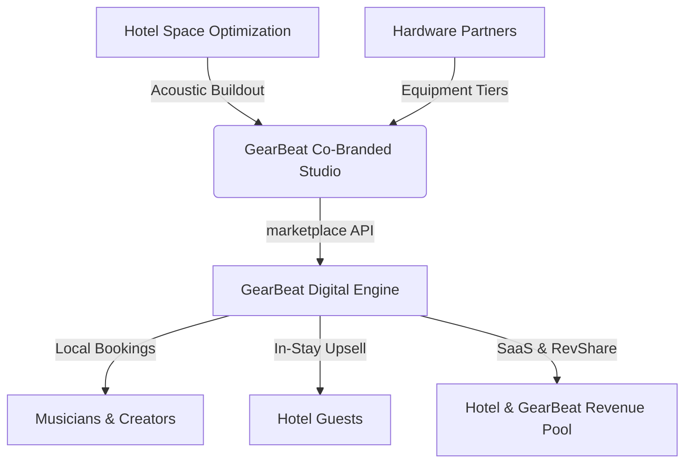
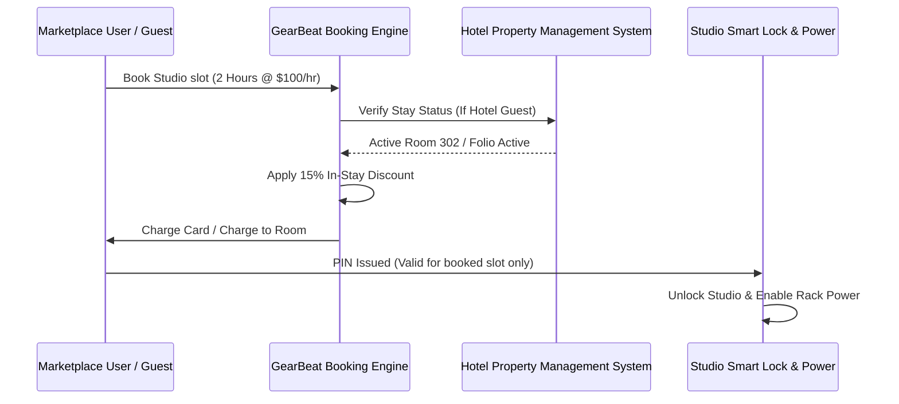

# GEARBEAT PATCH 108G — HOTEL STUDIO PROGRAM FUTURE ROADMAP

**Agent:** Agent 4 — Business Operations & Product Strategy  
**Status:** DRAFT / FUTURE STRATEGY ONLY  
**Date:** 2026-05-17  
**Branch:** `patch-108g-hotel-studio-program-roadmap`  
**Target File:** [GEARBEAT_PATCH_108G_HOTEL_STUDIO_PROGRAM_FUTURE_ROADMAP.md](file:///c:/Users/iaals/Documents/GitHub/gearbeat-V2/docs/GEARBEAT_PATCH_108G_HOTEL_STUDIO_PROGRAM_FUTURE_ROADMAP.md)

---

> [!NOTE]
> **Strategic Alignment Notice:** This document outlines a forward-looking strategic product vertical for the GearBeat platform. No code changes, database migrations, or payments integrations are implemented in this patch. All architectures and UI wireframes described below are blueprints for future execution.

---

## 1. CONCEPT & VISION

The **GearBeat Hotel Studio Program** is a B2B2C turnkey vertical that enables premium hotels to design, equip, brand, and operate high-fidelity, rentable in-hotel recording and creator studios. 

By converting underutilized hotel rooms, executive suites, or empty basement business centers into professional acoustic environments, hotels can tap into the booming creator economy. GearBeat acts as the end-to-end technology and logistics partner—providing standard acoustic buildout specifications, pre-configured hardware and gear bundles, co-branded marketing systems, and a seamless digital booking portal that integrates with both hotel guest folios and the public GearBeat marketplace.



---

## 2. TARGET USER PERSONAS

The Hotel Studio Program addresses two primary customer segments: **Hotel Guests** seeking elite room amenities and **Local Creators** seeking high-end workspace rentals.

| Persona Group | Primary Needs | Typical Use Cases |
| :--- | :--- | :--- |
| **Touring Musicians** | Zero-latency monitoring, pristine vocal recording, private space, 24/7 availability. | Laying down demo tracks or finishing vocals while traveling for gigs or tours. |
| **Podcasters & Hosts** | Multi-mic inputs, soundproof environment, easy-to-use mixers, video-ready lighting. | Recording guest episodes, solo monologues, or high-fidelity audiobooks. |
| **Music Producers** | High-end reference monitors, MIDI controllers, analog synthesizers, treated acoustics. | Mixing, mastering, or starting new beats in a highly focused workspace. |
| **Creator Suite Guests** | High-definition cameras, green screens, ring lights, dynamic microphones. | Recording vlogs, streaming live on Twitch/YouTube, or filming social media reels. |
| **Business Professionals** | Crystal-clear voice capture, private conferencing space, professional camera feed. | Recording high-stake webinars, virtual keynote speeches, or premium podcast ads. |
| **Hotel Guests (General)** | Novel premium experience, high-end entertainment option, local cultural connection. | Testing out professional music gear as a high-end luxury resort activity. |

---

## 3. MUTUAL VALUE PROPOSITIONS

The program creates a symbiotic ecosystem where hotels leverage unused real estate while GearBeat expands its active hardware marketplace footprint.

### A. Hotel Value Proposition
*   **Incremental RevPAR & TrevPAR:** Converts low-occupancy rooms or out-of-use corporate centers into high-margin hourly spaces earning upwards of $75 to $250 per hour.
*   **Differentiated Guest Amenity:** Establishes the hotel as a cultural hub for creators, out-competing boring business centers with cutting-edge cultural amenities.
*   **Local Community Footprint:** Drives local non-guest foot traffic into the hotel’s public areas, boosting secondary spending at in-hotel restaurants, bars, and lounges.
*   **Low Operational Friction:** GearBeat supplies the full equipment kit, handles all digital bookings, automates access codes, and manages support/troubleshooting.

### B. GearBeat Value Proposition
*   **Marketplace Synergy:** Integrates with GearBeat’s hardware vendors; every hotel studio serves as a physical showroom where creators can test gear and purchase it directly through the GearBeat Marketplace via QR codes.
*   **Platform Lock-in:** Establishes GearBeat as the only global aggregator for premium in-hotel creative spaces, making it a critical hub for touring creators.
*   **SaaS License Fees:** Generates reliable recurring revenue via white-labeled booking engines and platform integration fees.
*   **High-Value Brand Partners:** Positions GearBeat alongside luxury hospitality brands (e.g., W Hotels, Standard Hotels, CitizenM), elevating brand equity.

---

## 4. STUDIO TYPES (TIERED OFFERINGS)

To fit varying spatial capacities and capital expenditures (CapEx) of different hotel partners, GearBeat defines four distinct studio archetypes.

### Archetype 1: The Vocal Booth
*   **Target Size:** 8 - 12 sqm (optimized for converted walk-in closets, storage rooms, or micro-hotel spaces).
*   **Core Function:** High-end voiceovers, solo podcasts, vocal tracking, and clean instrument overdubs.
*   **Acoustic Target:** Dry, completely dead room response, maximizing sound isolation over room reflections.

### Archetype 2: The Podcast Room
*   **Target Size:** 12 - 18 sqm (typical small guestroom or executive office footprint).
*   **Core Function:** Multi-person podcasts (up to 4 hosts), live interviews, video-recorded panel discussions.
*   **Acoustic Target:** Controlled decay time ($RT_{60} \approx 0.3s$), visually optimized backdrop paneling for multi-angle video filming.

### Archetype 3: The Music Production Suite
*   **Target Size:** 18 - 25 sqm (standard double guestroom or executive suite).
*   **Core Function:** Music production, mixing, mastering, synthesizer sound design, and collaborative writing camps.
*   **Acoustic Target:** Critically balanced room acoustics with extensive bass traps, ceiling clouds, and reflection-free zones (RFZ).

### Archetype 4: The Creator Suite (Multi-Media)
*   **Target Size:** 25 - 40 sqm (junior suite or penthouse layout).
*   **Core Function:** Dynamic vlog recording, green-screen video production, TikTok/Reels creation, and casual gaming streams.
*   **Acoustic Target:** Moderate treatment with dynamic RGB accent lighting, modular set backgrounds, and premium soundbars for casual playbacks.

---

## 5. EQUIPMENT PACKAGE LEVELS

Every studio archetype is paired with a specific Equipment Package. All hardware is procured, configured, and certified by GearBeat in partnership with leading global audio brands.

```
       [Silver Package]                 [Gold Package]                [Platinum Package]
   -----------------------          -----------------------       ---------------------------
   • Focusrite Scarlett 2i2         • Universal Audio Apollo      • Apollo x6 / Neve 1073 Channel
   • Shure SM7B Microphones         • Shure SM7B / Neumann TLM    • Neumann U87 Ai Signature Mic
   • KRK Rokit 5 Monitors           • Genelec 8030C Monitors      • ATC SCM25A Pro Monitors
   • Ableton / Reaper DAW           • Pro Tools / Logic Pro       • Full DAW Suite & Outboard Rack
```

### 📋 Technical Specifications Matrix

| Feature | Silver Level (Essential) | Gold Level (Premium) | Platinum Level (Pro/Signature) |
| :--- | :--- | :--- | :--- |
| **Audio Interface** | Focusrite Scarlett 4i4 / MOTU M4 | Universal Audio Apollo Twin X Duo | Universal Audio Apollo x6 or x8 |
| **Microphones** | Shure SM7B, Røde NT1 | Neumann TLM 103, Shure SM7B | Neumann U87 Ai, Royer R-121 |
| **Studio Monitors**| Yamaha HS5 or KRK Rokit 5 | Genelec 8030C or Focal Alpha 65 | ATC SCM25A Pro or Barefoot MicroMain |
| **MIDI & Keys** | Novation Launchkey 49 | Arturia KeyLab Essential 61 | Native Instruments Komplete Kontrol S88 |
| **Headphones** | Audio-Technica ATH-M50x | Beyerdynamic DT 770 Pro | Sennheiser HD 600 / Audeze LCD-X |
| **Primary DAW** | Reaper / Ableton Live Lite | Logic Pro / Pro Tools Studio | Pro Tools Ultimate / Ableton Suite |
| **Outboard Gear** | None | Golden Age Project Pre-73 | Rupert Neve Designs Shelford Channel |
| **Typical CapEx** | $2,500 - $4,000 | $8,000 - $12,000 | $25,000 - $45,000 |

---

## 6. ACOUSTIC & BUILDOUT STANDARDS

To maintain the premium "GearBeat Certified" status, hotels must execute the physical space buildout strictly according to our Acoustic and Structural Blueprint.

> [!IMPORTANT]
> A luxury hotel guest in an adjacent room must not hear the recording session, nor can the recording artist capture hotel hallway noise (elevators, housekeeping, ice machines). Isolation is our absolute priority.

```
+---------------------------------------------------------------------------------+
|                                 HALLWAY / GUESTROOM                             |
+---------------------------------------------------------------------------------+
                                         ||
                                         || (Noise Source)
                                         \/
    ===========================================================================  <-- Drywall (12.5mm)
    ###########################################################################  <-- Sound Dampening Compound (Green Glue)
    ===========================================================================  <-- Drywall (12.5mm)
    |   |   |   |   |   |   |   |   |   |   |   |   |   |   |   |   |   |   | |  <-- Air Cavity with Rockwool (100mm, 45kg/m³)
    ===========================================================================  <-- Decoupled Resilient Channel (RC-1)
    ===========================================================================  <-- Internal Drywall (12.5mm)
    [=========================================================================]  <-- Acoustic Panels & Bass Traps
                                         ||
                                         \/ (Ambient Noise: NC-15)
+---------------------------------------------------------------------------------+
|                                 STUDIO INTERNAL                                 |
+---------------------------------------------------------------------------------+
```

### A. Sound Transmission Class (STC) Targets
*   **Target Performance:** Minimum **STC 60** for studio-to-guestroom walls; **STC 55** for hallway doors.
*   **Ambient Noise Floor:** Maximum **NC-15** (Noise Criterion) inside the room with active central HVAC.

### B. Structural Isolation Checklist
*   **Double Stud Wall Build:** Dual independent wood/metal stud rows separated by a 25mm air gap, packed with high-density rockwool (minimum 45kg/m³).
*   **Viscoelastic Decoupling:** Double layers of 12.5mm fire-rated plasterboard on both sides, bound with dynamic sound-damping compounds (e.g., Green Glue).
*   **Resilient Channels:** Internal drywall sheets decoupled from the structural studs via resilient isolation clips and channels.
*   **Heavy Acoustic Doors:** Solid-core wood or specialized acoustic metal doors fitted with heavy drop seals and perimeter magnetic gaskets.
*   **Floating Floors:** Optional 50mm concrete screed laid over high-density acoustic rubber underlayments to mitigate impact sound transmission from footsteps or bass frequencies.

### C. Internal Acoustic Treatment
*   **Reflection Control:** Broadband fabric-wrapped fiberglass panels (50mm depth) mounted at key reflection points to eliminate flutter echo.
*   **Low-Frequency Control:** High-density corner bass traps (minimum 100mm depth) to prevent low-end resonance and standing waves.
*   **Ceiling Treatment:** Decoupled acoustic "clouds" suspended above the producer's mix desk and vocal area.

---

## 7. GEARBEAT BRANDING & SIGNAGE

The physical and visual aesthetics of the hotel studio must scream premium luxury. GearBeat provides physical brand manuals, signature color specifications, and high-fidelity signage templates.

```
                  +-----------------------------------------+
                  |                                         |
                  |                GEARBEAT                 |
                  |               [CERTIFIED]               |
                  |                                         |
                  |             STUDIO  NO. 403             |
                  |                                         |
                  +-----------------------------------------+
```

### A. Visual Aesthetics & Materials
*   **Signature Palette:** Premium luxury dark obsidian (#0A0A0A) backgrounds with brushed champagne gold (#D4AF37) accents.
*   **Materials:** Dark walnut wood paneling, premium acoustic felt in charcoal, sand-cast brass hardware, and matte black steel fixtures.
*   **Lighting:** Indirect recessed warm LED lines (3000K) combined with customizable RGB smart LED accents for atmospheric adaptation.

### B. Mandatory Signage Requirements
*   **Illuminated Entry Plaque:** Brushed brass faceplate with CNC-milled "GEARBEAT CERTIFIED" branding, illuminated with warm back-lit LEDs.
*   **"On-Air" Indicator:** Auto-activated glowing gold LED bar above the door frame that lights up when the studio's microphones are active or the door is locked from the inside.
*   **Branded Welcome Mirror:** Two-way glass vanity mirror with a glowing integrated screen displaying the guest's name, local checkout checklist, and custom Spotify playlist link.

---

## 8. BOOKING & PRICING MODEL

The platform must support flexible, multi-tiered transactional engines to cater to both overnight hotel guests and local day-pass users.



### A. Pricing Strategies
*   **Day-Pass Model (Hourly Booking):** Minimum booking of 2 hours. Pricing varies by tier:
    *   *Silver Studios:* $50 - $75 / Hour.
    *   *Gold Studios:* $100 - $150 / Hour.
    *   *Platinum Studios:* $200 - $350 / Hour.
*   **In-Stay Bundle Upgrade:** Hotel guests receive a flat 15% to 20% discount on hourly rates if booked as an add-on to their room reservation, or can book the "Studio Room Pack" where the room and studio are connected as a single reservation.
*   **Dynamic Pricing:** Dynamic surge pricing logic during peak hours (6 PM - Midnight) and local creative weekends.

### B. Access & Automation
*   **Smart Access Integration:** Upon a verified checkout, the guest receives a dynamic 6-digit PIN and mobile NFC key valid *only* for the duration of the booked session.
*   **Auto-Power Sequencing:** Entering the valid PIN triggers a smart power sequencer that safely powers up the console, outboard gear, and studio monitors, preventing loud pops or thermal speaker damage.

---

## 9. REVENUE SHARE & SaaS PARTNERSHIP MODELS

Hotels can choose from three cooperative financial structures designed to align interests, offset CapEx, or maximize yield.

```
+---------------------------------------------------------------------------------+
|                               FINANCIAL MODEL COMPARISON                        |
+---------------------------------------------------------------------------------+

  [Model A: Shared Revenue Split]
  • Hotel CapEx: Medium (Acoustics Only)
  • GearBeat CapEx: Medium (Supplies Gear)
  • Booking Split: 60% Hotel / 40% GearBeat
  • Monthly SaaS Fee: Waived

  [Model B: Software-as-a-Service (SaaS)]
  • Hotel CapEx: High (Hotel buys all gear)
  • GearBeat CapEx: Zero
  • Booking Split: 85% Hotel / 15% GearBeat
  • Monthly SaaS Fee: $299 / Month per Studio

  [Model C: Co-Branded Franchise]
  • Hotel CapEx: Zero (GearBeat funds room conversion)
  • GearBeat CapEx: High
  • Booking Split: 30% Hotel / 70% GearBeat
  • Monthly SaaS Fee: Waived (Minimum Occupancy Guarantee)
```

### A. Model 1: Shared Revenue Split (Standard)
*   **CapEx Allocation:** The hotel funds the physical acoustic wall construction and buildout. GearBeat supplies the complete, pre-configured hardware and gear bundle.
*   **Transaction Split:** **60% Hotel / 40% GearBeat** of all gross booking revenues.
*   **SaaS Fee:** Waived.

### B. Model 2: SaaS Licensing Engine
*   **CapEx Allocation:** The hotel purchases all equipment and acoustic hardware directly using GearBeat's wholesale purchasing agreements.
*   **Transaction Split:** **85% Hotel / 15% GearBeat** transaction fee to cover booking processing and global marketing exposure.
*   **SaaS Fee:** $299 per active studio room / month.

### C. Model 3: Co-Branded Franchise (Turnkey Lease)
*   **CapEx Allocation:** GearBeat funds both the acoustic construction and the hardware package, fully converting a lease-backed room.
*   **Transaction Split:** **30% Hotel / 70% GearBeat** to recover upfront capital.
*   **SaaS Fee:** Waived. The hotel receives a minimum occupancy guarantee to offset room withdrawal from the standard rental inventory.

---

## 10. INSURANCE, LIABILITY & DAMAGE CONTROLS

To protect high-value recording hardware and hotel assets, the program establishes a robust real-time tracking and liability framework.

> [!WARNING]
> Recording hardware is highly sensitive. The program must deploy real-time environment sensors, smart inventories, and strict check-in flows to secure physical assets.

### A. Real-Time Hardware Protection
*   **Smart RFID Locker Inventory:** All loose high-value hardware (Neumann microphones, premium headphones, dynamic cables) are housed inside a wall-mounted glass locker. Each item is tagged with an active RFID chip. 
*   **Check-out Verification:** The booking session cannot start until the RFID sensors confirm all gear is present in the locker. Guests must scan each item out using the in-room tablet, which takes a photographic log of the guest's ID.
*   **Environmental Smart Logging:** Every studio is outfitted with an active sensor array (e.g., NoiseSentry) tracking:
    *   *Relative Humidity:* Target 45% - 55% (critical to prevent microphone capsule deterioration and guitar neck warping).
    *   *Temperature:* Constant $20^\circ\text{C} - 22^\circ\text{C}$.
    *   *Decibel Levels:* Auto-logging if average levels exceed $105\text{dB}$ for more than 3 consecutive minutes to protect speaker cones.

### B. Insurance Policies & Security Deposits
*   **Automated Security Authorization:** Local day-pass bookers have a pre-authorization hold of **$500** placed on their registered credit card 1 hour before the session starts.
*   **Damage Waiver Add-On:** Booking users can opt for a $15 non-refundable "Studio Damage Waiver" which caps their maximum personal liability at $100 for accidental drop damage.
*   **Dedicated Commercial Liability:** GearBeat maintains a centralized global commercial property policy backing every "GearBeat Certified" studio room up to $1,000,000 in structural damage.

---

## 11. CERTIFICATION & QA REQUIREMENTS

To guarantee that a musician receives the exact same pristine recording quality in London, Dubai, or Riyadh, we enforce an absolute, non-negotiable certification protocol.

```
       [INITIAL AUDIT]                 [CALIBRATION]                 [CERTIFICATE]
   -----------------------         ---------------------         --------------------
   • Acoustic testing              • Hardware testing            • QR Code Issued
   • STC Verification              • Driver / DAW Updates        • Live Verification
   • NC-15 Ambient Audit           • Monitor Tuning (Sonarworks) • Premium Badge UI
```

### A. The 3-Step Certification Protocol
1.  **Acoustic Validation Audit:** A certified GearBeat acoustic engineer conducts real-world sound sweep tests to measure reverberation decay ($RT_{60}$ curve) and verify that sound isolation meets the minimum STC 60 standard.
2.  **Hardware Alignment & Calibration:** Hardware outputs are calibrated. Monitor speakers are digitally tuned using reference microphones and software (e.g., Sonarworks SoundID Reference) to ensure a perfectly flat frequency response in the room.
3.  **Digital Key Activation:** Once certified, the studio is flagged in the Supabase database as `is_certified = true` and assigned an active `certification_uuid`. A physically framed certificate with a unique dynamic QR code is mounted on the studio wall.

### B. Recertification Schedule
*   **Bi-Annual Audits:** Active local engineers perform physical sound checks and microphone capsule cleanings every 6 months.
*   **Automated Daily Self-Checks:** Every morning at 4:00 AM, the in-room tablet plays a silent 5-second dynamic ultrasonic diagnostic tone through the monitors to verify speaker response and microphone connectivity, alerting the GearBeat Admin dashboard of any hardware discrepancies.

---

## 12. FUTURE PLATFORM INTERFACE ARCHITECTURE

When the program is officially scheduled for code implementation, the following route structures, UI layouts, and database relations will be deployed.

### A. Future UI Wireframes & Mockups

#### 1. Future Public Booking Interface (`/studios/hotels`)
```
+---------------------------------------------------------------------------------+
|  GEARBEAT  [ Discover ] [ Marketplace ] [ Hotels ]                     [Log In]  |
+---------------------------------------------------------------------------------+
|                                                                                 |
|  FIND A PREMIUM IN-HOTEL STUDIO                                                 |
|  Select City: [ Riyadh, KSA   v ]  Check-in: [ 2026-06-01 ]  Tiers: [ All v ]    |
|                                                                                 |
|  +---------------------------------------------------------------------------+  |
|  | [ Image of W Hotel Studio ]  W HOTEL - CREATOR SUITE (PLATINUM)           |  |
|  |                              Riyadh, Diplomatic Quarter • STC 65 • Flat   |  |
|  |                              * Neumann U87 Ai * UA Apollo x6 * Barefoots  |  |
|  |                              Price: $250/hr ($200/hr for In-Stay Guests)  |  |
|  |                              [ VIEW AVAILABILITY ] [ BOOK ROOM + STUDIO ] |  |
|  +---------------------------------------------------------------------------+  |
|  | [ Image of CitizenM Studio]  CITIZENM - PODCAST ROOM (GOLD)               |  |
|  |                              Dubai, Financial Centre • STC 60 • Dynamic   |  |
|  |                              * Shure SM7B * Rodecaster Pro II * Genelecs  |  |
|  |                              Price: $120/hr ($100/hr for In-Stay Guests)  |  |
|  |                              [ VIEW AVAILABILITY ] [ BOOK SLOT NOW ]      |  |
|  +---------------------------------------------------------------------------+  |
|                                                                                 |
+---------------------------------------------------------------------------------+
```

#### 2. Future Partner Extranet Dashboard (`/portal/hotel-admin`)
```
+---------------------------------------------------------------------------------+
|  GEARBEAT PARTNER PORTAL  •  W Hotel Riyadh                    [Housekeeping v] |
+---------------------------------------------------------------------------------+
|  [Dashboard] [Studio Occupancy] [Equipment Lockers] [Revenue Share] [Settings]  |
|                                                                                 |
|  STUDIO STATUS: ACTIVE & CALIBRATED  (Certification: Valid till 2026-11-17)     |
|                                                                                 |
|  Today's Bookings:                                                              |
|  • 10:00 - 12:00: Sarah J. (Guest, Room 302)     - [PIN Active: 483920]         |
|  • 14:00 - 18:00: Local Podcaster (Day Pass)     - [PIN Pending]                |
|                                                                                 |
|  Locker Status:                                                                 |
|  • Neumann U87 Mic: [SECURED IN LOCKER]                                         |
|  • UA Apollo Interface: [ONLINE & SECURED]                                      |
|  • AKG K712 Headphones: [CHECKED OUT - Sarah J.]                                |
|                                                                                 |
|  Revenue Earned (May 2026):                                                     |
|  • Gross Bookings: $12,450.00                                                   |
|  • Your Split (60%): $7,470.00                                                  |
|  • Payout Status: Scheduled for 2026-06-01                                      |
|                                                                                 |
+---------------------------------------------------------------------------------+
```

#### 3. Future Admin Master Control Dashboard (`/admin/hotel-program`)
```
+---------------------------------------------------------------------------------+
|  GEARBEAT SUPER-ADMIN  •  Hotel Studio Program Control                          |
+---------------------------------------------------------------------------------+
|  [Users] [Studios] [Hotel Program] [Payouts] [CRM Leads] [AI Safety]            |
|                                                                                 |
|  ACTIVE PARTNER HOTELS: 14  •  PENDING CERTIFICATIONS: 3                        |
|                                                                                 |
|  Pending Approvals:                                                             |
|  • Sheraton Grand Jeddah - Applied: Vocal Booth (Gold)  - [REVIEW APPLICATION]  |
|  • Marriott Riyadh North - Applied: Prod. Room (Platinum)- [SCHEDULE SITE AUDIT] |
|                                                                                 |
|  System Alerts:                                                                 |
|  • Alert: citizenM Dubai Studio 104 - Daily self-check FAILED (Mic offline)     |
|    Action: Alerting on-site tech manager (Room code issued for support).        |
|                                                                                 |
+---------------------------------------------------------------------------------+
```

### B. Future Database Schema Additions (SQL Blueprints)
When this program moves to implementation, the following new tables will be added to the Supabase database.

```sql
-- Future Hotel Program Schema Definitions (Do not execute now)

-- 1. Hotel Partner Profile
CREATE TABLE hotel_partners (
    id UUID PRIMARY KEY DEFAULT gen_random_uuid(),
    business_name VARCHAR(255) NOT NULL,
    brand_rating VARCHAR(50) DEFAULT 'Luxury',
    city VARCHAR(100) NOT NULL,
    country VARCHAR(100) NOT NULL,
    address TEXT NOT NULL,
    pms_integration_type VARCHAR(100) DEFAULT 'None',
    pms_api_key_hash VARCHAR(255),
    created_at TIMESTAMP WITH TIME ZONE DEFAULT CURRENT_TIMESTAMP,
    updated_at TIMESTAMP WITH TIME ZONE DEFAULT CURRENT_TIMESTAMP
);

-- 2. Hotel Studios
CREATE TABLE hotel_studios (
    id UUID PRIMARY KEY DEFAULT gen_random_uuid(),
    hotel_id UUID REFERENCES hotel_partners(id) ON DELETE CASCADE,
    room_number VARCHAR(50) NOT NULL,
    studio_type VARCHAR(50) CHECK (studio_type IN ('vocal_booth', 'podcast_room', 'production_suite', 'creator_suite')),
    package_level VARCHAR(50) CHECK (package_level IN ('silver', 'gold', 'platinum')),
    hourly_rate NUMERIC(10, 2) NOT NULL,
    instay_discount_pct NUMERIC(5, 2) DEFAULT 15.00,
    is_certified BOOLEAN DEFAULT FALSE,
    certification_uuid UUID UNIQUE,
    certification_expires_at DATE,
    stc_rating INTEGER,
    ambient_noise_nc INTEGER,
    last_calibration_at TIMESTAMP WITH TIME ZONE,
    status VARCHAR(50) DEFAULT 'maintenance' CHECK (status IN ('active', 'maintenance', 'decommissioned')),
    created_at TIMESTAMP WITH TIME ZONE DEFAULT CURRENT_TIMESTAMP
);

-- 3. Smart Locker Inventory Tracking
CREATE TABLE studio_locker_inventory (
    id UUID PRIMARY KEY DEFAULT gen_random_uuid(),
    studio_id UUID REFERENCES hotel_studios(id) ON DELETE CASCADE,
    item_name VARCHAR(255) NOT NULL,
    rfid_tag VARCHAR(100) UNIQUE NOT NULL,
    item_category VARCHAR(100) NOT NULL,
    replacement_value NUMERIC(10, 2) NOT NULL,
    is_present_in_locker BOOLEAN DEFAULT TRUE,
    last_scanned_at TIMESTAMP WITH TIME ZONE DEFAULT CURRENT_TIMESTAMP
);

-- 4. Hotel Studio Bookings Extensions
CREATE TABLE hotel_studio_bookings (
    id UUID PRIMARY KEY DEFAULT gen_random_uuid(),
    studio_id UUID REFERENCES hotel_studios(id) ON DELETE RESTRICT,
    guest_profile_id UUID REFERENCES profiles(id) ON DELETE RESTRICT,
    is_in_stay_guest BOOLEAN DEFAULT FALSE,
    hotel_room_number VARCHAR(50),
    folio_reference VARCHAR(100),
    pin_code VARCHAR(6) NOT NULL,
    pin_valid_from TIMESTAMP WITH TIME ZONE NOT NULL,
    pin_valid_to TIMESTAMP WITH TIME ZONE NOT NULL,
    access_status VARCHAR(50) DEFAULT 'pending' CHECK (access_status IN ('pending', 'checked_in', 'checked_out', 'expired')),
    revenue_split_hotel_pct NUMERIC(5, 2) DEFAULT 60.00,
    revenue_split_gearbeat_pct NUMERIC(5, 2) DEFAULT 40.00,
    created_at TIMESTAMP WITH TIME ZONE DEFAULT CURRENT_TIMESTAMP
);
```

---

## 13. STRATEGIC ROADMAP & TIMELINE

```
Phase 1: Conceptual Drafting (Patch 108G) --> Current Status Complete
  |
  +--> Phase 2: Partner Outreach & Feasibility Audits (Sprints 12 - 13)
  |      - Present B2B Pitch Deck to 3 selected pilot hotels (Riyadh, Dubai).
  |      - Conduct spatial and acoustic audits on proposed rooms.
  |
  +--> Phase 3: Technical Planning & SQL Implementation (Sprints 14 - 15)
  |      - Merge database schema extensions and write RPC functions.
  |      - Develop smart access and power sequencer API integrations.
  |
  +--> Phase 4: Pilot Studio Construction & Launch (Sprints 16 - 18)
  |      - Build out and calibrate the first "GearBeat Certified" vocal/podcast room.
  |      - Run guest trials and optimize the check-in/locker workflow.
  |
  +--> Phase 5: Commercial Scale & Wholesale Partnership (Sprint 20+)
         - Scale to 15+ hotels across KSA and UAE.
         - Enable wholesale gear check-out directly via physical studio showroom QR links.
```

---

**THIS CONCLUDES THE ARCHITECTURAL AND BUSINESS ROADMAP FOR THE GEARBEAT HOTEL STUDIO PROGRAM. NO CODE MUTATIONS HAVE BEEN EXECUTED.**
