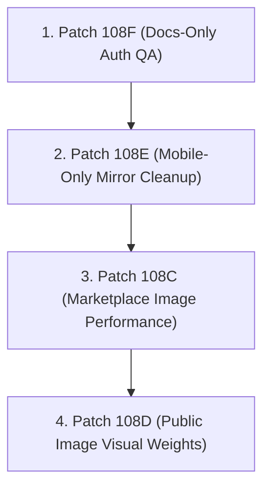

# Patch 108H — Post-Performance QA / Merge Safety Closeout

## Overview
This runbook provides the comprehensive post-performance QA checklist, visual QA standards, and recommended merge sequencing for the **Sprint 10B/10C Performance and Media Cleanup** series. By enforcing a systematic verification pipeline, we guarantee that all enhancements to image optimization and loading performance maintain absolute visual, responsive, and bilingual consistency across the GearBeat ecosystem.

---

## 1. Summary of Patches (108C / 108D / 108E / 108F)

* **Patch 108C (Marketplace Image Cleanup)**:
  * Converted standard `` tags on the Marketplace Product Detail pages (`app/marketplace/products/[slug]/page.tsx`) to Next.js `<Image>` components using correct parent relative containers.
  * Resolved console warning logs within product cards by removing redundant manual `loading` and `decoding` attributes when `priority={true}` was supplied.
  * Enforced dynamic layout sizing and lazy loading below-the-fold.
* **Patch 108D (Public Image Cleanup)**:
  * Optimized visual asset weights on central public pages (Homepage `/`, `/studios`, `/services`, `/gearbeat-certified`).
  * Replaced large uncompressed banner elements with optimized modern formats and configured Next.js `<Image>` tags.
* **Patch 108E (Mobile Image Cleanup)**:
  * Cleaned up and cached image assets inside the Expo mobile shell to optimize startup speeds.
  * Standardized image components in the mobile mirror framework.
* **Patch 108F (Post-Auth QA Checklist)**:
  * Docs-only master checklist verifying registration flow hardening, password validator constraints, OTP/email registration redirects, and pre-release boundary audits.

---

## 2. Recommended Merge Order
To avoid codebase regressions and conflicts, all branches must be integrated strictly in this sequence:

1. **Patch 108F (Docs-Only)**: Zero risk to production code; sets baseline auth validation rules.
2. **Patch 108E (Mobile-Only)**: Safely isolated within mobile folder pathing; no impact on standard web layouts.
3. **Patch 108C (Marketplace)**: Modifies primary marketplace listings and cart states. Must be validated independently.
4. **Patch 108D (Public Views)**: Modifies public layout landing images. Integrates last to conclude the visual cleanup cycle.

---

## 3. Post-Merge QA Checklist

### Target Routes & Verification Guide

Verify each page listed below directly on the local server after merging the performance series:

| Route Path | Key Visual Elements to Verify | Verification Status |
| :--- | :--- | :---: |
| **`/signup`** | Verify live password strength validator styling and Arabic translations. | `[ ]` |
| **`/profile`** | Verify user profile details load without layout shifts. | `[ ]` |
| **`/customer`** | Verify customer active sessions and cart indicators. | `[ ]` |
| **`/portal/studio`** | Confirm partner extranet panels load correct badges. | `[ ]` |
| **`/marketplace`** | Ensure the first 4 product cards load with prioritized LCP. | `[ ]` |
| **`/marketplace/products/[slug]`** | Verify main product image, thumbnails, and related products. | `[ ]` |
| **`/` (Homepage)** | Check LCP banner image crispness and text overlay alignment. | `[ ]` |
| **`/studios`** | Verify booking grids and search previews load smoothly. | `[ ]` |
| **`/services`** | Confirm visual banners are well-proportioned. | `[ ]` |
| **Mobile Shell Preview** | Test Expo bundle launch speed and check cache logs. | `[ ]` |

---

## 4. Performance Checks to Run Later
Once merged to staging/main:
- [ ] **Lighthouse Mobile Score**: Ensure the homepage is scoring above **85** on Mobile performance.
- [ ] **Lighthouse LCP**: Largest Contentful Paint should occur within **2.5 seconds** on standard mobile networks.
- [ ] **CLS Validation**: Verify Cumulative Layout Shift is strictly **0.0** on `/marketplace/products/[slug]` during layout hydration.
- [ ] **Next.js Image Optimization Cache**: Confirm `_next/image` headers return `x-nextjs-cache: HIT` on subsequent page loads.

---

## 5. Visual QA Checklist (Dark/Gold Brand Identity)
* **Contrast Ratios**: Gold primary elements (`#D4AF37`) must retain high contrast against dark primary backgrounds (`#0B0F16`).
* **Hover Micro-Animations**: Card wrappers must show smooth transitions (`var(--transition)`) and glow effects (`var(--gb-gold-glow)`) on mouse hover.
* **Aspect Ratios**: Ensure no image stretch or warp exists. The `style={{ objectFit: "cover" }}` property must be active on all filled Next.js images.
* **Bilingual Copies**: Text flow must align to LTR for English and RTL for Arabic (`dir="rtl"`, Cairo font integration).

---

## 6. Auth Verification Safety Checks
* **No Magic Link Registration**: The sign-up flow must strictly prompt for secure password fields.
* **OTP Input Behavior**: Verification screens must clearly outline constraints for email activation and phone verification.
* **Route Guards**: Unauthorized access to `/customer` or `/portal/studio` must redirect gracefully to `/login?account=...` without exposing server states.

---

## 7. Image/License Review Note
All assets utilized during these cleanup patches must be validated against the **GearBeat Brand Safety Registry**. Only approved royalty-free, licensed assets or vector SVGs are allowed. Standard web placeholders are prohibited.

---

## 8. Explicit Blockers Before Next Patch
The following issues will trigger a **No-Go** decision and must block subsequent releases:
1. **Redundant Loading Warning**: Any React/Next.js console warnings regarding image component priority mismatch.
2. **Missing Key Translation**: Empty or untranslated UI elements when toggling bilingual language switchers.
3. **Broken Relative Wrappers**: Images overflowing standard card borders due to missing parent `position: "relative"` properties.
4. **Local Fonts Missing**: Reversion to system generic sans-serif fonts instead of the premium brand typography (Space Grotesk & Cairo).
