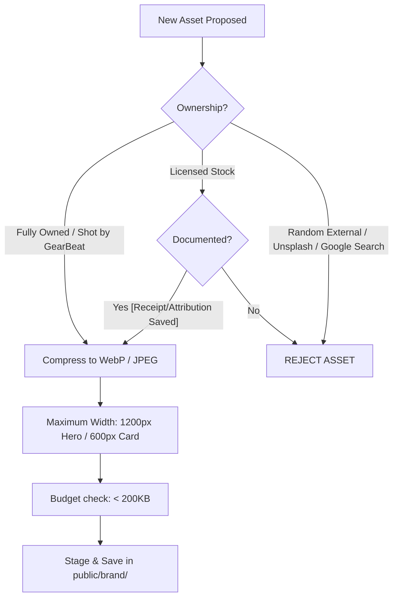
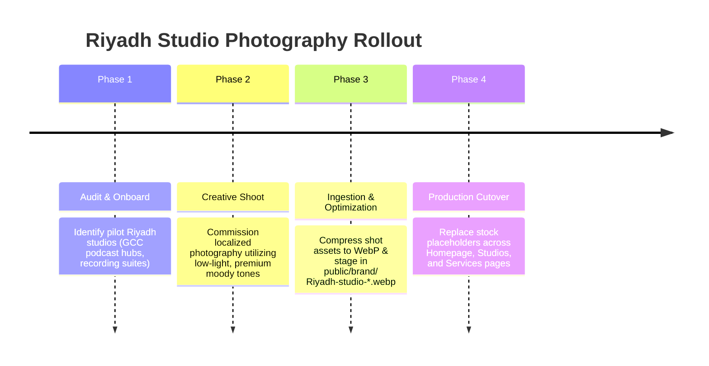

# GEARBEAT PATCH 108I — IMAGE ASSET LICENSE & BRAND SAFETY REGISTRY

## Overview
As GearBeat approaches its pilot launch and commercial activation, ensuring legal safety, copyright compliance, and visual brand consistency is paramount. **Patch 108I** implements a comprehensive **Image Asset License & Brand Safety Registry** to audit the current state of image assets, trace licenses, identify copyright risks, and establish strict standards for future image asset ingestion and visual quality assurance.

This registry secures the platform against legal liabilities (e.g., copyright infringement, DMCA takedown requests) and technical stability issues (e.g., Next.js remote pattern image crashes) while reinforcing our premium Saudi dark/gold brand identity.

---

## 1. Directory Audits & Asset Inventory

Below is the verified inventory of all brand-related image and graphic assets tracked in the repository.

### A. Public Web Brand Assets (`public/brand/`)
These files represent the core brand assets served across the public Next.js web application.

| Asset Filename | Format | File Size | Intended Use / Location | Status / Review Requirement |
| :--- | :--- | :--- | :--- | :--- |
| `logo-app-icon-ai.png` | PNG | 981.36 KB | High-resolution brand icon for marketing | **Cleared**: Original GearBeat vector-render asset. |
| `logo-app-icon.svg` | SVG | 1.31 MB | High-fidelity vector brand icon | **Cleared**: Original GearBeat vector design. |
| `logo-horizontal-ai.png` | PNG | 631.80 KB | Main horizontal brand logo for headers | **Cleared**: Original GearBeat vector-render asset. |
| `logo-horizontal.svg` | SVG | 842.57 KB | Vector horizontal brand logo for web navigation | **Cleared**: Original GearBeat vector design. |
| `logo-mark-ai.png` | PNG | 830.32 KB | High-resolution logo mark (no text) | **Cleared**: Original GearBeat vector-render asset. |
| `logo-mark.svg` | SVG | 1.11 MB | Vector logo mark (no text) | **Cleared**: Original GearBeat vector design. |

> [!NOTE]
> All SVG logo assets are vector graphics and have relatively large file sizes due to high path complexity (averaging 1MB+). To optimize page load speed and Core Web Vitals, it is recommended to compile/compress these SVGs using tools like SVGO before full production release.

### B. Mobile Shell Brand Assets (`mobile/assets/`)
These assets represent the icons and splash graphics compiled inside the React Native / Expo mobile application shell. 

| Asset Filename | Format | Intended Use / Location | Status / Review Requirement |
| :--- | :--- | :--- | :--- |
| `adaptive-icon.png` | PNG | Android adaptive home screen launcher icon | **Cleared**: Derived from original brand mark. |
| `favicon.png` | PNG | Mobile web version icon | **Cleared**: Derived from original brand mark. |
| `icon.png` | PNG | Universal app icon | **Cleared**: Derived from original brand mark. |
| `splash-icon.png` | PNG | Mobile application loading splash screen | **Cleared**: Original GearBeat dark/gold splash graphic. |

---

## 2. License Review & Identified Risks

An audit of the codebase reveals several placeholder or externally derived assets that must be reviewed, localized, and eventually replaced to ensure brand safety.

### Risk 1: Unsplash-Derived Services Page Background
- **Target URL**: `https://images.unsplash.com/photo-1598488035139-bdbb2231ce04?q=80&w=2070&auto=format&fit=crop`
- **Location in Code**:
  - `app/services/page.tsx` (Line 164) — Served as a direct external background image URL in the CSS `background` style:
    ```tsx
    background: "linear-gradient(rgba(0,0,0,0.85), rgba(0,0,0,0.95)), url('https://images.unsplash.com/photo-1598488035139-bdbb2231ce04?q=80&w=2070&auto=format&fit=crop') center/cover"
    ```
  - `app/services/page.tsx` (Line 228) — Served as the default fallback image in the studio service loop if no `cover_image_url` is provided in the database.
- **Identified Risks**:
  1. **Performance**: Directly requesting a raw `2070px` resolution image from Unsplash creates a massive, unoptimized bandwidth footprint, severely degrading the Largest Contentful Paint (LCP) metric.
  2. **Stability**: If this external URL is loaded through Next.js `<Image>` component instead of standard `` tags, it will trigger a **runtime crash** unless `images.unsplash.com` is explicitly whitelisted in `next.config.ts`'s `images.remotePatterns`.
  3. **Licensing**: While Unsplash images are generally free under the Unsplash license, commercial platforms like GearBeat require explicit control and trace records for all core background graphics.

### Risk 2: Provisional Local Placeholder Asset (Unmerged)
- **Asset**: `public/brand/studio-placeholder.jpg`
- **Context**: In the unmerged developer branch `patch-108d-public-image-visual-weight-cleanup`, a localized, cropped, and optimized `167 KB` version of the Unsplash image mentioned above was placed at this path to address the performance issues of Risk 1.
- **Ownership/Action Requirement**: Even though this local asset significantly improves performance and eliminates remote domain loading risks, **it is still derived from an external stock source**. The legal team must verify the author attribution, confirm the stock license allows commercial GCC platform distribution, or prioritize replacing it with native, owned studio photography.

### Risk 3: Vendor-Uploaded Marketplace Images
- **Location in Code**:
  - `app/marketplace/page.tsx` (via `MarketplaceProductCard`)
  - `app/marketplace/products/[slug]/page.tsx`
- **Data Source**: Loaded dynamically from the `marketplace_products.images` table column in the Supabase database.
- **Identified Risks**: 
  - Dynamic listings uploaded by third-party sellers can include watermarks, copyrighted manufacturer stock images, low-contrast text overlays, or low-resolution files that detract from the premium dark/gold marketplace aesthetic.
  - Since standard `` tags are used to display vendor images on the product details page (`app/marketplace/products/[slug]/page.tsx`), they bypass domain whitelists but remain a visual QA and brand consistency risk.

---

## 3. Preferred Future Asset Policy

To establish absolute visual control and legal immunity, the following asset guidelines are now active policies across all branches:



### Key Policy Mandates:
1. **GearBeat-Owned First**: All landing pages, hero backgrounds, and system placeholders must prioritize original photography, 3D renders, or graphic designs owned entirely by GearBeat.
2. **Licensed Stock Ledger**: Stock images (such as Shutterstock, Adobe Stock, or verified royalty-free vectors) are permitted **only** if a commercial license record is filed. The purchase receipt, stock ID, and author attribution details must be recorded in `docs/licenses/` prior to adding the asset to the repository.
3. **No Unmanaged Local Saving**: Saving arbitrary external images downloaded from the web into `public/` or `public/brand/` without developer documentation and legal review is strictly prohibited.
4. **Optimized Local Performance**: All local assets must be highly compressed using modern WebP or optimized JPEG formats.
   - **Resolution Limit**: Capped at `1200px` width for desktop hero background banners, and `600px` width for cards.
   - **Size Budget**: A strict budget of `< 200 KB` per asset must be enforced to maintain superior Core Web Vitals performance.

---

## 4. Brand Safety & Visual QA Rules

To maintain our luxurious, premium Saudi dark/gold identity, all digital assets and web page layouts must adhere to these visual guidelines:

> [!IMPORTANT]
> **GearBeat Brand Standards**:
> - **Primary Backgrounds**: Deep blacks and dark greys (`#030507`, `#080b0e`, `rgba(255,255,255,0.035)`).
> - **Accents & Highlights**: Radiant Gold (`#D4AF37` / `var(--gb-gold)`), glowing gradients, and subtle amber pulses.
> - **Typography**: High contrast, crisp sans-serif fonts, and balanced letter spacing.

### QA Checklist for Web Visuals:
- [ ] **Contrast Verification**: Any text overlaid on top of an image asset must satisfy a minimum **4.5:1 contrast ratio**.
- [ ] **Linear Gradient Overlays**: Image banners used as container backgrounds must utilize a dark linear gradient overlay (e.g., `linear-gradient(rgba(0,0,0,0.85), rgba(0,0,0,0.95))`) to guarantee the readability of overlying white and gold bilingual text.
- [ ] **Card Uniformity**: All studio or product cards must enforce uniform border-radius properties (`var(--gb-radius-md)` or `16px`) with `overflow: hidden` to prevent images from breaking page alignment.
- [ ] **Bilingual Balance**: Text overlays on brand images must be neatly rendered using the `<T>` translation component to support Arabic (right-to-left) and English (left-to-right) perfectly without visual clipping or overlapping.

---

## 5. Riyadh Partner Studios Photography Replacement Plan

To systematically phase out stock placeholders, GearBeat will execute a professional photography program matching our GCC launch timeframe:



### Visual Guidelines for Original Shoots:
- **Style**: High-end, low-light studio setups showcasing professional analog equipment (SSL consoles, Neve outboard preamps, custom acoustic wood panelling).
- **Lighting**: Moody amber backlighting, golden ambient tube-glows, and deep steel-blue shadows to mirror the digital platform's luxurious interface.
- **Composition**: 16:9 widescreen orientation, utilizing shallow depth-of-field to draw the eye to core music production equipment.

---

## 6. Commercial Launch Blocker Rules

The following rules represent **Go / No-Go Launch Gates** that must be checked prior to full commercial activation:

> [!CAUTION]
> ### 🚨 Launch Gate Blockers:
> 1. **No Unclear Licenses**: Any asset served in a production web page or compiled mobile bundle that lacks a documented, verified license ledger in `docs/licenses/` is a **hard launch blocker**.
> 2. **No Active External Domain Backgrounds**: Direct references to external domains (such as Unsplash, raw Imgur, or external development nodes) for site backgrounds or fallbacks must be completely eliminated. All core visuals must be served locally from optimized `public/` paths or via our secure, whitelisted media CDN.
> 3. **No Uncompressed Banners**: Any background asset exceeding `500 KB` is flagged as a performance regression and must be compressed to WebP/JPEG format before release.
> 4. **No Unvetted Vendor Assets**: An automated script or a manual admin review gate must audit newly registered vendor marketplace images to ensure no copyright violations or off-brand visuals are displayed publicly.
