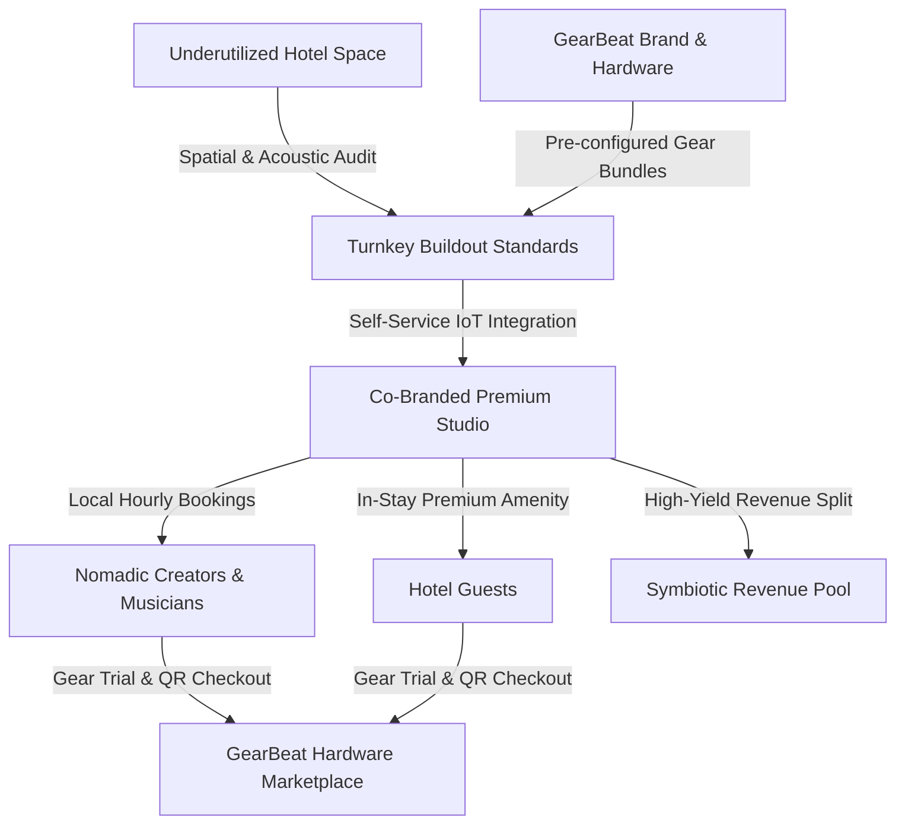
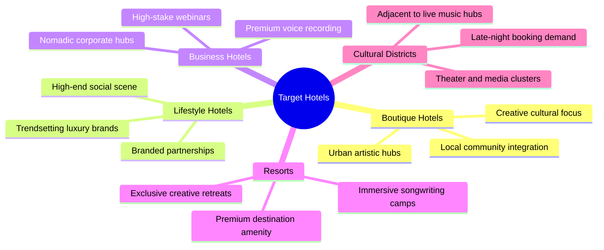
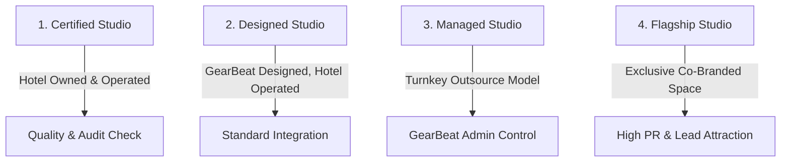

# GEARBEAT PATCH 108J — HOTEL STUDIO PROGRAM: BUSINESS MODEL & PARTNER PITCH

**Agent:** Agent 4 — Business Operations & Product Strategy  
**Status:** DRAFT / FUTURE STRATEGY ONLY  
**Date:** 2026-05-17  
**Branch:** `patch-108j-hotel-studio-business-model-partner-pitch`  
**Target File:** [GEARBEAT_PATCH_108J_HOTEL_STUDIO_PROGRAM_BUSINESS_MODEL_PARTNER_PITCH.md](file:///c:/Users/iaals/Documents/GitHub/gearbeat-V2/docs/GEARBEAT_PATCH_108J_HOTEL_STUDIO_PROGRAM_BUSINESS_MODEL_PARTNER_PITCH.md)

---

> [!NOTE]
> **Strategic Alignment Notice:** This document outlines a forward-looking strategic business model and partner pitch for the GearBeat platform. In strict compliance with security boundaries, no application code, mobile configuration, database schema, payment API, or packages have been altered. This is a strategy-level blueprint intended to establish conceptual validation before any future production implementation.

---

## 1. ONE-PAGE CONCEPT SUMMARY

The **GearBeat Hotel Studio Program** is a pioneering B2B2C turnkey business model that enables premium hotel brands to convert underutilized, low-yield square footage into professional-grade, tech-enabled recording and creative studio spaces. 

By turning empty corporate boardrooms, basement business centers, or low-occupancy guestrooms into beautiful, acoustically isolated creative hubs, hotels can tap directly into the explosive global creator economy. GearBeat acts as the end-to-end technology and logistics partner—providing acoustic construction specifications, pre-configured hardware/gear bundles, and a unified booking software engine. This program creates a prestigious cultural amenity that attracts local nomadic creators while offering in-house guests a premium, high-end entertainment experience.



---

## 2. HOTEL PROBLEM & OPPORTUNITY

Modern hospitality faces critical spatial and cultural challenges in maximizing yield per square foot while staying relevant to younger, high-net-worth traveler cohorts.

### The Problem
*   **The Death of the Business Center:** Traditional hotel business centers (equipped with standard desktop PCs, cubicles, and basic printers) sit completely empty, acting as zero-yield CapEx sinks.
*   **Volatile Room Occupancies:** Certain layouts or floor levels (such as spaces adjacent to elevator shafts, mechanical rooms, or basement spaces) suffer from persistent low-occupancy and depressed average daily rates (ADR).
*   **Homogenous Brand Experience:** Premium hotels struggle to differentiate themselves, relying on standard pool, spa, and fitness amenities that fail to capture the cultural attention of Gen Z and Millennial Nomads.

### The Opportunity
*   **The Rise of the Nomadic Creator:** The creator economy is valued at over $250 billion. Traveling musicians, podcasters, corporate voice-over artists, and social media producers are constantly on the search for professional-grade acoustic spaces while traveling.
*   **Unprecedented Spatial Yield:** Converting a standard $150/night guestroom into a rentable studio charging $75 to $200 per hour dramatically increases revenue per available room (RevPAR) and total revenue per available room (TrevPAR).
*   **Secondary Spending Drivers:** Local creators booking the hotel studio inject high-spending foot traffic directly into the hotel's high-margin secondary outlets, including lobby lounges, specialty cafes, bars, and restaurants.

---

## 3. THE GEARBEAT SOLUTION

GearBeat bridges the gap between premium hospitality real estate and the specialized world of pro-audio engineering by offering a fully managed, co-branded, turnkey studio integration framework.

```
       +-----------------------------------------------------------------+
       |                      THE GEARBEAT FRAMEWORK                     |
       +-----------------------------------------------------------------+
       |  1. ACOUSTIC SPECIFICATION: Custom STC 60 wall & door designs   |
       |  2. TECH BUNDLES: Curated, pre-calibrated pro-audio hardware     |
       |  3. PLATFORM INTEGRATION: Real-time booking, IoT access keys    |
       |  4. SHOWROOM NETWORK: In-studio QR code gear marketplace purchase|
       +-----------------------------------------------------------------+
```

1.  **Acoustic & Spatial Design Guidelines:** GearBeat provides hotels with architectural blueprints and material specifications to achieve professional-grade isolation (STC 60) and silent ambient noise floors (NC-15).
2.  **Pre-configured Hardware Bundles:** We curate, procure, and drop-ship pre-configured, calibrated hardware packages (Silver, Gold, Platinum) tailored to specific creative use cases, backed by our global pro-audio distribution partners.
3.  **Unified Booking & Access Management:** We extend our booking engine to handle hotel studio listings, providing automated check-in, real-time availability, dynamic in-stay guest discounts, and secure IoT smart access keys (NFC/PIN).
4.  **The Physical Showroom Network:** Every in-hotel studio acts as an interactive physical showroom. Creators can test out premium gear in a treated room and purchase it directly through the GearBeat Marketplace using on-site QR codes, creating an additional affiliate commission stream.

---

## 4. TARGET HOTELS

The Hotel Studio Program is structured to fit the unique brand identities and spatial configurations of five key hospitality segments:



### A. Boutique Hotels
*   **Profile:** High-design, independent properties located in trendy urban neighborhoods (e.g., citizenM, The Standard).
*   **Program Rationale:** Ideal for converting small, quirky spaces (like converted closets or basement lounges) into cozy vocal booths or high-end podcast rooms that double down on their local artistic community focus.

### B. Lifestyle Hotels
*   **Profile:** Trendsetting, upscale global hospitality brands (e.g., W Hotels, Edition, Mama Shelter).
*   **Program Rationale:** Perfect fit for larger, visually stunning "Creator Suites" or high-end music production rooms. These properties serve as prestigious hubs for social media influencers and touring DJs, utilizing the studio as a centerpiece for celebrity marketing.

### C. Business Hotels
*   **Profile:** Corporate-focused properties catering to traveling business executives and remote professionals in financial districts (e.g., Hyatt Regency, Sheraton).
*   **Program Rationale:** Focused on high-quality podcasting, professional voice-overs, and broadcast-ready webinar setups, allowing business travelers to record high-stakes media campaigns without leaving their hotel.

### D. Resorts & Wellness Retreats
*   **Profile:** Premium destination resorts located in scenic, isolated areas (e.g., Aman, Six Senses, premium coastal resorts).
*   **Program Rationale:** Positioned as exclusive "Creative Retreats" where musicians, songwriters, and authors can book week-long retreats to focus on songwriting camps and production in a distraction-free, luxurious environment.

### E. Entertainment & Cultural Districts
*   **Profile:** Hotels situated in the immediate vicinity of major arenas, concert halls, theaters, and creative clusters (e.g., hotels near Riyadh Boulevard, Dubai Opera, or Soho London).
*   **Program Rationale:** Caters directly to touring bands, theater actors, and visiting media professionals who require immediate, 24/7 access to vocal tracking and rehearsal facilities during their performance runs.

---

## 5. TARGET USERS

Our customer acquisition strategy focuses on six distinct creative and professional personas, ensuring a steady stream of bookings across different days of the week:

| Target Persona | Key Value Drivers | Core Studio Use Case |
| :--- | :--- | :--- |
| **Musicians (Touring & Local)** | Zero-latency monitoring, high-end vocal chains, complete privacy, 24/7 self-service access. | Laying down vocal overdubs, tracking instrumentals, or hosting writing sessions while traveling. |
| **Podcasters & Interviewers** | Soundproof environment, multi-microphone inputs, simple mix console, video-ready lighting sets. | Recording episodic multi-guest interviews, high-fidelity audiobooks, or solo monologues. |
| **Digital Creators & Streamers** | Dynamic RGB accent backdrops, professional video feeds, green screen setups, high-speed fiber. | Filming social media vlogs, TikTok/Reels content, gaming live-streams, and brand sponsorships. |
| **Music Producers & Engineers** | Treated room acoustics (Reflection-Free Zones), high-end monitors, MIDI controllers, analog synthesizers. | Mixing tracks, adjusting arrangements, starting new beats, and conducting final mastering runs. |
| **Voice-over Artists & Narrators** | Dry acoustic response (no room reflection), low noise floor, ultra-sensitive condenser microphones. | Recording premium commercials, localized corporate training materials, and audiobook narrations. |
| **Premium Hotel Guests** | Novel luxury experience, easy booking via hotel app, integration with guest room folio billing. | Recording a fun family podcast, testing professional music gear as a premium leisure activity. |

---

## 6. REVENUE MODEL OPTIONS

The Hotel Studio Program features six layered, highly lucrative monetization mechanisms designed to align financial incentives, de-risk CapEx, and establish reliable recurring revenue streams:

```
+---------------------------------------------------------------------------------+
|                              REVENUE MODEL MATRIX                               |
+---------------------------------------------------------------------------------+
|                                                                                 |
|  [ Revenue Share ]       =======> 60% Hotel / 40% GearBeat Booking Split        |
|  [ Setup & Design Fee ]  =======> Upfront CapEx consultation charge             |
|  [ Equipment Margin ]    =======> Procurement markup on certified audio bundles |
|  [ Monthly SaaS Fee ]    =======> Software maintenance & monitoring subscription|
|  [ Booking Commission ]  =======> Marketplace lead generation fee (10% - 15%)   |
|  [ Certification Fee ]   =======> Annual acoustic & calibration validation audit|
|                                                                                 |
+---------------------------------------------------------------------------------+
```

### A. Collaborative Revenue Share
*   **Mechanic:** Hourly booking revenues are split directly between the hotel and GearBeat (e.g., **60% Hotel / 40% GearBeat** under the standard partnership model).
*   **Benefit:** Strongly aligns incentives. The hotel provides the physical space and daily housekeeping, while GearBeat handles marketing, support, and booking technology.

### B. Upfront Setup & Design Fee
*   **Mechanic:** A flat architectural design and acoustic consultation fee (ranging from **$2,500 to $7,500** depending on spatial complexity) charged to the hotel.
*   **Benefit:** Covers GearBeat's cost for structural acoustic modeling, wiring schematics, and customized interior branding design before physical work begins.

### C. Equipment Package Markup Margin
*   **Mechanic:** GearBeat buys professional studio hardware in bulk directly from manufacturers and sells pre-packaged, pre-configured bundles to the hotel at a healthy retail margin.
*   **Benefit:** Generates immediate upfront product sales revenue, while providing hotels with significant procurement savings compared to standard retail pricing.

### D. Recurring Monthly Management SaaS Fee
*   **Mechanic:** A flat monthly subscription fee (e.g., **$199 to $399 per studio room**) for properties operating under the self-owned SaaS model (Model 2).
*   **Benefit:** Provides predictable, highly scalable recurring software revenue, covering real-time diagnostic monitoring, IoT access key routing, and database hosting.

### E. Marketplace Booking Commission
*   **Mechanic:** A standard **10% to 15% transaction commission** charged to the hotel for bookings originated directly through the public GearBeat Marketplace.
*   **Benefit:** Incentivizes the hotel's local marketing efforts; bookings made directly via the hotel's own website/PMS incur zero lead-generation commissions.

### F. Annual Certification & Calibration Fee
*   **Mechanic:** An annual fee (e.g., **$990 / year**) for physical acoustic audits, dynamic frequency room tuning, microphone capsule detailing, and renewal of the co-branded "GearBeat Certified" status.
*   **Benefit:** Guarantees platform quality control while establishing an ongoing professional services revenue stream.

---

## 7. PARTNERSHIP MODELS

To accommodate the varying operational structures, capital expenditure (CapEx) appetites, and risk thresholds of different hospitality operators, the program defines four structured partnership frameworks:



### 1. GearBeat Certified Hotel Studio (SaaS Model)
*   **Spatial & CapEx Responsibility:** The hotel funds all acoustic construction and purchases the equipment package directly.
*   **Operational Scope:** The hotel operates the space entirely. GearBeat simply conducts the acoustic audit, grants the "Certified" listing badge, and lists the room on the GearBeat booking network.
*   **Financial Split:** **85% Hotel / 15% GearBeat** booking transaction split + monthly SaaS subscription fee.

### 2. GearBeat Designed Studio (Standard Model)
*   **Spatial & CapEx Responsibility:** The hotel funds the physical room renovation. GearBeat provides the full architectural blueprint, acoustic design packages, and leases/supplies the pre-configured hardware bundle.
*   **Operational Scope:** The hotel handles daily room cleaning, guest check-in, and smart locker verification. GearBeat manages the digital booking flow and 24/7 remote technical support.
*   **Financial Split:** **60% Hotel / 40% GearBeat** gross revenue split. No monthly SaaS fees.

### 3. GearBeat Managed Studio (Outsource Model)
*   **Spatial & CapEx Responsibility:** The hotel allocates the room and funds baseline spatial cleaning. GearBeat supplies all acoustic treatments, builds the decoupled walls, and installs all tech.
*   **Operational Scope:** GearBeat manages the space entirely. We coordinate specialized cleaning schedules, handle dynamic hourly pricing, manage remote customer onboarding, and handle hardware maintenance.
*   **Financial Split:** **40% Hotel / 60% GearBeat** gross revenue split.

### 4. GearBeat Flagship Hotel Studio (Strategic Showcase)
*   **Spatial & CapEx Responsibility:** Jointly funded high-CapEx conversion of a prestigious hotel penthouse or luxury executive suite (e.g., at a selected W Hotel in Riyadh or Dubai).
*   **Operational Scope:** Highly customized, visually stunning "Platinum Tier" production suite, podcasting parlor, and social media studio. Includes bespoke interior brand art and custom physical hardware cabinets.
*   **Financial Split:** Custom lease-back agreement with occupancy guarantees, paired with a dynamic **50% / 50% revenue split**, serving as a prime regional marketing showcase for both brands.

---

## 8. PILOT PROPOSAL (LIGHTHOUSE PILOT)

To prove economic viability and operational stability before committing major technical or engineering resources to build extensive automated PMS integrations, we propose a lightweight **90-Day Lighthouse Pilot**:

```
                 LIGHTHOUSE PILOT TIMELINE (90 DAYS)
  
  [Days 1 - 30]          [Days 31 - 45]          [Days 46 - 75]         [Days 76 - 90]
  -------------          --------------          --------------         --------------
  │ Room Buildout        │ Soft Launch           │ Dynamic Booking      │ Cohort Review
  │ Manual Setup         │ Concierge Check-in    │ Creator Outreach     │ Go/No-Go Decision
  │ Acoustic Calibration │ Local Guest Trial     │ Metrics Validation   │ Final Handoff
```

### A. Pilot Parameters
*   **Scale:** **1 Selected Partner Hotel** (highly visible boutique or lifestyle property in Riyadh or Dubai).
*   **Capacity:** **1 Single Studio Room** (specifically, a mid-tier "Podcast Room" & "Vocal Booth" combo in a converted low-occupancy basement space or business center).
*   **Duration:** **90 Days** from physical activation.

### B. Manual Booking Operations First
To avoid premature backend development and database schema changes, the pilot will operate using simplified, manual concierge workflows:
1.  **Manual Web Listing:** The pilot studio is listed on a dedicated, static landing page with a basic embedded scheduler widget (e.g., Calendly or simple manual booking form).
2.  **Concierge Booking Intake:** When a booking is submitted, the GearBeat support team receives the reservation, processes the charge manually via Stripe invoice, and coordinates directly with the hotel's front desk.
3.  **Physical Key Delivery:** The guest checks in at the hotel's front desk. The receptionist issues a standard physical hotel room keycard programed with access to the studio room.
4.  **Housekeeping Inspections:** After each session, the front desk alerts housekeeping via walkie-talkie to conduct a visual equipment verification checklist (using a printed visual laminated sheet) and clean the room before the next slot.

---

## 9. REQUIRED EVIDENCE BEFORE IMPLEMENTATION

To transition the Hotel Studio Program from a strategic strategy document to a live production roadmap (Sprints 14+), the following validation checkpoints must be met and logged:

1.  **3 Signed B2B Letters of Intent (LOIs):** Formal, non-binding commitments from three major hospitality brands indicating a willingness to participate in the program and fund spatial acoustic renovations.
2.  **1 Completed Prototype Acoustic Test:** Physical testing of the proposed decoupled wall build in a mock hotel environment, confirming a real-world isolation score of at least **STC 58** and an air HVAC noise floor below **NC-18**.
3.  **Verified Hardware Distribution Agreements:** Signed distributor terms with major brand partners (e.g., Sennheiser, Neumann, Focusrite, Universal Audio) confirming wholesale purchase margins of at least **25%** for GearBeat.
4.  **Local Creator App Appetite Survey:** Quantitative survey responses from at least **150 active creators** (musicians, podcasters, producers) in the target city, confirming that:
    *   At least **70%** are willing to pay **$75/hour** or more for an acoustically treated lifestyle workspace.
    *   At least **50%** would book a hotel-based studio over a traditional commercial studio due to location convenience and 24/7 availability.

---

## 10. RISKS & MITIGATION MATRIX

```
+---------------------------------------------------------------------------------+
|                                 RISK ANALYSIS MATRIX                            |
+---------------------------------------------------------------------------------+
|                                                                                 |
|   [RISK]                                     [MITIGATION]                       |
|   1. Acoustic Leakage / Bleed  ===========> Decoupled double-stud, STC 60 req.  |
|   2. Equipment Theft / Damage  ===========> Smart RFID Cabinet, $500 CC hold    |
|   3. Hotel Operational Friction ===========> Laminated checklists, auto-diagnose|
|   4. Hardware Maintenance      ===========> Daily ultrasonic diagnostic tones   |
|   5. Adjacent Noise Complaints ===========> Hard db limits, floating floor specs|
|   6. Audio Routing Support     ===========> Tablet guided setup, 1-click reset  |
|                                                                                 |
+---------------------------------------------------------------------------------+
```

### Risk 1: Construction Complexities & Acoustic Bleed
*   **Risk Description:** Acoustic isolation fails, allowing structural bass frequencies to vibrate adjacent guestrooms, resulting in severe customer complaints and refunds.
*   **Mitigation Strategy:** Enforce absolute decoupled "room-within-a-room" construction standards, using visco-elastic damping compounds (Green Glue), double stud cavities packed with high-density Rockwool, and decoupling resilient channels. No studio construction is certified without an independent acoustic pressure sweep test.

### Risk 2: High-Value Equipment Theft & Vandalism
*   **Risk Description:** Guests walk away with premium $3,000 Neumann microphones, or physically abuse delicate hardware.
*   **Mitigation Strategy:** House all loose, high-value gear inside an active, wall-mounted glass locker monitored by active RFID tag sensors. The session cannot close or begin until all tagged assets are scanned inside. Charge a mandatory pre-authorization security hold of **$500** on day-pass cards.

### Risk 3: Operational Friction for Hotel Staff
*   **Risk Description:** Hotel front-desk agents or housekeepers are overwhelmed by complex audio technicalities, leading to negative hotel partner reviews.
*   **Mitigation Strategy:** Simplify the operational touchpoints. Housekeeping only conducts a binary visual audit (is the mic physically on the stand?). Use a specialized single-button power sequencer to turn all studio gear on or off safely, bypassing manual power buttons.

### Risk 4: Equipment Maintenance & Wear-and-Tear
*   **Risk Description:** Condenser capsules degrade due to humidity, speaker cones blow out due to extreme volume, and cables short circuit.
*   **Mitigation Strategy:** Install hard sound limiters (e.g., active volume caps in the DAW or audio interface) to protect monitors. Program an automated daily diagnostic script that runs every morning at 4:00 AM, playing an ultrasonic tone through the speakers and capture via the mics to verify frequency response, instantly reporting abnormalities to GearBeat.

### Risk 5: Noise Complaints from Hotel Guests
*   **Risk Description:** High-energy rap vocal recording or drum beat-making sessions disturb sleeping guests in the rooms above or below.
*   **Mitigation Strategy:** Require a floating floor setup (concrete slab over acoustic rubber pads) for any studio designated as a "Music Production Suite," and configure software-level decibel limiters that alert the guest tablet if sound thresholds are exceeded for more than 2 minutes.

### Risk 6: Technical Booking & Audio Setup Support
*   **Risk Description:** Non-technical guests cannot figure out how to configure the audio interface, select the microphone input, or use the DAW, clogging up the support line.
*   **Mitigation Strategy:** Integrate a specialized, interactive touch-tablet on the studio wall displaying a simplified "1-Click Setup Guide". Provide a global "Factory Reset Routing" button that instantly restores default input/output drivers across the entire DAW system via automated script, resolving 95% of common user routing errors.

---

## 11. STRATEGIC IMPLEMENTATION BLUEPRINT

This blueprint outlines the phased plan for moving the Hotel Studio Program from its current conceptual phase to a full production reality once the pilot phase successfully concludes.

```
Conceptual Validation (Patch 108J) --> *CURRENT STATE COMPLETE*
  │
  ├──► Phase 2: Partner Outreach & Feasibility Audits (Sprints 12 - 13)
  │     ├── Present B2B Pitch Deck to 3 selected pilot hotels in Riyadh & Dubai
  │     ├── Conduct physical spatial and acoustic isolation scans on proposed rooms
  │     └── Obtain signed pilot Letters of Intent (LOIs)
  │
  ├──► Phase 3: Technical Planning & SQL Implementation (Sprints 14 - 15)
  │     ├── Merge database schema extensions (hotel_partners, hotel_studios tables)
  │     ├── Implement server-side check-in status validation and discount routing
  │     └── Develop smart access IoT API integrations for keycard PIN routing
  │
  └──► Phase 4: Commercial Scale & Wholesale Partnership (Sprint 20+)
        ├── Scale Certified network to 15+ high-occupancy hotels across KSA and UAE
        └── Enable wholesale gear check-out directly via physical studio QR links
```

---

**THIS CONCLUDES THE STRATEGIC BUSINESS MODEL AND PARTNER PITCH OUTLINE FOR THE GEARBEAT HOTEL STUDIO PROGRAM. NO CODE MUTATIONS OR DATABASE CHANGES HAVE BEEN APPLIED TO THE CODEBASE.**
