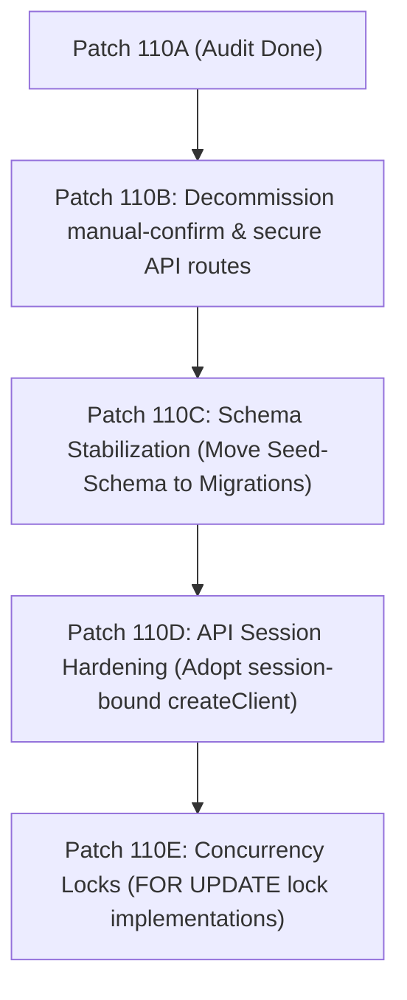

# GEARBEAT PATCH 110A — SUPABASE CONNECTION / DATA REALITY AUDIT

## 1. Executive Summary

This audit establishes a "ground truth" verification of the GearBeat V2 database topology, environment variables, Supabase SDK client usage, and real-time backend/frontend data mappings.

While the data layer is robust—leveraging PostgreSQL Row Level Security (RLS), custom database functions (RPCs), and atomic row locking—our investigation has uncovered significant functional "shortcuts" built for local/deferred testing phases (e.g. manual payment confirmation API routes) and potential RLS/Service Role usage exposures that represent high-severity security blockers.

This document inventories active connection clients, evaluates module-by-module data reality, exposes security risks, and establishes a safe engineering roadmap for subsequent Sprint 110 hardening tasks.

---

## 2. Supabase Client Architecture

We identified and audited four central database interface handlers inside the [lib/supabase/](file:///c:/Users/iaals\Documents/GitHub/gearbeat-V2/lib/supabase) directory:

1.  **Public Browser Client** (`client.ts`):
    *   *Implementation*: `createBrowserClient(NEXT_PUBLIC_SUPABASE_URL, NEXT_PUBLIC_SUPABASE_ANON_KEY)`
    *   *Usage*: Confined strictly to client-side react components (e.g. `SignupClient`, password update screens) to manage sessions, password resets, and simple read operations subject to RLS.
2.  **Server Client** (`server.ts`):
    *   *Implementation*: `createServerClient` utilizing cookies to extract and synchronize authorization tokens.
    *   *Usage*: Server Components (e.g. listing pages, studio layouts) and Next.js Server Actions to securely perform data operations under the currently authenticated user's session.
3.  **Privileged Admin Client** (`admin.ts`):
    *   *Implementation*: Direct `createClient` utilizing `SUPABASE_SERVICE_ROLE_KEY` with autocommit enabled.
    *   *Usage*: Cron jobs, backend-only API hooks, and audit loggers. **Bypasses all PostgreSQL Row Level Security (RLS) rules.**
4.  **Session Middleware** (`middleware.ts`):
    *   *Implementation*: Intercepts cookies and runs `supabase.auth.getUser()` on every request/response cycle to guarantee session expiration states are verified prior to page loads.

---

## 3. Environment Variables Audit

The platform utilizes a structured variable list as shown in [.env.example](file:///c:/Users/iaals/Documents/GitHub/gearbeat-V2/.env.example):

*   `NEXT_PUBLIC_SUPABASE_URL`: Public database endpoint URL. (Publicly exposed).
*   `NEXT_PUBLIC_SUPABASE_ANON_KEY`: Public client-side token for executing RLS-enforced queries. (Publicly exposed).
*   `SUPABASE_SERVICE_ROLE_KEY`: Secret master key that grants full database write/read access. **Must NEVER be loaded in browser contexts or committed to repository trees.**
*   `NEXT_PUBLIC_SITE_URL`: Set to `http://localhost:3000` locally, dynamically replaced by Vercel deployment variables to handle password-reset and callback redirections.

---

## 4. Module-by-Module Data Reality Assessment

We audited the core pages and directories to determine whether they pull live PostgreSQL tables or display static mock values:

### A. Customer Auth & Profiles (`app/login/`, `app/signup/`, `app/profile/`)
*   **Reality Status**: **100% Dynamic / Live**.
*   **Queries**: Uses client-side and server-side clients to interface with Supabase Auth. User profile updates directly synchronize with the `public.profiles` table.

### B. Studios Directory (`app/studios/`)
*   **Reality Status**: **100% Dynamic / Live**.
*   **Queries**:
    *   Fetches from `public.studios` where status is `approved`, `verified = true`, `booking_enabled = true`, and owner compliance is validated.
    *   Leverages advanced filtering parameters against the active list.
    *   Studio detail slugs (`app/studios/[slug]/page.tsx`) query `studios`, `studio_availability_rules`, and related tables live.

### C. Marketplace (`app/marketplace/`)
*   **Reality Status**: **100% Dynamic / Live**.
*   **Queries**:
    *   Fetches from `marketplace_categories` (filtered by active status and sorted).
    *   Fetches from `marketplace_brands` (filtered by active status).
    *   Fetches from `marketplace_products` (including price thresholds, stock states, and vendor badges).

### D. Audio Services (`app/services/`)
*   **Reality Status**: **Dynamic / Live**.
*   **Queries**: Queries verified audio service provider rows and categorizations.

### E. Tickets & Experiences (`app/tickets/`)
*   **Reality Status**: **Mock / Static**.
*   **Queries**: No active Supabase client calls. Renders mock ticket items for local visual demo parity.

### F. Academy & Masterclasses (`app/academy/`)
*   **Reality Status**: **Mock / Static**.
*   **Queries**: No active database hooks. Renders offline program layouts.

### G. GearBeat Certified (`app/gearbeat-certified/`)
*   **Reality Status**: **Hybrid**.
*   **Queries**: The main Certified index landing is static copy. However, individual certificate verification slug pages (`app/gearbeat-certified/[slug]/page.tsx`) query `certified_studios` live.

### H. Partner Landing (`app/partner/`)
*   **Reality Status**: **Static / Landing Only**.
*   **Queries**: The landing is static marketing assets. However, the onboardingextranet portal dynamic wizard fields save to `provider_leads`.

### I. Admin & Partner Extranet Views (`app/portal/`, `app/admin/`)
*   **Reality Status**: **Dynamic / Live**.
*   **Queries**: Queries leads pipelines (`provider_leads`), product inventories, payout request reports, and commission overrides from PostgreSQL.

---

## 5. Database Schema & Migration Observations

Auditing all 22+ migration files under [supabase/migrations/](file:///c:/Users/iaals/Documents/GitHub/gearbeat-V2/supabase/migrations) revealed highly sophisticated table structures:
*   **Table Families**:
    *   *Core*: `studios`, `studio_availability_rules`, `studio_availability_exceptions`.
    *   *Bookings*: `bookings`, `provider_leads`.
    *   *Marketplace*: `marketplace_products`, `marketplace_product_variants`, `marketplace_carts`, `marketplace_cart_items`, `marketplace_orders`, `marketplace_order_items`.
    *   *Payments*: `checkout_payment_sessions`, `payment_transactions`, `coupon_redemptions`.
    *   *Finance*: `finance_ledger`, `commission_settings`, `settlement_batches`, `finance_audit_log`.
    *   *Security*: `trusted_devices`.
*   **Seed Hazard**:
    *   `supabase/seed.sql` inserts standard test studio parameters and day-of-week rules. However, it also executes structural commands like `CREATE TABLE IF NOT EXISTS studio_boost_subscriptions` and `ALTER TABLE provider_leads ADD COLUMN...`. 
    *   **Warning**: Performing schema mutations in seed scripts creates a critical environment drift risk and breaks standard automated migration pipelines.

---

## 6. Access Security & Service Role Risk Analysis

### A. High Risk: Over-Reliance on `createAdminClient`
*   **Observation**: Standard public-facing API endpoints (e.g. `bookings/create`, `cart`) and Server Components utilize `createAdminClient()` (Service Role) to bypass RLS.
*   **Risk**: This represents an architectural "blind trust" vulnerability. If an API route fails to run `supabase.auth.getUser()` and verify the session user prior to switching context, **any anonymous browser client can execute queries that mutate other users' data.** RLS is ignored, leaving backend routes as the sole validator.

### B. Critical Blocker: Manual Payment Confirmation Hook
*   **Observation**: `app/api/checkout/manual-confirm/route.ts` allows marking checkout sessions as `paid` under deferred manual testing parameters.
*   **Risk**: If this route remains active in production, any visitor can send a manual session ID post request to flag their shopping carts or bookings as paid without completing real-world gateway transactions.

### C. Concurrency: Inventory Race Conditions
*   **Observation**: The product checkout pipeline queries available product quantities, but does not enforce atomic table-locks during the purchase execution.
*   **Risk**: If two clients check out the same final in-stock product simultaneously, both queries can pass the validation check, resulting in negative inventory values or double-booking discrepancies.

---

## 7. Recommended Safe Implementation Sequence for Phase 110B+

To systematically secure the platform prior to production commercial activities, we recommend the following chronological patch order:

1.  **Patch 110B — API Decommissioning & Gateway Lock**:
    *   Decommission `/api/checkout/manual-confirm` routes for non-admin profiles. 
    *   Gate manual confirmations strictly under authenticated administrator role guards.
2.  **Patch 110C — Database Schema Parity Stabilization**:
    *   Move structural SQL mutations (like creating `studio_boost_subscriptions` and altering columns) out of `seed.sql` and into formal migration files under `supabase/migrations/` to guarantee clean deployment baselines.
3.  **Patch 110D — API Route Session Hardening**:
    *   Refactor non-privileged API routes to utilize session-aware `createClient` (Subject to RLS) instead of service-role `createAdminClient`, reducing security vulnerability vectors.
4.  **Patch 110E — Concurrency & Inventory Race Mitigation**:
    *   Integrate select-for-update transaction locks in order checkout and booking creation actions to prevent race conditions on low-inventory items or double-booked slots.
