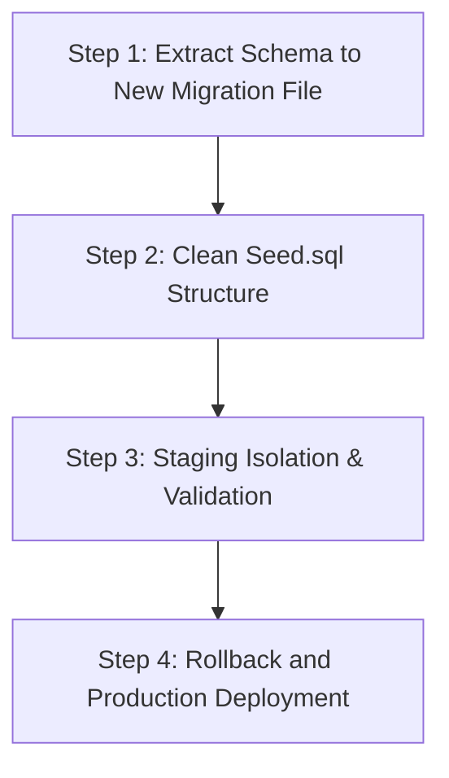

# GEARBEAT PATCH 110C — SEED SQL / SCHEMA DRIFT AUDIT & MIGRATION PLAN

## 1. Overview & Objectives

The primary objective of **Patch 110C** is to perform a strict, documentation-only audit of the database schema configuration state, specifically targeting seed structure dependencies, database migrations, and structural schema drift risks.

This is a **strategic and audit-only patch**. It does not perform SQL executions, remote schema alterations, Supabase CLI operations, or modifications to active database scripts. It acts as a safety gate for organizing the serialization of subsequent migration tasks.

---

## 2. Seed SQL Analysis & Overlaps

We inspected [supabase/seed.sql](file:///c:/Users/iaals/Documents/GitHub/gearbeat-V2/supabase/seed.sql) and cross-referenced it with [docs/GEARBEAT_SQL_MASTER_CONSOLIDATION_REVIEW.md](file:///c:/Users/iaals/Documents/GitHub/gearbeat-V2/docs/GEARBEAT_SQL_MASTER_CONSOLIDATION_REVIEW.md).

### A. Current Seed.sql Usage
*   **Intended Role**: Sets up basic static parameters and test rows (e.g. "Studio One Riyadh" / "استوديو ون الرياض") and a standard 7-day hourly availability schedule template.
*   **Discovered Reality**: Includes structural table creation, row-level security policies, and column altering scripts that belong strictly in database migrations.

### B. Structural Non-Seed SQL Code Found in Seed.sql
1.  **Boost System V2 Table Creation** (Lines 76–94):
    ```sql
    CREATE TABLE IF NOT EXISTS studio_boost_subscriptions (
      id UUID PRIMARY KEY DEFAULT gen_random_uuid(),
      studio_id UUID NOT NULL REFERENCES studios(id) ON DELETE CASCADE,
      owner_auth_user_id UUID NOT NULL,
      base_commission_percent DECIMAL(5,2) NOT NULL DEFAULT 15.00,
      boost_commission_percent DECIMAL(5,2) NOT NULL DEFAULT 0.00,
      total_commission_percent DECIMAL(5,2) GENERATED ALWAYS AS 
        (base_commission_percent + boost_commission_percent) STORED,
      duration_days INTEGER NOT NULL CHECK (duration_days IN (7, 14, 30)),
      starts_at TIMESTAMPTZ NOT NULL DEFAULT NOW(),
      ends_at TIMESTAMPTZ GENERATED ALWAYS AS 
        (starts_at + (duration_days || ' days')::INTERVAL) STORED,
      status TEXT DEFAULT 'active' CHECK (status IN ('active', 'expired', 'cancelled')),
      terms_accepted BOOLEAN DEFAULT false,
      terms_accepted_at TIMESTAMPTZ,
      created_at TIMESTAMPTZ DEFAULT NOW()
    );
    ```
2.  **Row-Level Security Policies** (Lines 96–112):
    ```sql
    ALTER TABLE studio_boost_subscriptions ENABLE ROW LEVEL SECURITY;
    CREATE POLICY "Owner can manage own boosts" ...
    CREATE POLICY "Public can read active boosts" ...
    ```
3.  **Provider Leads Schema Expansion** (Lines 114–117):
    ```sql
    ALTER TABLE provider_leads 
    ADD COLUMN IF NOT EXISTS signed_contract_url TEXT,
    ADD COLUMN IF NOT EXISTS commission_percent INTEGER DEFAULT 15;
    ```

---

## 3. Schema Drift & Deployment Risks

*   **Broken Migration Timeline**: 
    Developers or CI engines spinning up a clean development baseline using `supabase db reset` or applying raw migrations will **not** have the `studio_boost_subscriptions` table or the expanded `provider_leads` columns unless they also invoke the seed file.
*   **Seed Corruption**: 
    If seed execution fails (e.g., due to missing foreign keys or duplicate constraint conflicts), subsequent environment boots fail, making local developer onboarding unstable.
*   **Duplicate Policy Collisions**: 
    Executing policies using inline check statements (e.g. `IF NOT EXISTS SELECT 1 FROM pg_policies`) directly inside seed scripts presents critical performance bottlenecks during local database bootstrapping.

---

## 4. Existing Migrations & Draft Overlaps

*   **Active Migrations List**: 
    We observed **22 active migration files** under [supabase/migrations/](file:///c:/Users/iaals/Documents/GitHub/gearbeat-V2/supabase/migrations), cleanly mapping out certified tiers, finance audit tables, atomic reservation structures, and hourly calendar rules.
*   **Overlap with SQL Drafts**: 
    Draft consolidation files (`docs/sql-drafts/` and `docs/GEARBEAT_SQL_MASTER_CONSOLIDATION_REVIEW.md`) have proposed a master inventory of 100+ tables. Moving `studio_boost_subscriptions` and `provider_leads` extensions to formal migrations aligns with Sprint 2 (Studios & Bookings) and Sprint 7 (Operations & Legal) migration maps.

---

## 5. What must NOT be Executed Now

> [!CAUTION]
> **STRICT SAFETY GATE ACTIONS**:
> *   Do **NOT** execute structural statements or edit SQL schemas on the live remote database.
> *   Do **NOT** run any Supabase CLI tools (e.g. `supabase db push`, `supabase db reset`) against production profiles during this audit phase.
> *   Do **NOT** manually edit `supabase/seed.sql` to clean it up until a dedicated migration file is created.

---

## 6. Safe Future Migration Serialization Plan

We recommend executing subsequent database schema hardening tasks in the following strict order:



1.  **Step 1: Extract Schema Mutations**:
    *   Create a formal migration file `supabase/migrations/patch_91_studio_boost_and_provider_leads.sql`.
    *   Move the table creation `studio_boost_subscriptions`, the policy definitions, and the `ALTER TABLE provider_leads` column extensions into this file.
2.  **Step 2: Pure Seed Cleanup**:
    *   Remove lines 76–118 from `supabase/seed.sql` so that it contains **only** pure INSERT rows.
3.  **Step 3: Staging Isolation**:
    *   Initialize an isolated staging Supabase instance.
    *   Run `supabase db reset` locally and push to staging to ensure everything compiles cleanly.
4.  **Step 4: Backup, Rollback & Cutover**:
    *   Take a full SQL pg_dump backup of the production database before cutover.
    *   Apply the new migration sequence and verify table statuses.

---

## 7. Recommended Next Patch

**Patch 110D — API Session Hardening**
*   *Objective*: Refactor public-facing API routes to adopt session-bound `createClient` instances instead of direct `createAdminClient` (service role) context switching, locking in Row Level Security boundaries across all primary user interaction points.
