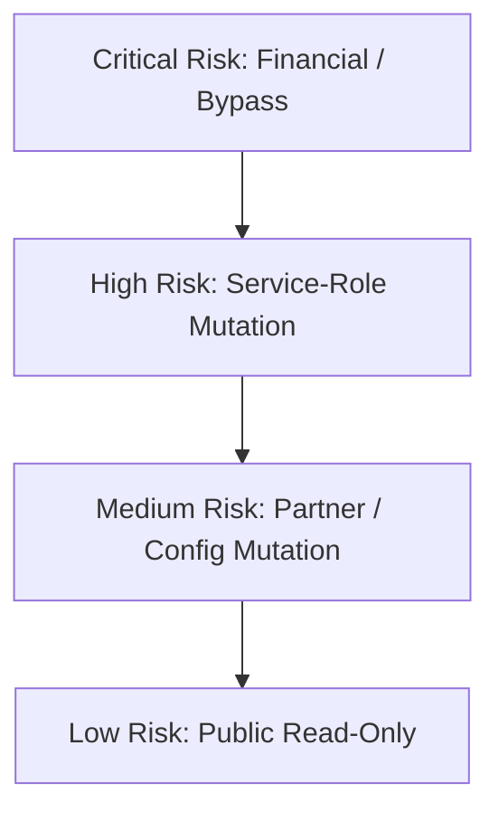
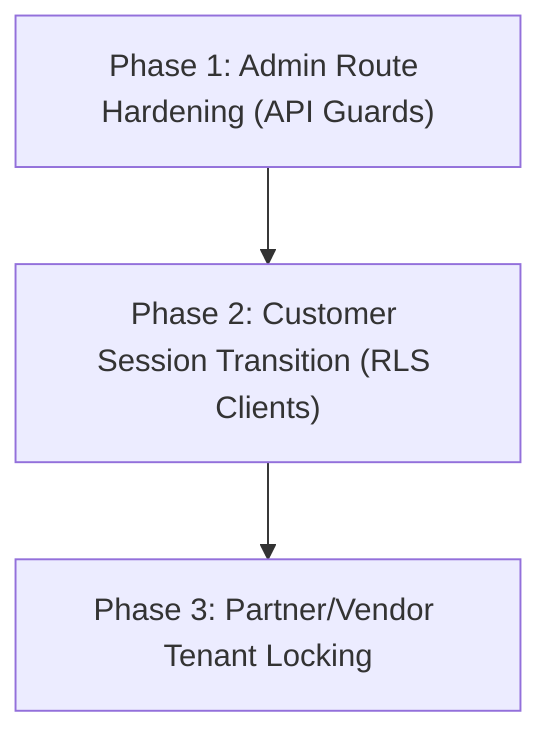

# GEARBEAT PATCH 110D-A — API SESSION HARDENING AUDIT

## 1. Executive Summary

As identified in the **Patch 110A Connection Audit**, the GearBeat V2 API backend features multiple public-facing mutation routes that execute database transactions using the privileged `createAdminClient()` (Service Role Client). This bypasses PostgreSQL Row Level Security (RLS), relying entirely on API-level session checks to prevent unauthorized data access or mutation.

This audit systematically reviews all active Next.js API route templates, categorizes their clients (Service Role vs Session-Bound), calculates risk indexes, and outlines a comprehensive roadmap for transition to session-authenticated clients under strict RLS boundaries.

---

## 2. API Routes Inspected

We audited the active HTTP endpoints under the [app/api/](file:///c:/Users/iaals/Documents/GitHub/gearbeat-V2/app/api) directory:

| API Directory Path | Primary Action | HTTP Method | Data Mutation | Public Read-Only |
| :--- | :--- | :--- | :--- | :--- |
| `/api/admin/loyalty/adjust-points` | Adjust points balance | `POST` | Yes | No |
| `/api/admin/settlements/create` | Generate payout batches | `POST` | Yes | No |
| `/api/admin/settlements/update-status` | Update settlement state | `POST` | Yes | No |
| `/api/checkout/manual-confirm` | Lock/Manual check (Locked) | `POST` | No (410) | No |
| `/api/cron/bookings/cleanup-stale` | Prune expired bookings | `POST`/`GET` | Yes | No |
| `/api/documents/upload` | Secure partner doc uploads | `POST` | Yes | No |
| `/api/marketplace/checkout/create-order` | Converted carts to orders | `POST` | Yes | No |
| `/api/marketplace/cart/add` | Add items to cart | `POST` | Yes | No |
| `/api/marketplace/cart/update` | Adjust cart quantites | `POST` | Yes | No |
| `/api/marketplace/cart/remove` | Delete item from cart | `POST` | Yes | No |
| `/api/otp/send` | Request phone validation SMS | `POST` | Yes | No |
| `/api/otp/verify` | Validate OTP code | `POST` | Yes | No |
| `/api/owner/bookings/update-status` | Confirm/Cancel hourly bookings | `POST` | Yes | No |
| `/api/owner/studios/availability/update`| Modify operational calendars | `POST` | Yes | No |
| `/api/portal/studios/availability/update`| Modify availability rules | `POST` | Yes | No |
| `/api/payout-requests/create` | Request payout allocations | `POST` | Yes | No |
| `/api/studios/bookings/create` | Place atomic reservation requests | `POST` | Yes | No |
| `/api/tap/create-charge` | Trigger credit card checkout | `POST` | Yes | No |
| `/api/tap/webhook` | Process payment status callbacks | `POST` | Yes | No |
| `/api/vendor/products/bulk-upload` | Import vendor items catalog | `POST` | Yes | No |
| `/api/cities` | List operational cities | `GET` | No | Yes |
| `/api/countries` | List active GCC countries | `GET` | No | Yes |
| `/api/studios/availability/slots` | Fetch free booking hours | `GET` | No | Yes |

---

## 3. Client & Authorization Reality Matrix

We analyzed client creation and session check rules across all audited paths:

### A. Routes Using `createAdminClient()` (Service Role)
These routes bypass Row Level Security to write or select administrative data:
*   `/api/marketplace/checkout/create-order`
*   `/api/studios/bookings/create`
*   `/api/owner/bookings/update-status`
*   `/api/admin/settlements/create`
*   `/api/cron/bookings/cleanup-stale`
*   `/api/documents/upload` (Accesses secure storage buckets)

### B. Routes Using `createClient()` (Session-Bound)
These routes query the database under standard user session limitations:
*   `/api/marketplace/cart`
*   `/api/notifications`
*   `/api/favorites/toggle`

### C. Routes Requiring Strict Session Checks (`auth.getUser()`)
These routes properly extract the authenticated user identity before processing:
*   `/api/marketplace/checkout/create-order`
*   `/api/studios/bookings/create`
*   `/api/payout-requests/create`
*   `/api/vendor/products/bulk-upload`
*   `/api/owner/bookings/update-status`

---

## 4. Security Risk Index

We evaluated risk parameters for each operational route:

### 🔴 Critical Risk
*   **Target**: `/api/checkout/manual-confirm` (*Decommissioned & locked down in Patch 110B*) and `/api/admin/loyalty/adjust-points`.
*   **Vulnerability**: Financial bypass or credit generation. Bypasses RLS. Requires absolute administrator role validation (`finance_admin`).

### 🟠 High Risk
*   **Targets**: `/api/studios/bookings/create` and `/api/marketplace/checkout/create-order`.
*   **Vulnerability**: Public mutation endpoints that create core billing records. Re-exposing these without robust `getUser()` session mapping would allow unauthenticated data injection.

### 🟡 Medium Risk
*   **Targets**: `/api/owner/bookings/update-status`, `/api/vendor/products/bulk-upload`, `/api/otp/verify`.
*   **Vulnerability**: Partner/Vendor config alterations. Requires strict validation of tenant ownership (e.g. verifying that a vendor actually owns the product they are updating).

### 🟢 Low Risk
*   **Targets**: `/api/cities`, `/api/countries`, `/api/studios/availability/slots`.
*   **Vulnerability**: Public read-only lookups subject to zero mutation vulnerabilities.

---

## 5. Architectural Transformation Plan

To secure the platform, we categorize the recommended client transitions:

### A. Must Move to Session-Bound `createClient()` (RLS Restored)
*   **Cart Actions** (`/api/marketplace/cart/*`): Users should only read/write their own cart items. RLS policies on `marketplace_carts` automatically handles isolation.
*   **Favorites & Likes** (`/api/favorites/*`): User-level toggling should be fully session-bound.
*   **Availability Slot Requests**: Ensure queries adhere to standard public RLS rules.

### B. Must Remain Service-Role Based (`createAdminClient()` + Strict Guards)
*   **Admin Settlements** (`/api/admin/settlements/*`): System-wide payout calculations and ledger auditing must bypass tenant blocks but are restricted strictly to the `super_admin` or `finance_admin` roles.
*   **Cron Cleansers** (`/api/cron/*`): System-triggered stale bookings cleanup runs without a user context. Must be verified via a strong `CRON_SECRET` headers gate.
*   **Third-Party Webhooks** (`/api/tap/webhook`): Callbacks from credit card gateways lack a browser session. Must be guarded by secure IP/Header validation tokens.

### C. Gated under Specific Role Policies
*   **Customer Session Gate**: `/api/marketplace/checkout/create-order`
*   **Partner/Studio Session Gate**: `/api/owner/bookings/update-status`
*   **Vendor Session Gate**: `/api/vendor/products/bulk-upload`

---

## 6. What must NOT be Changed Now

> [!WARNING]
> **COMPILATION & TRANSACTION DANGER**:
> *   Do **NOT** alter `/api/studios/bookings/create` or `/api/marketplace/checkout/create-order` client configurations until Postgres database schema structures and atomic RPC locking functions (such as `create_studio_booking_v1`) are fully verified in the local staging sandbox.
> *   Transitioning these core tables prematurely will break checkout pipelines.

---

## 7. Recommended Safe Implementation Sequence

1.  **Phase 1 — Admin Route Hardening**:
    *   Enforce absolute administrator role checking (`isAdminRole`) across all `/api/admin/*` endpoints to isolate administrative tools.
2.  **Phase 2 — Customer Session Transition**:
    *   Refactor cart management and favorites endpoints to leverage session-bound `createClient` rather than admin clients, validating RLS policies.
3.  **Phase 3 — Partner/Vendor Tenant Locking**:
    *   Introduce strict membership checks (`partner_accounts` lookup) in all `/api/vendor/*` and `/api/owner/*` mutation paths to ensure a user only alters rows belonging to their business profile.

---

## 8. Confirmation

We confirm the absolute safety and boundaries of this patch:
*   [x] **Zero active API route files** were modified.
*   [x] **Zero backend/API logic** was altered.
*   [x] **Zero SQL, migrations, or Supabase CLI commands** were executed.
*   [x] **Zero package, UI, or environment configuration modifications** occurred.
