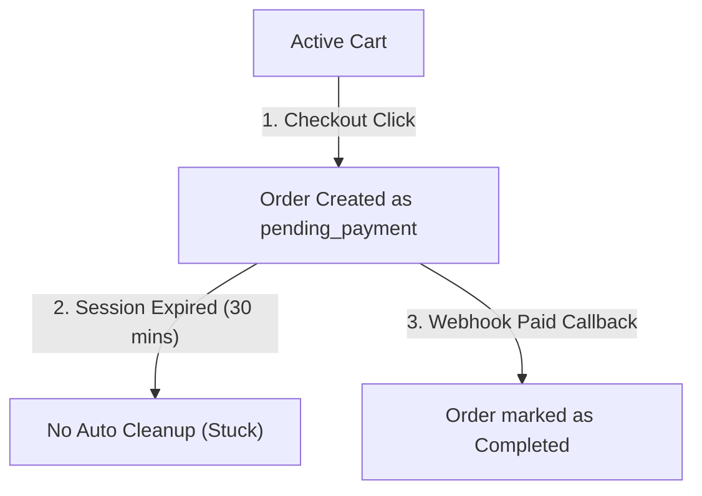

# GEARBEAT PATCH 110E — CONCURRENCY & BOOKING TRANSACTION SAFETY AUDIT

## 1. Executive Summary

As GearBeat V2 transitions towards live payment processing and public launch, verifying the transaction boundary integrity and database concurrency safety is paramount. High-traffic systems are vulnerable to race conditions such as double-bookings or product overselling, which directly impact customer trust, operational billing, and data sanity.

This audit evaluates the transactional behaviors of the Hourly Studio Booking engine and the Marketplace vertical, maps current concurrency risks, and outlines an architectural roadmap to establish transaction-safe operations.

---

## 2. Hourly Studio Booking Concurrency Analysis

We audited the booking reservation mechanics in [app/api/studios/bookings/create/route.ts](file:///c:/Users/iaals/Documents/GitHub/gearbeat-V2/app/api/studios/bookings/create/route.ts) and [supabase/migrations/patch_46d2_rpc_booking_status_harmonization.sql](file:///c:/Users/iaals/Documents/GitHub/gearbeat-V2/supabase/migrations/patch_46d2_rpc_booking_status_harmonization.sql).

### A. Ground Truth: Advanced Transaction Lock
Unlike standard API-level read-then-insert checks, the Hourly Studio Booking engine is highly secure. It delegates booking insertion directly to a custom database function (`public.create_studio_booking_v1`) which executes inside an atomic database transaction.

### B. Advisory Lock Strategy
To prevent parallel requests from double-booking the exact same studio hour slots, the function immediately acquires a transactional PostgreSQL advisory lock:
```sql
PERFORM pg_advisory_xact_lock(hashtext(p_studio_id::text), hashtext(p_booking_date::text));
```
*   **Safety Level**: **Strong with documented caveats**. 
*   **Result**: All concurrent booking attempts targeted at the **same studio on the same calendar day** are serialized. The first request grabs the lock, inserts the booking row, and releases the lock. Subsequent requests waiting in line will read the updated slot inventory, hit the overlap check, and fail gracefully with a `CONFLICT` status.

---

## 3. Marketplace Inventory Reservation & Stock Gaps

We audited the product inventory validation in [app/api/marketplace/checkout/create-order/route.ts](file:///c:/Users/iaals/Documents/GitHub/gearbeat-V2/app/api/marketplace/checkout/create-order/route.ts) and the cart controllers under [app/api/marketplace/cart/](file:///c:/Users/iaals/Documents/GitHub/gearbeat-V2/app/api/marketplace/cart/).

### A. Discovered Vulnerability: Read-Only Stock Checks
During the checkout phase, the API reads available stock levels by performing a basic select query against the products and variants tables:
```typescript
const availableStock = variant
  ? Number(variant.stock_quantity || 0)
  : Number(product.stock_quantity || 0);
```
*   **The Gap**: 
    1.  The route does **not** acquire row-level locks (e.g., `SELECT FOR UPDATE`) on the product/variant rows during checkout initialization.
    2.  There are **no** triggers, RPCs, or webhook routines inside `/api/tap/webhook` or checkout controllers that actually decrement `stock_quantity` during order creation or upon payment completion.

### B. Overselling Risks
*   **Overselling Risk**: **High**. 
*   *Scenario*: If a product has `1` unit left in stock, two customers can simultaneously start checkout. Both queries read `stock_quantity = 1`, pass the stock verification check, create their respective unpaid `marketplace_orders` (both flagged as `pending_payment`), and redirect to payment portals. If both pay successfully, the vendor must fulfill two units of a single-item inventory.
*   *Lack of Stock Count Declines*: Since there is no database update query to decrement `stock_quantity` upon order completion, the available quantity remains static, permanently allowing unlimited sales of out-of-stock items until manually updated.

---

## 4. Order State Conflicts & Cart-to-Order Operations



### A. Missing Order Sweeper
For Hourly Studio Bookings, [app/api/cron/bookings/cleanup-stale/route.ts](file:///c:/Users/iaals/Documents/GitHub/gearbeat-V2/app/api/cron/bookings/cleanup-stale/route.ts) runs every 60 minutes to transition bookings stuck in `pending_payment` to `cancelled`, releasing the studio calendar slots.

However, **no similar sweeper exists for the Marketplace**. Once an order is created as `pending_payment` and its cart is marked as `converted`, if the customer abandons the transaction, the order remains `pending_payment` indefinitely. 

### B. Conflict Risks
1.  **Cart Locking**: Once converted, the user loses access to the cart. If the payment fails, the user is forced to add items again from scratch since there is no auto-restore trigger.
2.  **Stale Stock Reservation**: If stock reservations are implemented in the future, abandoned orders will permanently hold inventory hostage because no cron worker exists to cancel unpaid stale orders.

---

## 5. Webhook & Payment Idempotency Requirements

With `/api/checkout/manual-confirm` permanently locked, all order/booking status updates rely on credit card payment webhook endpoints (`/api/tap/webhook`).

### A. Double Callback Fires
Webhook triggers are asynchronous. Network latency can cause third-party gateways to retry callback payloads. If the same `charge_id` POST request is fired twice concurrently:
*   The first process updates the transaction state, calculates ledger splits, and awards loyalty points.
*   The second process could execute concurrently, inserting duplicate financial ledgers, sending double notifications, or double-allocating loyalty points.

### B. Idempotency Table Protection
To prevent this, the backend must implement a strict `payment_idempotency` ledger table tracking all processed `charge_id` keys using a unique database constraint.

---

## 6. Admin/Owner Status Update Conflicts

Admin tools (such as `/api/owner/bookings/update-status` and `/api/admin/settlements/*`) handle manual status transitions.
*   **The Risk**: If an owner cancels a booking while an admin simultaneously approves it, concurrent update statements can conflict or overwrite each other out of order.
*   **Recommendation**: Enforce a strict state transition matrix (State Machine) in SQL. For example, updating booking status should only be allowed if `status = 'pending_owner_review'`. An update statement must include the expected source state in its `WHERE` clause:
    ```sql
    UPDATE bookings SET status = 'accepted' WHERE id = :id AND status = 'pending_owner_review';
    ```

---

## 7. Recommended Safe Future Implementation Plan

To secure the transactional boundaries of GearBeat V2, we recommend:

1.  **Phase 1 — Webhook Idempotency Guards**:
    *   Create a unique database table `processed_payment_webhooks` to store `charge_id` hashes. Verify that new webhook events do not already exist in this ledger before executing updates.
2.  **Phase 2 — Atomic Inventory Reservation RPC**:
    *   Create a database function `public.reserve_product_stock_v1` that locks the target product/variant row using `SELECT FOR UPDATE` and decrements `stock_quantity` during order creation, implementing a 15-minute expiration hold.
3.  **Phase 3 — Stale Order Expiration Cron**:
    *   Deploy `/api/cron/marketplace/cleanup-stale` to sweep unpaid orders past their 30-minute payment session expiration, returning reserved stock back to the listing quantity.

---

## 8. Confirmation

We confirm the absolute safety and boundaries of this patch:
*   [x] **Zero active application code** files were modified.
*   [x] **Zero SQL executions or Supabase CLI commands** were run.
*   [x] **Zero package, UI, or environment configuration modifications** occurred.
