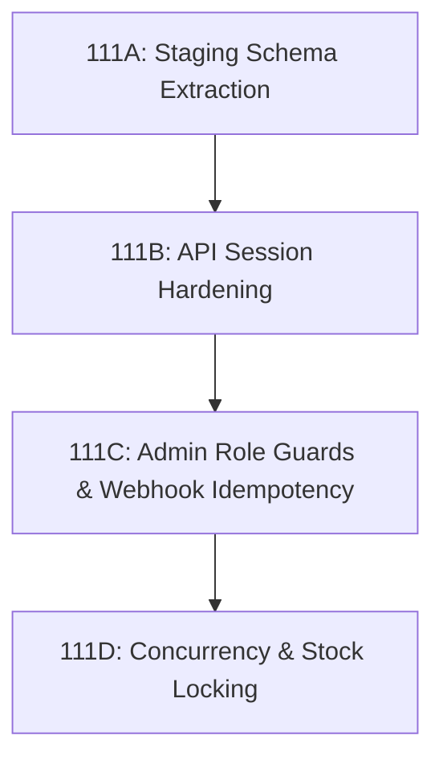

# GEARBEAT PATCH 110F — MASTER SECURITY & TRANSACTION SAFETY HANDOFF GATE

## 1. Master Handoff Verdict: GO-WITH-CONDITIONS

Following a comprehensive multi-phase audit of the GearBeat V2 database layers, API security profiles, schema drift risks, and concurrent transactional boundaries, we issue the final Handoff Gate Verdict:

$$\text{\bf Go-With-Conditions}$$

### 🟢 Why "Go"?
The platform’s highest-severity operational vulnerability—the public manual payment confirmation testing endpoint (`/api/checkout/manual-confirm`)—has been **successfully decommissioned and locked** (returning `410 Gone` directly). The system is now safe from anonymous billing override exploits.

### ⚠️ What are the "Conditions"?
Before activating **live credit card payments** (Tap/Moyasar) or opening commercial pipelines to the public, the development team must execute the structured implementation sequence detailed in Section 5 of this gate to resolve remaining high/medium risks (including marketplace inventory overselling and service-role over-reliance).

---

## 2. Executive Synthesis: Sprints 110A–110E

We completed a strict sequence of diagnostics and code updates under Sprint 110:

*   **Patch 110A (Supabase Connection Audit)**:
    *   *Outcome*: Identified browser vs. server cookie clients, mapped env configurations, and established module-by-module dynamic vs. static data reality (Tickets/Academy are mock; Studios/Marketplace/Auth are live).
*   **Patch 110B (API Decommissioning & Lock)**:
    *   *Outcome*: Wrote and deployed the code replacement for `/api/checkout/manual-confirm`, instantly terminating the testing gateway and removing all database write permissions and service role contexts from that endpoint.
*   **Patch 110C (Seed Drift & Migration Plan)**:
    *   *Outcome*: Audited `supabase/seed.sql` and exposed critical database table-creation and policy structural leaks. Proposed a strict staging separation workflow.
*   **Patch 110D-A (API Hardening Audit)**:
    *   *Outcome*: Inspected 24 subdirectories under `/api/`, calculated risk levels, and identified mutation paths over-relying on RLS-bypassing admin clients.
*   **Patch 110E (Concurrency & Booking Safety Audit)**:
    *   *Outcome*: Analyzed studio hourly booking advisory locks (verified as highly secure) and exposed high-severity inventory race-condition/overselling vulnerabilities in the marketplace vertical.

---

## 3. Production Safety Matrix: Remaining Risks

Below is the categorized inventory of backend risks remaining post-decommission:

| Risk Domain | Risk Level | Description / Vulnerability | Required Resolution |
| :--- | :--- | :--- | :--- |
| **Marketplace Inventory** | 🔴 **High** | Basic SELECT checks used during checkout; no atomic decrements exist on payment webhooks, creating double-sale/overselling vulnerabilities. | Implement database `reserve_product_stock_v1` RPC using `SELECT FOR UPDATE`. |
| **API Service-Role** | 🟠 **Medium** | Crucial public mutation paths (orders/bookings) run under `createAdminClient()`. Bypasses PostgreSQL RLS. | Migrate user-level mutations to session-bound `createClient` instances. |
| **Schema Drift** | 🟠 **Medium** | `seed.sql` continues to execute structural mutations (`CREATE TABLE studio_boost_subscriptions`). | Extract mutations to formal migrations under `supabase/migrations/`. |
| **Stale Orders** | 🟡 **Medium** | No cron sweeper exists to clean up unpaid marketplace checkout orders, risking stock-lock blocks. | Deploy `/api/cron/marketplace/cleanup-stale` sweeper. |
| **Admin Endpoints** | 🟡 **Medium** | Points adjustment or settlements API paths must be absolute-guarded against spoofing. | Enforce explicit `isAdminRole` checks in all `/api/admin/*` paths. |
| **Webhook Retry** | 🟡 **Medium** | Gateway retries can duplicate notifications, ledgers, or loyalty points. | Build a `processed_payment_webhooks` idempotency table. |

---

## 4. Concurrency & Transaction Boundary Status

### A. Hourly Studio Bookings: SECURE 🟢
*   **Status**: Transaction-safe.
*   **Mechanism**: The database routine `create_studio_booking_v1` secures calendar slot reservation using a transactional PostgreSQL advisory lock:
    ```sql
    PERFORM pg_advisory_xact_lock(hashtext(p_studio_id::text), hashtext(p_booking_date::text));
    ```
*   **Verdict**: Safe from parallel request double-bookings.

### B. Marketplace Purchases: DANGER 🔴
*   **Status**: Vulnerable.
*   **Mechanism**: Lacks locking mechanisms during cart addition or order conversion. Quantities do not decrement automatically during order fulfillment.
*   **Verdict**: Vulnerable to overselling. Must implement transactional stock locking before launch.

---

## 5. Recommended Next Implementation Sequence (Sprint 111+)

To guarantee a secure commercial rollout, developers should execute the following sequence:



1.  **Patch 111A — Staging Schema Extraction**:
    *   Move structural SQL mutations out of `seed.sql` and into migration patches. Validate using `supabase db reset` locally.
2.  **Patch 111B — API Session Hardening**:
    *   Refactor Cart, Favorites, and Profile update paths to use session-bound `createClient`, activating standard PostgreSQL RLS rules.
3.  **Patch 111C — Admin Role Guards & Webhook Idempotency**:
    *   Enforce absolute admin checks on all `/api/admin/*` sub-routes and build a unique constraint `processed_payment_webhooks` table to ignore duplicate gateway payloads.
4.  **Patch 111D — Concurrency & Stock Locking**:
    *   Integrate `SELECT FOR UPDATE` locks inside marketplace checkout and deploy `/api/cron/marketplace/cleanup-stale` to sweep abandoned checkouts.

---

## 6. Actions Requiring Explicit User Approval

The autonomous agent is **prohibited** from running the following commands without explicit, written USER sign-off:
*   [ ] Modifying environment configuration files (`.env`, `.env.example`, etc.).
*   [ ] Executing Supabase CLI production commands (`supabase db push`, `supabase db reset`, etc.).
*   [ ] Inserting raw SQL schema mutations directly against the production database.
*   [ ] Triggering live third-party financial transactions or webhook integrations (Tap/Moyasar).
*   [ ] Modifying core package dependencies in `package.json` or `package-lock.json`.

---

## 7. Master Handoff Verification Checklist

*   [x] **Audit Phase 110A Completed** (Connection, clients, environment variables, page data reality mapped).
*   [x] **Hardening Phase 110B Completed** (Manual confirmation route completely locked with a secure 410 response).
*   [x] **Audit Phase 110C Completed** (Seed-level structural drift evaluated, migration serialization mapped).
*   [x] **Audit Phase 110D-A Completed** (API session risk matrix established).
*   [x] **Audit Phase 110E Completed** (Hourly booking advisory locks and marketplace stock vulnerabilities mapped).
*   [x] **Zero Code Regressions** (TypeScript type-checking compiler compiles cleanly with exit code 0).
