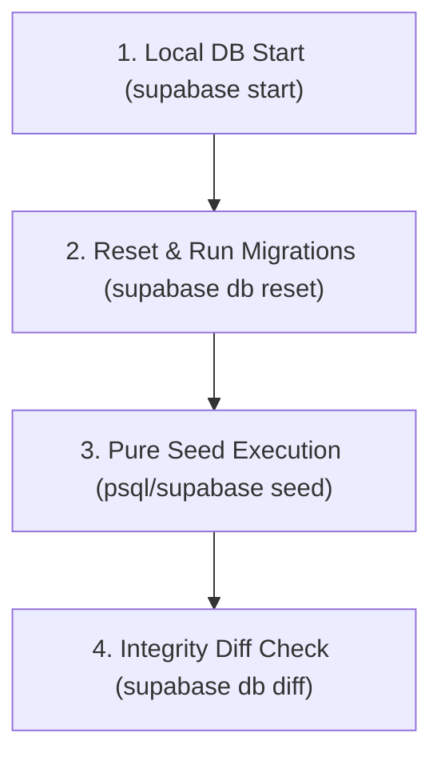

# GEARBEAT PATCH 111A — STAGING SCHEMA EXTRACTION & PURE SEED INTEGRATION PLAN

## 1. Executive Summary

During our **Patch 110C Schema Drift Audit**, we identified structural table and column mutations embedded directly inside `supabase/seed.sql`. Storing schema statements inside seed files breaks database migration timelines, introduces critical environment drift, and creates onboarding instability in local and staging sandbox environments.

This plan details the precise structural SQL to be extracted, establishes the roadmap for a 100% pure data `seed.sql`, and outlines a staging-first validation and rollback process.

---

## 2. Structural SQL Extraction Target

The following commands must be stripped from `supabase/seed.sql` and relocated to a dedicated migration patch:

### A. Boost Subscriptions Table Creation
*   **Command**: `CREATE TABLE IF NOT EXISTS public.studio_boost_subscriptions (...)`
*   **Components**: Handles UUID primary key generation, references to `studios(id)`, total commission computation, starts/ends timestamptz intervals, and acceptance terms.
*   **Relocation Path**: Must move to a formal migration script.

### B. Row Level Security Policies
*   **Commands**:
    *   `ALTER TABLE studio_boost_subscriptions ENABLE ROW LEVEL SECURITY;`
    *   `CREATE POLICY "Owner can manage own boosts" ON studio_boost_subscriptions FOR ALL TO authenticated USING (owner_auth_user_id = auth.uid()) WITH CHECK (owner_auth_user_id = auth.uid());`
    *   `CREATE POLICY "Public can read active boosts" ON studio_boost_subscriptions FOR SELECT TO public USING (status = 'active' AND starts_at <= NOW() AND ends_at >= NOW());`
*   **Relocation Path**: Must move alongside table creation.

### C. Provider Leads Alteration
*   **Command**:
    ```sql
    ALTER TABLE provider_leads 
    ADD COLUMN IF NOT EXISTS signed_contract_url TEXT,
    ADD COLUMN IF NOT EXISTS commission_percent INTEGER DEFAULT 15;
    ```
*   **Relocation Path**: Must move to formal migrations to ensure columns exist prior to user queries.

---

## 3. Pure Seed Data Model (What Remains)

Once structural queries are purged, `supabase/seed.sql` will remain a **100% pure data-only file**, containing:
1.  **Test Studio Insertion**: Standard mock row parameters for "Studio One Riyadh" / "استوديو ون الرياض" inside `public.studios`.
2.  **Test Operational Calendars**: Day-of-week hour blocks inside `public.studio_availability_rules` to simulate booking availability inside developer environments.

---

## 4. Recommended Migration Order & Naming Convention

Based on our migrations audit, we identified **22 active migration files** up to `patch_100_certified_rewards_program.sql`. To maintain strict numbering alignment:

*   **Target Migration Path**: `supabase/migrations/patch_101_studio_boost_and_provider_leads.sql`
*   **Dependency Requirement**: Must execute immediately after `patch_100_certified_rewards_program.sql` and prior to any seed data executions.

---

## 5. Staging-First Validation Process

Prior to executing any migrations on remote databases, the team must run the following validation steps locally:



1.  **Local Reset**: Boot clean containerized local environments (`supabase start`).
2.  **Apply Timeline**: Run `supabase db reset` to apply all 23 migrations (including the new `patch_101_*.sql`).
3.  **Run Clean Seed**: Execute the purged `seed.sql` to verify that data inserts succeed without schema exceptions.
4.  **Verify Drift**: Run `supabase db diff` to confirm that the local PostgreSQL schema matches the repository's migration files.

---

## 6. Rollback & Disaster Recovery Planning

Should the migration fail or cause operational problems, developers must have the following rollback script tested and ready:

*   **File Path**: `docs/sql-drafts/rollback_patch_101_studio_boost_and_provider_leads.sql`
*   **Rollback Code**:
    ```sql
    -- Drop Boost Table and dependent policies
    DROP TABLE IF EXISTS public.studio_boost_subscriptions CASCADE;

    -- Revert Provider Leads extensions
    ALTER TABLE public.provider_leads 
    DROP COLUMN IF EXISTS signed_contract_url,
    DROP COLUMN IF EXISTS commission_percent;
    ```

---

## 7. Risks & Production DB No-Go List

### ⚠️ Pre-Migration Risks
*   **Table Lock Locks**: Running `ALTER TABLE provider_leads` on a production table containing millions of rows can trigger exclusive locks, freezing new partner signup API queries.
*   **Schema Cache Invalidation**: PostgREST caches table descriptions. Modifying structures will cause temporary `502 Bad Gateway` API errors unless a schema refresh (`NOTIFY pgrst, 'reload schema'`) is dispatched immediately after the migration.

### 🚫 Production DB No-Go List
*   [ ] Do **NOT** execute migrations manually using the Supabase Web SQL Editor.
*   [ ] Do **NOT** apply migrations during peak GCC business hours.
*   [ ] Do **NOT** execute migrations without capturing a full, verified PostgreSQL backup (`pg_dump`) first.

---

## 8. Handoff Approval Gates

The autonomous agent is **strictly prohibited** from performing database modifications without explicit sign-offs:

1.  **Gate 1 (Staging Sandbox Pass)**:
    *   *Requirement*: Verify clean typechecking and local migration execution.
    *   *Sign-off Status*: [ ] Pending
2.  **Gate 2 (Schema Review Pass)**:
    *   *Requirement*: Core SQL scripts approved by the Lead Database Administrator.
    *   *Sign-off Status*: [ ] Pending
3.  **Gate 3 (Production Execution Pass)**:
    *   *Requirement*: Final authorized signature from the Project Sponsor.
    *   *Sign-off Status*: [ ] Pending

---

## 9. Recommended Next Patch

**Patch 111B — API Session Hardening Implementation**
*   *Action*: Convert customer favorites and cart API routes away from the `createAdminClient()` (Service Role) client to cookie-authenticated session-bound `createClient` wrappers, enforcing standard row security boundaries.
