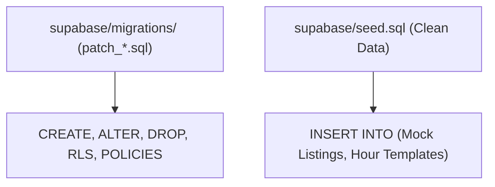

# GEARBEAT PATCH 111B — STAGING MIGRATION SERIALIZATION CHECKLIST

## 1. Executive Summary

This checklist outlines the absolute engineering requirements and operational safeguards necessary to execute the **Patch 111A Schema Extraction & Pure Seed Integration Plan**. It enforces strict separation of database structures from test datasets, maps out validation stages, defines rollback matrices, and institutes safety gates prior to any Supabase interaction.

This is a **strategic and checklist-only patch**. It does not execute SQL commands, create migration scripts, or perform application mutations.

---

## 2. Naming & Versioning Constraints

To ensure complete continuity with the existing **22 active migration files** located in [supabase/migrations/](file:///c:/Users/iaals/Documents/GitHub/gearbeat-V2/supabase/migrations), all future migrations must adhere to the following rules:

*   **Format**: `patch_<number>_<description_snake_case>.sql`
*   **Target Sequence Number**: `101`
*   **Target Filename**: `patch_101_studio_boost_and_provider_leads.sql`
*   **Directory Boundary**: Must reside exclusively in `supabase/migrations/`.

---

## 3. Separation of Schema vs. Seed Data



### A. Migrations Folder (Schema State)
Must contain **only** structural SQL queries:
*   `CREATE TABLE`, `ALTER TABLE`, `DROP TABLE`
*   `ALTER TABLE ... ENABLE ROW LEVEL SECURITY;`
*   `CREATE POLICY ...`
*   Function and trigger declarations (`CREATE OR REPLACE FUNCTION`)

### B. Seed File (Mock/Demo Data State)
Must contain **only** static mock rows:
*   `INSERT INTO public.studios (...)`
*   `INSERT INTO public.studio_availability_rules (...)`
*   Mock user credentials or test profiles.

---

## 4. Pre-Migration Backups & Rollback Checklist

Prior to performing any SQL executions on a remote server, the DBA team must check off the following tasks:

- [ ] **Capturing Schema Snapshot**:
    ```bash
    supabase db dump --db-url "$PRODUCTION_DB_URL" --schema-only > backups/production_schema_backup_$(date +%F).sql
    ```
- [ ] **Capturing Data Backup**:
    ```bash
    supabase db dump --db-url "$PRODUCTION_DB_URL" --data-only > backups/production_data_backup_$(date +%F).sql
    ```
- [ ] **Rollback Script Verification**:
    Confirm the presence of a verified rollback file `docs/sql-drafts/rollback_patch_101_*.sql` containing:
    ```sql
    DROP TABLE IF EXISTS public.studio_boost_subscriptions CASCADE;
    ALTER TABLE public.provider_leads DROP COLUMN IF EXISTS signed_contract_url, DROP COLUMN IF EXISTS commission_percent;
    ```
- [ ] **Rollback Execution Validation**: Verify the rollback script executes successfully in the local Docker environment without breaking foreign keys.

---

## 5. Staging Environment Checks

Before pushing any schema changes to the isolated staging database, the following boundary rules must be verified:

- [ ] **Configuration Isolation**: Validate that `supabase/config.toml` staging database endpoint parameters do **not** point to production resources.
- [ ] **Network Blocks**: Confirm staging resources are bound to isolated test environment networks.
- [ ] **Migration Ledger Sync**: Check that the `supabase_migrations.schema_migrations` history ledger in the staging DB is identical to the local database timeline.

---

## 6. Local & Staging Validation Flow

### Phase A: Local Containerized Verification
- [ ] Execute `supabase stop --backup` to clear the current local database state.
- [ ] Boot fresh PostgreSQL Docker containers using `supabase start`.
- [ ] Run `supabase db reset` to apply all migrations (up to patch 101).
- [ ] Confirm no SQL execution errors occur during the migration timeline.
- [ ] Run `psql` seed inputs to verify the clean `seed.sql` successfully inserts test slots.
- [ ] Confirm type-checking compiles cleanly: `npm run typecheck`.

### Phase B: Staging Deployment Verification
- [ ] Deploy migration sequence to staging: `supabase db push --db-url "$STAGING_DB_URL"`.
- [ ] Execute clean `seed.sql` on the staging database to populate Riyadh studio testing pages.
- [ ] Run integration tests against the staging API endpoint `/api/studios/bookings/create` to ensure the slot advisory locks operate correctly.

---

## 7. Production No-Go Conditions

The deployment team must issue an immediate **No-Go** halt if any of the following parameters are present:

*   [ ] **Active Checkout Traffic**: Concurrent payment or booking transactions are currently running on the server.
*   [ ] **Failed Staging Pass**: The clean `seed.sql` failed to seed the staging sandbox.
*   [ ] **Missing Snapshots**: No verified `pg_dump` snapshot has been captured in the last 12 hours.
*   [ ] **RLS Discrepancy**: The local `supabase db diff` indicates a row-security rule drift.

---

## 8. Handoff & Governance Sign-Off Gates

No migrations or schema adjustments are permitted against active Supabase instances without the following authorizations:

1.  **Gate 1: Tech Lead Handoff Approval** (Verifies local typechecking pass):
    *   *Sign-off*: [ ] Pending
2.  **Gate 2: Database Administrator Approval** (Verifies pg_dump snapshots and rollback availability):
    *   *Sign-off*: [ ] Pending
3.  **Gate 3: Project Sponsor Approval** (Authorizes execution maintenance window):
    *   *Sign-off*: [ ] Pending

---

## 9. Recommended Next Patch

**Patch 111C — API Session Hardening Implementation**
*   *Action*: Convert customer favorites, cart integrations, and OTP verification API routes from Service Role admin clients to cookie-authenticated session-bound `createClient` wrappers, activating standard PostgreSQL RLS rules.
