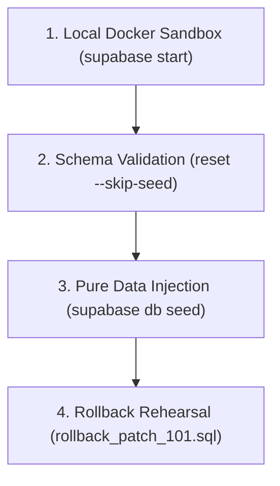

# GEARBEAT PATCH 111C — MIGRATION DRY-RUN / LOCAL-ONLY VALIDATION PLAN

## 1. Executive Summary

Prior to executing any database migrations or data seed insertions against remote staging or production Supabase databases, the engineering team must run a strict, local-only dry-run validation sequence. This isolates the migration process from network risks and ensures database schemas and pure data seeds align perfectly before deployment.

This is a **strategic and planning-only patch**. It does not perform SQL executions, create migrations, or modify route configurations.

---

## 2. Local-Only Dry-Run Strategy

The dry-run sequence must be executed **exclusively** inside a local containerized PostgreSQL sandbox utilizing Docker and the Supabase CLI, fully isolated from any remote database endpoints.



*   **Boundary Rule**: To ensure zero network leak risk, the deployment terminal must have remote database variables (e.g. `STAGING_DB_URL`, `PRODUCTION_DB_URL`) completely unset or blocked.

---

## 3. Preflight Checklist Before Supabase CLI Commands

Before executing any local Supabase commands, developers must check off the following prerequisites:

- [ ] **Docker Engine Status**: Ensure Docker is active and running locally:
    ```bash
    docker ps
    ```
- [ ] **Supabase CLI Configuration**: Verify that `supabase/config.toml` is initialized for local development.
- [ ] **Environment Variable Check**: Run the following command to guarantee no production or staging database URLs are exposed in the active terminal context:
    ```bash
    echo $STAGING_DB_URL && echo $PRODUCTION_DB_URL
    ```
    *(Both outputs must be empty)*.
- [ ] **Branch Verification**: Confirm you are on the correct planning or local validation branch:
    ```bash
    git branch --show-current
    ```

---

## 4. Verification of Schema vs. Seed Separately

To guarantee structural database code is completely decoupled from seed data, we will run the dry-run in two separate steps:

### Step A: Schema-Only Migration Validation
Run the migration timeline without injecting mock data:
```bash
supabase db reset --skip-seed
```
*   *Validation Criteria*: The migration timeline (up to `patch_101_*.sql`) must compile and execute successfully with exit code 0. This ensures all `CREATE TABLE`, `ALTER TABLE`, RLS, and policy commands are structurally sound.

### Step B: Pure Data Injection Validation
Once the database schema is built, inject the cleaned seed data separately:
```bash
supabase db seed
```
*   *Validation Criteria*: The pure `seed.sql` script must execute successfully, inserting Riyadh studio mock rows and availability templates without triggering missing constraints or datatype conflicts.

---

## 5. Required Evidence to Capture

To certify a successful local dry-run, the developer must capture and save the following evidence log files in the local `logs/` directory:

1.  **Dry-Run Terminal Output** (`logs/dry_run_reset_output.log`):
    Captured using standard redirection:
    ```bash
    supabase db reset --skip-seed > logs/dry_run_reset_output.log 2>&1
    ```
2.  **Schema State Verification Dump** (`logs/dry_run_schema_verification.sql`):
    Confirming database schemas match expectations:
    ```bash
    supabase db dump --schema-only > logs/dry_run_schema_verification.sql
    ```
3.  **Typechecking compiler Output** (`logs/dry_run_typecheck.log`):
    Confirming the application builds cleanly after schema additions:
    ```bash
    npm run typecheck > logs/dry_run_typecheck.log
    ```

---

## 6. Failure Categories & Documentation Rules

If the local dry-run fails, developers must categorize and log issues using the following structures:

*   **Syntax Errors** (SQL parsing issues, syntax mismatches).
*   **Constraint Violations** (Foreign keys references or out-of-order execution, e.g. referencing `studios.id` before the table exists).
*   **RLS Overlaps** (Creating policies on columns that do not exist or duplicate policy names).
*   **Documenting Failures**: Log all issues in `docs/sql-drafts/dry_run_failures.md` detailing the line number, exact terminal error output, root cause, and applied fix.

---

## 7. Rollback Rehearsal Requirements

A crucial step of the local dry-run is rehearsing disaster-recovery rollbacks:

- [ ] Apply the schema changes: `supabase db reset --skip-seed`.
- [ ] Run the custom rollback script `docs/sql-drafts/rollback_patch_101_*.sql` using `psql`.
- [ ] Verify that dropping the `studio_boost_subscriptions` table and stripping the `provider_leads` columns does **not** trigger CASCADE errors or leave orphaned schema components.

---

## 8. Staging Promotion Criteria

A migration sequence is only certified for promotion to the staging database if the following criteria are met:

*   [x] **100% local dry-run pass rate** (Zero execution errors on `supabase db reset`).
*   [x] **100% clean data seed pass** (Pure `seed.sql` executes cleanly).
*   [x] **Clean compile verification** (`npm run typecheck` passes).
*   [x] **Rollback validation pass** (Rollback scripts executed without exceptions).

---

## 9. Explicit No-Go Conditions & Approval Gates

### 🚫 No-Go Conditions
*   [ ] Local TypeScript compiler produces errors during check.
*   [ ] Unverified schema structural alterations remain in `seed.sql`.
*   [ ] Staging database credentials leak into local shell scopes.

### 🔑 Approval Gate
Before executing any migrations against staging or production Supabase servers, signed approvals are mandatory:
*   **Database Lead**: [ ] Pending
*   **Tech Lead**: [ ] Pending
*   **Project Sponsor**: [ ] Pending

---

## 10. Recommended Next Patch

**Patch 111D — API Session Hardening Implementation**
*   *Action*: Convert customer favorites, cart integrations, and OTP verification API routes from Service Role admin clients to cookie-authenticated session-bound `createClient` wrappers, ensuring PostgreSQL RLS is activated.
