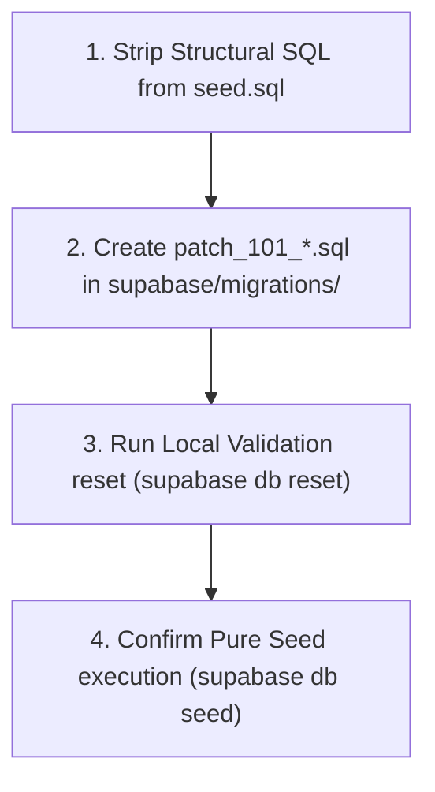

# GEARBEAT PATCH 111D — SQL DRAFT EXTRACTION PLAN

## 1. Executive Summary

This plan details the safe extraction of structural SQL statements currently embedded inside `supabase/seed.sql` and establishes a clear path for their future implementation under formal migration patches. 

This is a **checklist and planning-only patch**. No real database mutations, SQL executions, or application route changes occur in this branch.

---

## 2. Structural SQL Identified for Extraction

We analyzed [supabase/seed.sql](file:///c:/Users/iaals/Documents/GitHub/gearbeat-V2/supabase/seed.sql) and identified **42 lines of structural SQL** (lines 76 to 118) that must be relocated:

1.  **Table Creation**: `CREATE TABLE IF NOT EXISTS studio_boost_subscriptions`
    *   *Properties*: Computes total commission levels automatically via a generated column and enforces exact duration checks (7, 14, or 30 days).
2.  **Row Level Security Activation**:
    *   `ALTER TABLE studio_boost_subscriptions ENABLE ROW LEVEL SECURITY;`
3.  **Owner & Public Security Policies**:
    *   `Owner can manage own boosts`: Restricts modifications to the authenticated owner.
    *   `Public can read active boosts`: Restricts public queries to active boost durations.
4.  **Table Extensions**:
    *   `ALTER TABLE provider_leads ADD COLUMN IF NOT EXISTS signed_contract_url TEXT, ADD COLUMN IF NOT EXISTS commission_percent INTEGER DEFAULT 15;`

---

## 3. SQL Draft Files Created

We created the following draft file to serve as the template for future execution:
*   [docs/sql-drafts/GEARBEAT_PATCH_111D_STUDIO_BOOST_PROVIDER_LEADS_DRAFT.sql.txt](file:///c:/Users/iaals/Documents/GitHub/gearbeat-V2/docs/sql-drafts/GEARBEAT_PATCH_111D_STUDIO_BOOST_PROVIDER_LEADS_DRAFT.sql.txt)

This file contains the clean structural code separated from seed insertions. It is saved in `.sql.txt` format to guarantee it cannot be picked up or accidentally executed by Supabase migration CLI tools.

---

## 4. Extraction & Local Validation Strategy

Prior to any execution, developers must adhere to the following sequence:



1.  **Relocate Code**: Delete lines 76 to 118 from `supabase/seed.sql`.
2.  **Create Migration**: Copy the exact code from `docs/sql-drafts/GEARBEAT_PATCH_111D_STUDIO_BOOST_PROVIDER_LEADS_DRAFT.sql.txt` into a new migration:
    `supabase/migrations/patch_101_studio_boost_and_provider_leads.sql`
3.  **Local Reset Validation**: Run `supabase db reset --skip-seed` to ensure the schema builds cleanly without syntactical errors.
4.  **Local Seeding Validation**: Run `supabase db seed` to guarantee mock data inserts succeed against the pure database schema.

---

## 5. Rollback Planning Expectations

To ensure disaster recovery coverage, the migration folder must be accompanied by the following rollback draft:

*   **Rollback File**: `docs/sql-drafts/rollback_patch_101_studio_boost_and_provider_leads.sql`
*   **Draft Code**:
    ```sql
    -- Drop Boost Table and its policies
    DROP TABLE IF EXISTS public.studio_boost_subscriptions CASCADE;

    -- Revert Provider Leads extensions
    ALTER TABLE public.provider_leads 
    DROP COLUMN IF EXISTS signed_contract_url,
    DROP COLUMN IF EXISTS commission_percent;
    ```

---

## 6. Staging-First Promotion Rules

Once local validation succeeds, the staging database must be used as the **Gatekeeper Sandbox**:

- [ ] **Config Check**: Ensure the target database connection does not point to production resources.
- [ ] **Staging Push**: Apply migrations via `supabase db push` against the staging database.
- [ ] **Staging Seeding**: Populate Riyadh studio spaces and operational calendars using the clean data seed.
- [ ] **Integration Pass**: Run client checks against `/api/studios/availability/slots` to confirm calendar exception pricing queries function correctly under active RLS.

---

## 7. Explicit No-Go List for Supabase Execution

Under **no circumstances** should any developer perform the following actions:

*   [ ] Execute the structural SQL migrations directly inside the Supabase Web UI SQL Editor.
*   [ ] Modify or create real migration files under `supabase/migrations/` on this planning branch.
*   [ ] Trigger production CLI commands during active business traffic.
*   [ ] Skip compiling tests (`npm run typecheck`) during local sandboxing.

---

## 8. Handoff & Governance Approval Gates

The autonomous agent is **prohibited** from running SQL migrations without the following gates checked:
*   **Tech Lead Review**: [ ] Pending
*   **Database Administrator Review**: [ ] Pending
*   **Project Sponsor Sign-off**: [ ] Pending

---

## 9. Recommended Next Patch

**Patch 111E — API Session Hardening Implementation**
*   *Action*: Convert customer favorites, cart integrations, and OTP verification API routes from Service Role admin clients to cookie-authenticated session-bound `createClient` wrappers, ensuring PostgreSQL RLS is activated.
