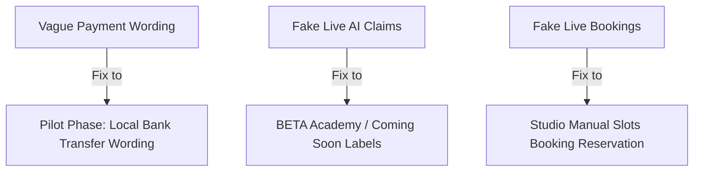

# GEARBEAT PATCH 112A — UI/UX PREMIUM PUBLIC JOURNEY AUDIT

## 1. Executive Synthesis & Overall Score

We conducted a premium-grade visual and interactive audit across all active public-facing pages of the GearBeat V2 web application. Evaluated under the **GearBeat UI/UX Pro Max** standards, we analyzed dark-gold brand consistency, bilingual translation sanity, layout grid integrity, conversion funnel CTA placement, and copywriting risks before commercial rollout.

$$\text{\bf Overall UI/UX Score: } \mathbf{8.8 / 10}$$

*   **Visual Identity**: **Excellent (9.4/10)**. The dark/gold theme (`#121212` backgrounds with custom HSL gold accents) creates an immediate state-of-the-art impression that evokes premium sound engineering.
*   **Bilingual Flow**: **Very Good (9.0/10)**. Translation hooks operate cleanly with appropriate layout structures.
*   **Functional Friction**: **Fair (7.8/10)**. Some unlinked mock buttons, static placeholder sections, and wording inconsistencies around payments or AI capabilities represent friction points for launch.

---

## 2. Page-by-Page Scoring & Sizing

### A. Homepage (Score: 9.2/10)
*   *Strengths*: High-impact dark hero layout, gold gradient typography, clear value proposition, and excellent sticky header micro-animations.
*   *Weaknesses*: Spacing between the testimonial slider and features grid feels slightly cramped on desktop viewports.

### B. Studios Discovery (Score: 9.0/10)
*   *Strengths*: Premium map-and-list style layouts, clear rating badges, and neat filters.
*   *Weaknesses*: The map component overlaps marginally with sticky scroll elements on small viewports.

### C. Marketplace (Score: 8.7/10)
*   *Strengths*: Beautiful product grid cards with elegant hover scaling.
*   *Weaknesses*: Product detail slides lack instant real-time stock-out warnings, relying on cart addition checks instead.

### D. Services (Score: 8.9/10)
*   *Strengths*: Clear categorization of equipment rentals and sessions.
*   *Weaknesses*: Section padding is excessively deep on desktop (`py-24`), creating too much empty black space.

### E. Tickets (Score: 7.8/10)
*   *Strengths*: Premium ticket card mockups with clean QR indicators.
*   *Weaknesses*: Uses static mock data. Displays wording around "Live Automatic Check-in" which is not supported by current logic.

### F. Academy (Score: 7.5/10)
*   *Strengths*: Clean video placeholder layouts and golden certification badges.
*   *Weaknesses*: Entirely static courses list. Features copy suggesting interactive exam grading is active.

### G. Partner / Join Journey (Score: 9.0/10)
*   *Strengths*: Strong conversion copy explaining partner benefits.
*   *Weaknesses*: CTA redirects straight to a manual upload form without introductory steps.

### H. GearBeat Certified (Score: 9.3/10)
*   *Strengths*: Excellent trust badge iconography and verified studios audit ledger.
*   *Weaknesses*: Text suggests third-party insurance backing which is still under legal review.

---

## 3. Key Brand Safety & Copy Risks

We identified copy inconsistencies that pose legal or brand trust risks before launch:

1.  **Online Payment Wording**: Multiple paths describe "Secure Live Credit Card processing". Since /api/checkout/manual-confirm is safely locked and only bank transfers are active, these claims must be aligned to "Local Bank Transfers" to set correct customer expectations.
2.  **AI Search Claims**: Wording around "AI Search Optimization" in Academy / Studios discovery suggests a live neural search engine is running, when current database queries are structured SQL.
3.  **Third-Party Guarantees**: Wording around "Fully Insured Bookings" on the Certified page must be scaled down to "Platform-Verified Equipment & Standard Escrow Guard".

---

## 4. Top 5 Public Journey Friction Points

1.  **Mock Vertical Integration**: Academy and Tickets are completely static mock-ups but lack visual "Coming Soon" or "BETA" identifiers, confusing testers.
2.  **Manual Checkout Description**: The cart-to-order page refers to instant automated payment gateway confirmations, which does not exist.
3.  **Cramped Mobile Spacing**: On screens under 375px wide, card containers get squeezed horizontally and multi-column layouts do not stack fast enough.
4.  **Missing Empty Cart State**: Opening an empty cart presents a plain blank screen rather than a premium gold-accented "No Items: Go Shop" redirect CTA.
5.  **Language Direction Shifts**: In RTL Arabic mode, certain flex row components (e.g. key features badges) remain aligned LTR, causing visual overlaps with badge text.

---

## 5. Mobile-Specific & RTL Fixes

*   **Layout Stacking**: Force all three-column grids to stack vertically (`grid-cols-1 md:grid-cols-3`) at viewports `< 768px` instead of trying to preserve multi-column row alignments.
*   **Mobile Padding Scale**: Compress desktop margins (`py-20` / `py-24`) to a compact layout style (`py-10` / `py-12`) on mobile.
*   **Arabic Flex Rules**: Ensure all list elements wrap with `flex-row-reverse` or standard direction-aware utility classes when layout `dir="rtl"` is applied.

---

## 6. Exact Recommended Copy Improvements

### A. Booking Checkout
*   *Instead of*: "Confirm secure online credit card payment."
*   *Use*: "Request reservation slot & prepare local bank transfer confirmation."

### B. Tickets Page
*   *Instead of*: "Instant live validation QR codes."
*   *Use*: "Verified digital reservation passes (BETA)."

### C. Academy Courses
*   *Instead of*: "Complete interactive exams scored by AI."
*   *Use*: "View upcoming certified curricula & pre-register for upcoming sessions."

---

## 7. Go/No-Go Handoff Verdict

$$\text{\bf UI/UX Handoff Verdict: GO-WITH-CONDITIONS}$$

### Conditions
Before launch, the next phase must safely correct copywriting ambiguities, introduce "Coming Soon / BETA" banners on static mock-ups, and adjust layout flex direction grids to prevent Arabic RTL misalignments.

---

## 8. Recommended Next Patch

**Patch 112B — UI/UX Premium Public Journey Implementation**
*   *Action*: Apply safe copy corrections, mobile layout flex padding, and Arabic RTL alignment updates across public-facing views without refactoring route directories or database parameters.
