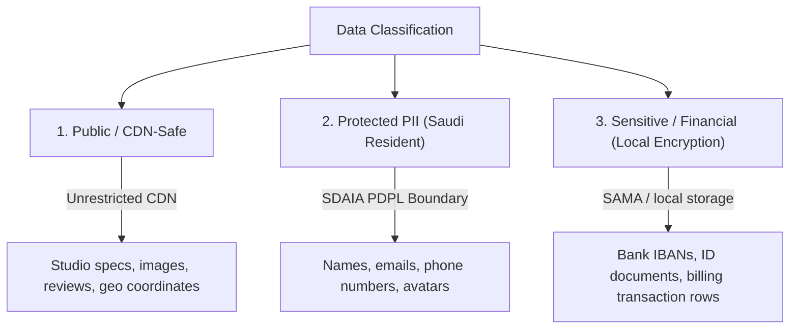
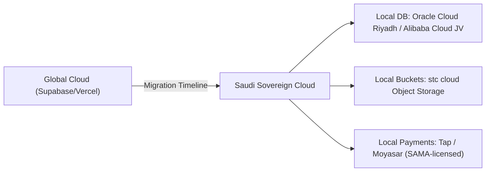

# GEARBEAT PATCH 112B — PDPL / SAUDI-FIRST DATA RESIDENCY & GLOBAL EXPANSION GATE

## 1. Executive Summary & Compliance Position

As GearBeat V2 transitions to partner onboarding and digital bookings inside the Kingdom of Saudi Arabia, adhering to the **Saudi Personal Data Protection Law (PDPL)** is legally and operationally mandatory. Enforced by the **Saudi Data and AI Authority (SDAIA)**, PDPL strictly governs how Personal Identifiable Information (PII) of Saudi residents is collected, stored, processed, and transferred.

This architecture gate maps GearBeat's data residency position, classifies PII and sensitive datasets, outlines the migration roadmap to local Saudi clouds, and defines a modular configuration matrix supporting GCC-wide and global expansion without rebuilding core system architectures.

---

## 2. Personal & Sensitive Data Classification Map

To ensure strict compliance with SDAIA regulations, we classify all active and future platform data into three security boundaries:



### A. Public / CDN-Safe Data
These assets do not contain PII or proprietary identifiers and can be cached globally:
*   Studio listings (descriptions, name_en, name_ar, equipment inventory).
*   Studio gallery images and public reviews.
*   Geographical coordinates (latitude and longitude).

### B. Personal Data (PII)
Requires user consent under PDPL, with logging and access controls:
*   Customer full name, email address, and mobile phone number.
*   Studio owner profile information and avatars.

### C. Sensitive Data (Requires Local Encryption & Strict Storage Controls)
Requires advanced security measures, strict access gates, and SAMA-compliant processing:
*   Payout details (IBANs, bank routing codes, legal business names).
*   Verification identity documents (Commercial Registrations, national IDs for vendor vetting).
*   Detailed transaction ledgers and booking history schedules.

### D. STRICTLY PROHIBITED (Do Not Collect Yet)
To minimize initial regulatory exposure, GearBeat must **NOT** collect:
*   *Biometric or Health Data* (no fingerprinting or physical tracking).
*   *Raw Credit Card details* (100% delegated to SAMA-licensed payment tokenizers).

---

## 3. Current Cloud Infrastructure & Data Residency Risks

Currently, GearBeat V2 relies on modern cloud providers:
*   **Supabase (Database)**: Multi-tenant Postgres instance (typically hosted in AWS eu-central-1 Frankfurt or us-east-1 Virginia).
*   **Vercel (Compute / Edge Hooks)**: Global edge network caching and routing API triggers.

### ⚠️ Primary Compliance Risks
1.  **Cross-Border Transfer Violation**: Storing Saudi citizen profile data on European or North American servers without a certified SDAIA transfer exemption represents a compliance risk under PDPL.
2.  **Lack of Local Encryption Keys**: System database backups are managed directly by cloud providers without local customer-managed keys (CMK) within the Saudi geography.

---

## 4. Future Saudi-First Data Residency Migration Roadmap

To achieve absolute sovereign compliance, GearBeat must migrate its storage and database layers to localized clouds within the next 12 months:



1.  **Database Migration**:
    *   Transition database hosting from standard Supabase US/EU regions to **Oracle Cloud Riyadh Region**, **Alibaba Cloud Saudi Arabia Joint Venture**, or **stc cloud**.
2.  **Object Storage Relocation**:
    *   Migrate secure partner files, CR documents, and verified IDs from AWS S3 to local, compliant Saudi object storage (e.g. stc or Mobily cloud buckets).
3.  **Local Gateway Edge**:
    *   Deploy local API reverse proxies inside KSA (e.g. stc cloud datacenters) to scrub, log, and filter user PII before dispatching secure transactional payloads to global compute endpoints.

---

## 5. Modular GCC & Global Expansion Configuration Model

To expand GearBeat to the rest of the GCC (UAE, Bahrain, Kuwait, Qatar, Oman) and globally without re-engineering core directories, we establish a **Country Configuration Matrix**. 

The system reads country-specific settings dynamically from a central database table:

```json
{
  "ksa": {
    "country_name": "Kingdom of Saudi Arabia",
    "currency_code": "SAR",
    "tax_percent": 15.00,
    "locale_languages": ["ar-SA", "en-US"],
    "privacy_policy_url": "/legal/privacy-ksa",
    "payment_gateway": "moyasar",
    "data_residency_rules": "pdpl-saudi-sovereign",
    "sms_provider": "unifonic"
  },
  "uae": {
    "country_name": "United Arab Emirates",
    "currency_code": "AED",
    "tax_percent": 5.00,
    "locale_languages": ["en-AE", "ar-AE"],
    "privacy_policy_url": "/legal/privacy-uae",
    "payment_gateway": "stripe-ae",
    "data_residency_rules": "uae-data-protection-law",
    "sms_provider": "twilio-me"
  }
}
```
*   **Result**: Core application tables (bookings, listings, carts) remain completely generic, simply linking to the dynamic `country_code` to calculate taxes, currencies, local payment widgets, and compliance templates.

---

## 6. Vendor Verification & Compliance Checklist

All third-party modules must pass a strict PDPL audit:

- [ ] **Payments (Moyasar / Tap Payments)**: Fully licensed by the **Saudi Central Bank (SAMA)**. Ensures cards are tokenized locally inside KSA.
- [ ] **SMS & OTP Validation (Unifonic / stc)**: Saudi-licensed SMS gateways to prevent routing customer verification codes through international aggregators.
- [ ] **Analytics (Fathom / Self-Hosted Matomo)**: Restrict Google Analytics. Ensure analytics tools strip IP addresses and are configured for zero PII retention inside the KSA boundary.
- [ ] **AI Assistant Gateways**: Route AI search queries through secure local proxies, completely masking customer names, phone numbers, or studio owner credentials before dispatching requests.
- [ ] **Logging & Auditing**: Mask all diagnostic logging to ensure email addresses, phone numbers, and full names are never written to unencrypted cloud console logs.

---

## 7. Mandatory Legal & Privacy Policy Upgrades

Prior to collecting active customer database registrations:
1.  **PDPL User Rights Integration**:
    *   Update Privacy Policy to outline the four mandatory user rights: *Right to know*, *Right to access*, *Right to correct/update*, and *Right to request data destruction*.
2.  **Data Processing Agreements (DPA)**:
    *   Establish signed DPAs with all cloud providers (Vercel, Supabase, Moyasar, Unifonic) verifying their role as Data Processors bound under PDPL.

---

## 8. Explicit No-Go Conditions

The deployment team must immediately **Halt Operations** under these conditions:

*   [ ] **Unencrypted CR Document Uploads**: Secure partner verification files are saved in public storage buckets without encryption keys.
*   [ ] **Unmasked Diagnostic PII Logs**: Server error console logs write unmasked emails or bank credentials.
*   [ ] **Cross-Border PII Transfer**: Bulk customer data export occurs without SDAIA exemption review.

---

## 9. Safety Rules for Future Code Patches

All future application code patches must adhere to the following safety rules:
1.  **No PII in Log Statements**: Never output client names or phone numbers inside `console.log` or `console.error`.
2.  **Tokenized Payments Only**: Never create database fields to store raw credit card numbers or security CVVs.
3.  **Dynamic Currency Calculation**: Always retrieve pricing values through the country config matrix, ensuring local tax rates are computed dynamically at the database level rather than hardcoded on client-side components.

---

## 10. Recommended Next Patch

**Patch 112C — UI/UX Premium Public Journey Copy & Styling Polish**
*   *Action*: Apply safe copy corrections to payment checkout screens (aligning wording to manual bank transfers) and introduce "Coming Soon / BETA" banners on static mock-ups (Academy / Tickets) to align user expectations before active pilot onboarding.
