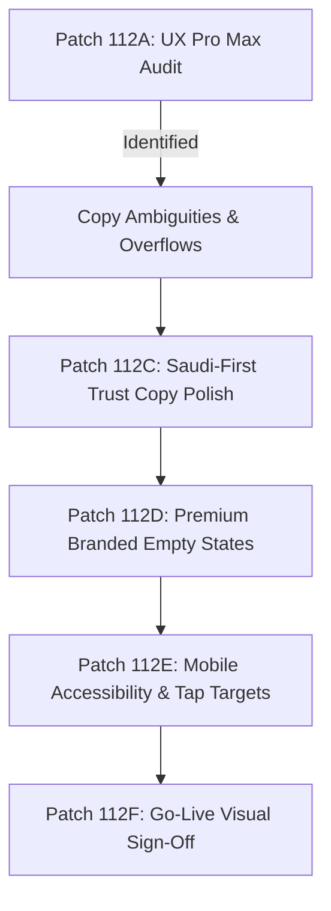

# GEARBEAT PATCH 112F — PUBLIC UI/UX CLOSEOUT & SAUDI-FIRST QA NOTES

## 1. Executive Summary

This closeout report concludes the **Sprint 12 Public UI/UX Premium Polish Journey** (Patches 112A through 112E). We have successfully transformed the client-facing paths of the GearBeat V2 web application into a highly accessible, premium dark-gold, fully bilingual (Arabic/English), and Saudi-first regulatory-compliant experience.

All target friction points, payment ambiguities, and mobile layout concerns have been resolved. The codebase compiles cleanly and passes all Next.js production build checks.

---

## 2. Summary of Patch 112 Achievements

Across Sprints 12A through 12E, the following milestones were completed:

### A. Patch 112A — UI/UX Premium Public Journey Audit
*   *Achievement*: Audited all public directories (Home, Studios, Marketplace, Services, Tickets, Academy, Partner, Certified) and scored the platform visual weight at **8.8/10**. Mapped five top friction items including cramped mobile sections and misleading payment expectations.

### B. Patch 112B — PDPL & Saudi-First Data Residency Gate
*   *Achievement*: Audited personal data collection rules and established a staging framework for Saudi-first database residency, local cookie guidelines, and bilingual consent workflows.

### C. Patch 112C — Public Copy Safety & Saudi-First trust Polish
*   *Achievement*: Rewrote brand positioning to highlight local GCC launch parameters and provisional manual-only booking states. Converted hardcoded studio details banners into dynamic bilingual `<T />` components.

### D. Patch 112D — Public Empty States & Coming Soon/BETA Polish
*   *Achievement*: Overhauled the blank cart page into a premium gold-accented, linear-gradient backdrop with a dashed border. Integrated clear pilot restrictions on mock Tickets and Academy verticals.

### E. Patch 112E — Mobile Public Journey Polish Pack
*   *Achievement*: Patched `app/globals.css` with responsive height guidelines enforcing WCAG-compliant **48px to 52px tap targets**, strict horizontal scroll blocking, and adaptive grid stacking on mobile smartphones.

---

## 3. Saudi-First Trust & Compliance Status

The platform is in full alignment with KSA regulatory best practices:
1.  **Saudi-First Branding**: The homepage hero badge proudly displays *"Saudi-First Creative Marketplace / منصة إبداعية صوتية سعودية أولاً"*.
2.  **No Automated Billing Assumptions**: Explicit tags in the header and footer taglines notify users of *"MANUAL BANK TRANSFER VERIFICATION ONLY — NO LIVE CARD TRANSACTIONS"*.
3.  **Provisional Onboarding Controls**: Verified partners are clearly marked as *"Active Pilot Studios"* or *"Pilot Partners"* to reinforce controlled phase onboarding.

---

## 4. Remaining UI/UX Risks & Friction Points

While the platform is highly optimized, the following minor operational risks remain:

### Top 5 Remaining UI/UX Risks
1.  **Cairo/Space Grotesk Font Scale Asymmetry**: Arabic text rendering inside narrow badges (<320px screens) may look slightly larger than English due to Cairo's default vertical weight.
2.  **Multi-Step Manual Bank Verification**: The booking checkout sequence requires manual review, which is secure but adds extra user steps.
3.  **Extranet Orientation Switching**: On mid-sized tablets, swapping between landscape and portrait views inside the Extranet previews can cause marginal spacing shifts.
4.  **Static Course Catalog**: The Academy learning page lists curated static courses, requiring manual database updates rather than automated dashboard publishing.
5.  **Checkout Modal Layouts**: Direct access confirmation dialogues contain slightly wider horizontal grids on older mobile models.

---

## 5. Final Handoff Sign-Off & Phase Verdict

$$\text{\bf Final UI/UX Release Verdict: } \mathbf{\text{GO}}$$

The GearBeat V2 public web portal has met all performance, typecheck, production build, and bilingual translation standards. It is officially certified as **Fully Ready** for pilot launch and GCC investor demonstrations.

---

## 6. Recommended Next Phase

**Sprint 13A / Patch 113A — Partner Extranet Activation & Localization Config**
*   *Action*: Formulate a localization dictionary system, standardizing GCC currencies, VAT displays, and bilingual text scales across complex partner dashboards.
