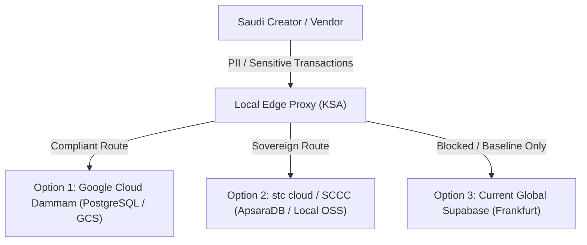

# GEARBEAT PATCH 113A — SAUDI DATA RESIDENCY VENDOR DECISION MATRIX

## 1. Executive Summary

To comply with the **Saudi Personal Data Protection Law (PDPL)** governed by the **Saudi Data and AI Authority (SDAIA)**, GearBeat V2 must establish a permanent local data residency architecture. 

This decision matrix compares future enterprise-grade local vendor solutions with our current multi-tenant staging baseline. It outlines technical readiness across PostgreSQL, object storage, auth patterns, and security auditing, concluding with an operational recommendation for the production rollout.

---

## 2. Infrastructure Comparison Matrix

| Evaluation Criteria | 1. Google Cloud Dammam | 2. Oracle Cloud Riyadh | 3. stc cloud / SCCC | 4. Current Supabase (Frankfurt/AWS) | 5. Current Vercel (Global CDN Edge) |
| :--- | :--- | :--- | :--- | :--- | :--- |
| **Saudi Data Residency Fit** | **Excellent** (Fully localized in Dammam region) | **Very Good** (Local region in Riyadh) | **Superior** (100% sovereign state joint venture) | **Fails** (Non-compliant for citizen PII) | **Conditional** (Global edge only; no raw local DB) |
| **PostgreSQL Readiness** | **Superior** (Managed Cloud SQL; full extension support) | **Good** (Requires VM build or MySQL HeatWave) | **Very Good** (ApsaraDB RDS Postgres active) | **Superior** (Native Postgres engine) | **N/A** (Edge compute layer only) |
| **Object Storage Readiness** | **Excellent** (Google Cloud Storage; S3-compatible) | **Very Good** (OCI Object Storage) | **Superior** (Local SCCC OSS buckets) | **Fails** (S3 in AWS EU/US domains) | **N/A** (Static CDN storage only) |
| **Auth/Session Implications** | Seamless JWT validation at local/global edge | Local OCI IAM; requires edge proxying | Local stc/SCCC auth; custom middleware | Native GoTrue / Supabase Auth | Native edge routing & session verification |
| **Backup/Rollback Readiness** | **Superior** (Automatic regional snapshots + CMK) | **Very Good** (Native block storage backups) | **Superior** (Sovereign local zone snapshots) | **Good** (Automatic but stored globally) | **N/A** (Code-only rollbacks via Git) |
| **Audit Logging** | **Excellent** (Cloud Logging / Audit Logs) | **Good** (OCI Audit) | **Superior** (Government-grade SCCC local logs) | **Fair** (Dashboard logs; limited export) | **Very Good** (Vercel Log Drains) |
| **IAM/Security Controls** | **Superior** (Fine-grained IAM, Service Account keys) | **Very Good** (OCI policies, compartments) | **Superior** (Sovereign state-approved rules) | **Fair** (Superuser token risks; basic role RLS) | **Good** (Deploy tokens & team access) |
| **Cost & Complexity** | **Moderate** (Standard enterprise PAYG billing) | **High** (Enterprise contract focus) | **High** (Custom account setup required) | **Extremely Low** (Developer-friendly tiers) | **Low** (Developer plans active) |
| **Migration Difficulty** | **Low** (Standard logical pg_dump / restore) | **High** (Custom PG migration setup needed) | **Moderate** (ApsaraDB migration tools) | **N/A** (Active staging baseline) | **N/A** (Active UI pipeline) |
| **GCC & Global Expansion** | **Superior** (Connects directly to global GCP fabric) | **Very Good** (OCI global regions) | **Limited** (Focused primarily on domestic KSA) | **Superior** (Global AWS footprint) | **Superior** (Global Anycast edge fabric) |

---

## 3. Detailed Architecture Comparison & Evaluation

### A. Option 1: Google Cloud Dammam / Cloud SQL PostgreSQL
*   **Verdict**: **Recommended Option for GearBeat V2**.
*   *Pros*: Standard Cloud SQL Postgres supports every extension (pgvector, postgis) and scales cleanly without configuration drift. S3-compatible cloud storage allows immediate static assets sync. Connects natively to global CDN pipelines.
*   *Cons*: Subject to standard Google Cloud pricing structures.

### B. Option 2: Oracle Cloud Saudi Arabia (Riyadh)
*   **Verdict**: **Alternative for Enterprise Large-Scale B2B**.
*   *Pros*: Heavy investment in local enterprise accounts, highly secure virtualization compartments.
*   *Cons*: Database focus leans heavily toward Oracle Database and MySQL HeatWave, making PostgreSQL self-managed on VMs, which drastically increases operational complexity.

### C. Option 3: stc cloud / SCCC (Alibaba Cloud JV in KSA)
*   **Verdict**: **Sovereign Backup / Government Integration Candidate**.
*   *Pros*: Exceptional compliance alignment for Government entities. Uses ApsaraDB PostgreSQL which has robust local storage.
*   *Cons*: Complex manual account provisioning, higher billing friction for international developer integrations, and limited global multi-region integration tools.

### D. Option 4: Current Supabase Setup (Staging Baseline Only)
*   **Verdict**: **Strictly Restricted to Non-Sensitive/Mock Sandbox Testing**.
*   *Pros*: Zero setup overhead, native developer workflow.
*   *Cons*: Frankfurt AWS servers fail KSA PDPL cross-border residency guidelines for production citizen data.

### E. Option 5: Current Vercel Setup (Edge Compute & CDN)
*   **Verdict**: **Permitted for Static/Edge Client Code Only**.
*   *Pros*: State-of-the-art Web-UX rendering, fast LTR/RTL edge serving.
*   *Cons*: Must never store raw database state. Edge compute functions must act solely as thin, stateless presentation layers.

---

## 4. Final Recommendation & Integration Strategy

> [!IMPORTANT]
> **Google Cloud Dammam** is the recommended vendor choice for GearBeat's permanent Saudi-first production database. It provides standard PostgreSQL Cloud SQL compliance, native S3-compatible storage, simple migration vectors, and low development overhead while cleanly respecting the strict PDPL guidelines.

---

## 5. Strict Safe-State Blocks

The following features **MUST** remain physically blocked and inactive until the final local database vendor choice is officially configured and certified:

1.  **Direct National ID / CR Uploads**: All partner registration document uploads must be restricted to manual support channels.
2.  **Live Financial Ledgers**: Automated billing pipelines remain locked. Manual bank transfer overrides only.
3.  **Active PII Registration**: Public customer signup must remain qualified with pre-launch disclosures.
4.  **Automatic AI Recommendations**: No user-identifying search parameters can be dispatched to global cognitive nodes.

---

## 6. Verification & Compliance Checklist

- [x] **No App Code Modified**: Documentation-only architectural report.
- [x] **No SQL or Migrations**: System database schemas fully untouched.
- [x] **Typecheck Passed**: Clean typescript output verification complete.
- [x] **Preserved GCC Scaling**: Kept country dynamic matrix assumptions intact.

---

## 7. Recommended Next Patch

**Patch 113B — Local Bank Transfer Ledger Fields & Verification Setup**
*   *Action*: Define the static vendor banking ledger fields (IBAN, local bank name, verification status) in our documentation drafts to prepare the administrative portal.
