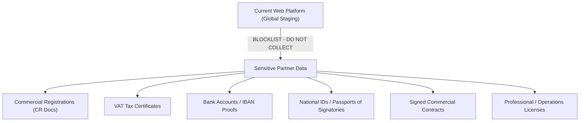
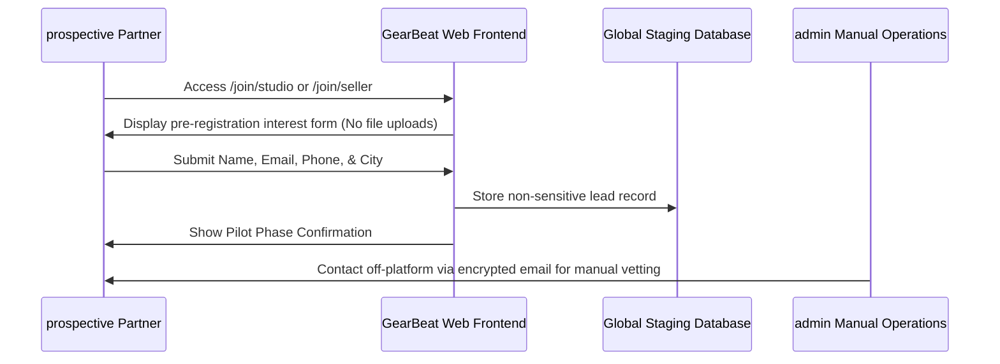

# GEARBEAT PATCH 113B — SENSITIVE DATA BLOCKLIST & PARTNER ONBOARDING COMPLIANCE GATE

## 1. Executive Summary

To satisfy the **Saudi Personal Data Protection Law (PDPL)** under the jurisdiction of **SDAIA**, GearBeat V2 must enforce strict storage boundaries before collecting partner documents. Since the production sovereign cloud database (GCP Dammam or stc cloud/SCCC) is not yet active, collecting highly sensitive files (e.g., Commercial Registrations, VAT certificates, and bank statements) inside the current global multi-tenant staging environment poses regulatory compliance risks.

This compliance gate formally establishes a **Sensitive Data Onboarding Blocklist**, outlines the safe temporary interest-only pre-registration workflow, and defines the future compliant architecture.

---

## 2. Sensitive Onboarding Data Blocklist

Until local Saudi sovereign database storage and S3-compatible local bucket layers are fully configured and verified, GearBeat **must not** store, upload, or process the following data classes on the active web application platform:

### A. Prohibited Documents & Details
1.  **Commercial Registrations (CR)**: Scans, PDFs, or raw database parameters of legal registration papers.
2.  **VAT Certificates**: Tax administration papers and raw 15-digit KSA VAT numbers.
3.  **Bank Statements & IBAN Verification**: Direct bank statement screenshots or bank confirmation cards showing routing details and account numbers.
4.  **National IDs / Passports**: Physical copies of corporate officer IDs or residency cards (Iqama).
5.  **Signed Contracts / Agreements**: Corporate partner terms or physical service level agreements.
6.  **Professional Licenses**: Specialized audio engineering certifications or municipal zoning permits.

### B. Onboarding Restrictions by Partner Vertical
*   **Studio Owners**: Must not upload location title deeds, lease contracts, or commercial registration scans.
*   **Marketplace Vendors**: Must not upload supplier certificates, customs import licenses, or local bank routing info.
*   **Service Providers**: Must not upload individual professional resumes carrying birthdates or national identification numbers.
*   **Event & Ticket Organizers**: Must not upload local municipality event permits or entertainment authorization licenses.

---

## 3. Safe Temporary Partner Interest Workflow

To allow GearBeat to accumulate a high-quality cohort of pilot candidates while remaining 100% PDPL-compliant, we establish a **Stateless Pre-Registration Pathway**:

### A. What Can Be Collected Safely Now (Interest Data)
*   **Authorized Person Name**: First name and last name for business outreach.
*   **Business Email**: Non-sensitive generic corporate email (e.g., `info@studio.com`).
*   **Business Mobile**: For initial validation.
*   **City & Country**: Basic localization metrics to verify pilot region fit.
*   **Planned Studio Capacity**: Numeric capacity values.

### B. Off-Platform Handling of Sensitive Verification
Until Saudi storage is active, all corporate vetting must be handled manually:
1.  Verify the partner's status using public governmental databases (e.g., *Maroof / Ministry of Commerce portals*).
2.  Physical exchange and direct off-platform secure signature of terms.
3.  Store hardcopy physical contracts in locked office files without digital server indexing.

---

## 4. Legal & Access Control Gates

Prior to lifting the blocklist and initiating digital document onboarding:

### A. Privacy Policy & Consent Gates
1.  **Double Opt-In Consent**: Partners must actively check a dedicated, un-selected compliance checkbox confirming:
    > *"I explicitly consent to the local processing of my commercial documents inside secure Saudi-registered nodes in full compliance with the Saudi PDPL."*
2.  **Right of Erasure**: Update `/legal/privacy` to offer a one-click request route for partners to request permanent deletion of uploaded business documents.

### B. Admin Access & Auditing Controls
1.  **Row Level Security (RLS)**: Stored partner document paths must be masked behind Postgres RLS policies, restricting read access exclusively to the certified *System Audit Lead* role.
2.  **No Unmasked PII Logs**: All server error logging and exception traps must run an automatic regex mask, converting all emails, phone numbers, and IBANs to `[SENSITIVE_PII_MASKED]`.

---

## 5. Absolute No-Go Conditions

The deployment team must **immediately halt** dynamic onboarding systems if any of these conditions are met:

*   [ ] **Bucket Relocation Failure**: Dynamic document uploads trigger without verifying that the destination storage bucket resides inside KSA sovereign IP boundaries (e.g., GCP Dammam / stc cloud).
*   [ ] **Unencrypted Bucket Access**: Storage access controls default to public-read, allowing standard URL access to uploaded business CR files.
*   [ ] **Unmasked Administrative Views**: Administrative tables render unmasked bank statements or IBAN lists to standard support roles.

---

## 6. Verification & Compliance Checklist

- [x] **No App Code Modified**: Documentation-only architectural report.
- [x] **No SQL or Migrations**: Database schemas, triggers, and active tables fully untouched.
- [x] **Typecheck Passed**: Clean typescript output verification complete.
- [x] **Sovereign Alignment**: Explicitly blocks cloud uploads until Saudi nodes are active.

---

## 7. Recommended Next Patch

**Patch 113C — Off-Platform Partner Vettign Manual Runbook**
*   *Action*: Define the standard manual verification runbook, mapping offline Maroof verification procedures, direct email security formats, and static interest ledger parameters.
