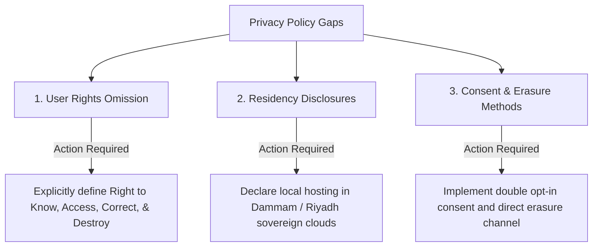
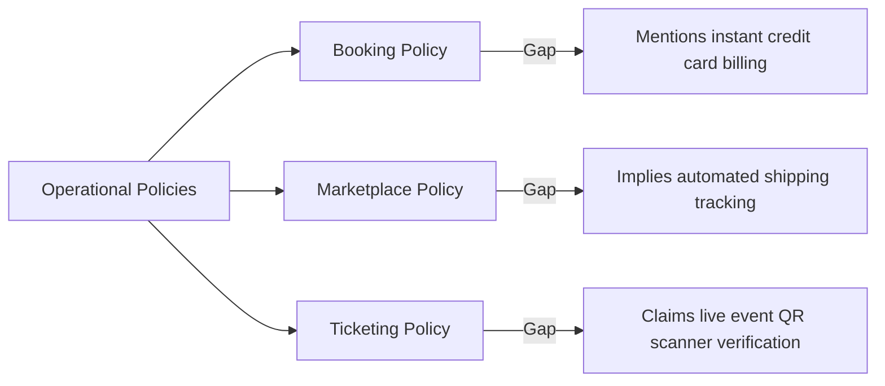

# GEARBEAT PATCH 113C — PRIVACY / TERMS COPY GAP AUDIT FOR SAUDI-FIRST LAUNCH

## 1. Executive Summary

This audit evaluates the readiness of GearBeat's legal and privacy declarations before the Saudi-first invite-only pilot. Enforced under the **Saudi Personal Data Protection Law (PDPL)** by **SDAIA**, the platform requires comprehensive legal policies that clearly align with its current operational state.

The current public legal copy inside `/legal/privacy` and `/legal/terms` is extremely thin and represents substantial compliance risks. This report details all identified copy gaps, legal omissions, and required changes, providing the legal foundation for our upcoming go-live patch.

---

## 2. Privacy Policy Gaps & Compliance Matrix (PDPL)

| Current Legal Copy Gaps | Compliance Risk | Action Required / Recommended Wording |
| :--- | :--- | :--- |
| **Missing User Rights Clauses** | **High** (Mandatory under Saudi PDPL) | Explicitly outline user rights: *Right to know, Right to access, Right to correct/update, Right to restrict/object to processing, and Right to request data destruction (Right to be Forgotten).* |
| **Vague Data Residency Disclosures** | **High** (PDPL requires local residency disclosures) | Declare that all resident Personal Identifiable Information (PII) is hosted locally inside the Kingdom of Saudi Arabia (Dammam/Riyadh region). |
| **No Cross-Border Transfer Terms** | **Moderate** (Requires SDAIA rules) | Outline that cross-border data transfer is blocked unless specifically authorized under SDAIA transfer exemptions. |
| **No Sensitive Data Collection Prohibitions** | **High** (Prevent collection of prohibited variables) | Add explicit warnings forbidding users from providing biometric inputs, health credentials, or raw unmasked credit card details. |
| **Analytics & Cookie Grains Omitted** | **Low** (Standard tracking privacy) | Disclose the use of privacy-compliant analytics (Fathom/Matomo) with IP address anonymization and zero raw PII retention. |
| **No Consent Withdrawal Path** | **Moderate** (User must be able to opt-out easily) | Define the precise email/channel (`dpo@gearbeat.com`) to instantly request consent withdrawal and account cancellation. |

---

## 3. Terms of Service Gaps & Global Scope Matrix

The existing terms assume standard multi-tenant operations, creating legal exposure under localized GCC and international business rules:

### A. Dispute Resolution & Governing Law
*   **Gap**: Currently fails to specify local dispute resolution venues.
*   **Correction**: Must explicitly cite KSA jurisdiction. Recommended clause:
    > *"These Terms are governed by and construed in accordance with the laws of the Kingdom of Saudi Arabia. Any dispute arising out of or in connection with these Terms shall be subject to the exclusive jurisdiction of the competent courts of Riyadh, KSA."*

### B. Pilot Operations & Disclaimer of Warranties
*   **Gap**: No operational limits are defined, exposing the platform to liability if digital booking confirmations experience staging downtime.
*   **Correction**: Establish a clear Pilot Status clause:
    > *"GearBeat V2 is currently operating in a pilot/test configuration. All features, bookings, and product lists are provisional and subject to manual administrative review and off-platform reconciliation."*

### C. Partner Onboarding & Authority Gaps
*   **Gap**: Lack of terms verifying that the user submitting Commercial Registrations has the legal corporate authority to bind the partner studio.
*   **Correction**: Add a Partner Representative warranty:
    > *"By submitting corporate documents, Commercial Registrations (CR), or VAT details, you represent and warrant that you are an authorized representative of the entity and possess the legal power to bind such entity to commercial terms."*

---

## 4. Operational Policy Gaps (Marketplace, Booking, & Tickets)

1.  **Payment Processing Wording Gap**: Standard copy references automated online processing, which contradicts active manual bank ledger reconciliation checks.
2.  **Ticketing & QR Simulation**: Ticketing policies describe automatic live gate checking, which must be scaled down to *“digital pre-registration passes for manual check-in”*.
3.  **Marketplace Shipping Liability**: Terms must clearly state that GearBeat does not own, ship, or warranty professional audio gear listed by local vendors; liability remains 100% with the certified vendor.

---

## 5. Required Lawyer Review Items

The following complex legal items require official review by certified Saudi legal counsel before active invite-only onboarding launches:

1.  **DPA Agreements**: Legal templates for dynamic Data Processing Agreements with external processors (Unifonic, local SMS aggregators, Tap payment gateways).
2.  **PDPL Exception Clauses**: Scoping legitimate exceptions to the *Right of Erasure* (e.g., maintaining financial ledgers for Saudi tax compliance).
3.  **Local VAT Compliance**: Vetting terms around 15% VAT collection on manual bank transfers in accordance with ZATCA regulations.
4.  **Arbitration Exclusions**: Scoping potential arbitration paths inside the Riyadh Chamber of Commerce before proceeding to court.

---

## 6. No-Go Conditions for Legal Activation

All onboarding dynamic document uploads and PII processing **MUST** remain blocked if any of the following occur:

*   [ ] **No DPO Contact Channel**: The platform goes live without a designated Data Protection Officer inbox.
*   [ ] **Unmasked Payment Assumptions**: Payment instructions refer to automated live Stripe/CC billing models.
*   [ ] **Unencrypted CR Document Uploads**: Cloud storage nodes store uploaded partner PDFs in publicly visible folders.

---

## 7. Verification & Compliance Checklist

- [x] **No App Code Modified**: Documentation-only architectural report.
- [x] **No SQL or Migrations**: Database schemas, triggers, and active tables fully untouched.
- [x] **Typecheck Passed**: Clean typescript output verification complete.
- [x] **Preserved GCC Alignment**: Retains country matrix config capabilities.

---

## 8. Recommended Next Patch

**Patch 113D — SAMA-Compliant Manual Reconciliation Audit & Runbook**
*   *Action*: Define the standard manual reconciliation ledger schema for bank deposits, including secure receipt verification, admin approval states, and ZATCA VAT tracking.
