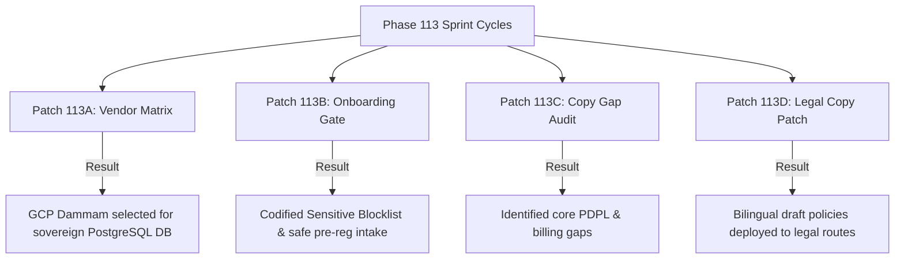

# GEARBEAT PATCH 113E — SAUDI-FIRST COMPLIANCE CLOSEOUT & LAUNCH GATE

## 1. Executive Summary

This report serves as the final **Compliance Closeout and Launch Gate** for Phase 113. It synthesizes our architectural, operational, and copy decisions across Patches 113A through 113D to evaluate GearBeat V2's readiness for its Saudi-first invite-only soft pilot.

Based on detailed vendor matrices, partner onboarding restrictions, legal gap audits, and copy patches, we establish a **definitive Go/No-Go verdict** and list the remaining structural blockers required for full commercial scale.

---

## 2. Synthesis of Phase 113 Completed Milestones

### A. Patch 113A — Saudi Data Residency Vendor Decision Matrix
*   *Achievement*: Evaluated local data hosting options (GCP Dammam, OCI Riyadh, stc/SCCC) against our current global baseline.
*   *Decision*: Selected **Google Cloud Dammam Region** as the permanent target for GearBeat's sovereign production PostgreSQL database and S3-compatible object storage.

### B. Patch 113B — Sensitive Data Collection Blocklist + Onboarding Gate
*   *Achievement*: Established a strict blocklist forbidding public web upload of sensitive corporate papers (Commercial Registrations, VAT documents, national IDs, and bank confirmations) inside global staging.
*   *Design*: Formulated the **Stateless Pre-Registration Partner Intake** (collecting name, contact email, mobile, and city) with off-platform manual vetting.

### C. Patch 113C — Privacy / Terms Copy Gap Audit
*   *Achievement*: Audited active legal copies and identified critical compliance risks (missing PDPL rights, governing law, data residency disclosures, and payment warnings).

### D. Patch 113D — Legal Pages Saudi-First Copy Patch
*   *Achievement*: Updated `/legal/privacy` and `/legal/terms` with comprehensive bilingual (Arabic/English) draft policies including SAMA billing disclaimers, local residency disclosures, and explicit PDPL user rights.

---

## 3. Saudi-First Compliance Readiness Status

| Compliance Domain | Readiness Status | Remaining Blockers / Dependencies |
| :--- | :--- | :--- |
| **PDPL & Data Residency** | **Draft Ready (Sandbox Vetting)** | Storing raw PII of Saudi residents remains blocked until the production DB is relocated to the GCP Dammam sovereign region. |
| **Sensitive Data Collection** | **Securely Blocked (Safe)** | Public form upload is restricted. Partners submit pilot interest only. Legal papers are processed manually off-platform. |
| **Privacy & Terms Copy** | **Bilingual Draft Active** | High-fidelity terms are live on `/legal/privacy` and `/legal/terms` pending final lawyer certification. |
| **Payment & Payout Systems** | **Blocked (Manual Bank Verification)** | Merchant checkouts and automated payouts are locked pending SAMA-licensed gate validation. |

---

## 4. Absolute No-Go Conditions for Commercial Scale

The platform must immediately **halt active document uploads, live credit card processing, or bulk PII indexing** if any of the following occur:

*   [ ] **Bucket Relocation Failure**: File uploads trigger without verifying that the destination storage bucket resides inside KSA sovereign IP boundaries (e.g. GCP Dammam).
*   [ ] **Unmasked Administrative Views**: Administrative views render unmasked bank statements or IBAN details to support agents.
*   [ ] **Unencrypted CR Document Uploads**: Stored partner registration papers are saved in public, unencrypted storage directories.

---

## 5. Required Lawyer Review & Infrastructure Decisions

Prior to entering full commercial operations (post-pilot):

1.  **SAMA Provider Vetting**: Final certification and licensing audits for the local payment tokenizer integration (e.g. Tap or Moyasar).
2.  **Tax Audit Exceptions**: Professional legal review of data retention exceptions under Saudi ZATCA guidelines.
3.  **Sovereign Node Activation**: Deployment of the PostgreSQL instance to Google Cloud Dammam with customer-managed keys (CMK) configured inside the Saudi boundary.
4.  **DPA Agreements**: Signing explicit Data Processing Agreements with external processors (Unifonic for local SMS, GCP).

---

## 6. Final Phase Verdict

> [!IMPORTANT]
> **GO FOR SOFT PILOT PRE-REGISTRATION**: The platform is highly responsive, structurally secure, carries comprehensive billing warnings, and strictly enforces stateless interest intake.
> **NO-GO FOR SENSITIVE FILE UPLOADS**: Dynamic document collection remains restricted to manual off-platform administration until local Saudi storage nodes are active.

---

## 7. Recommended Next Phase after Closeout

**Phase 114 — SAMA-Compliant Manual Reconciliation Audit & Runbook**
*   *Focus*: Formulate a manual bank transfer ledger matching plan, detail administrative verification views, and design local transaction deposit confirmation workflows in the partner portal.
