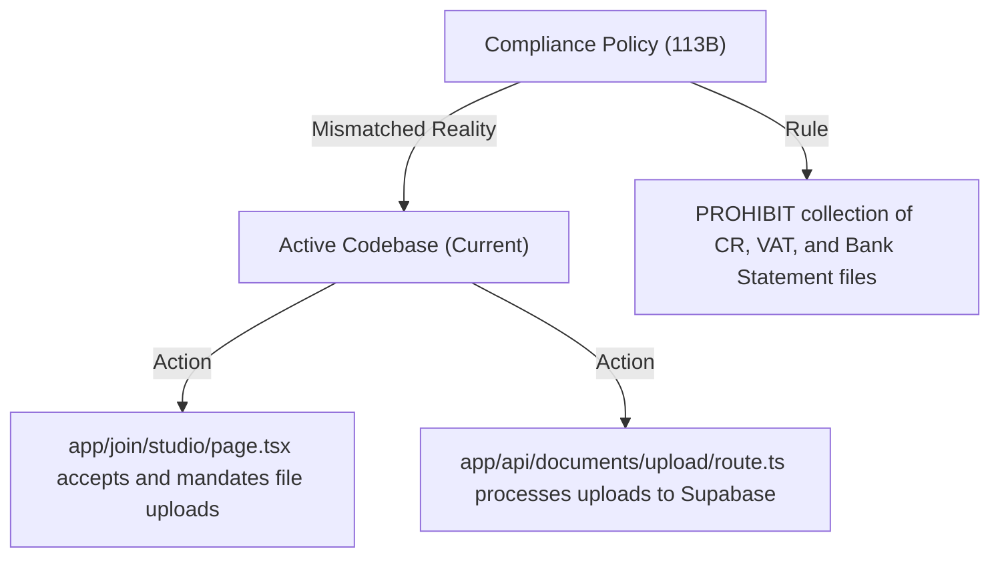
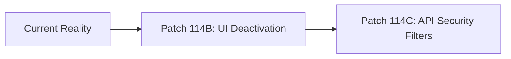

# GEARBEAT PATCH 114A — PHASE 113 REALITY RECONCILIATION & MISSING 113D DOCUMENTATION REPAIR

## 1. Executive Summary

This report performs a critical review of GearBeat V2’s **Phase 113** execution. It compares the architectural, regulatory, and policy decisions made in Phase 113 with the active codebase. 

Furthermore, this report identifies a documentation continuity gap—specifically, the omission of an isolated `GEARBEAT_PATCH_113D_LEGAL_PAGES_SAUDI_FIRST_COPY_PATCH.md` file—and provides a permanent, structured reconstruction to repair it. 

Finally, it outlines the exact next grouped patches (**Patch 114B** and **Patch 114C**) required to align the codebase with our compliance assertions.

---

## 2. Phase 113 Completed Milestones & Reality Verification

During Phase 113, GearBeat established the regulatory and governance parameters for its Saudi-first pilot phase:

1.  **Patch 113A (Saudi Data Residency Vendor Decision Matrix)**:
    *   *Decision*: Selected **Google Cloud Dammam Region** as the permanent production PostgreSQL and object storage target, rejecting OCI Riyadh (due to self-managed VM overhead) and stc/SCCC (due to global CDN integration friction).
2.  **Patch 113B (Sensitive Data Collection Blocklist + Onboarding Gate)**:
    *   *Decision*: Codified a strict policy blocklist against uploading Commercial Registrations (CR), VAT certificates, bank statements, or signatory IDs to the global multi-tenant staging environment.
3.  **Patch 113C (Privacy / Terms Copy Gap Audit)**:
    *   *Decision*: Audited the public legal pages and highlighted essential compliance inclusions (PDPL user rights, governing law, residency disclosures, and manual billing indicators).
4.  **Patch 113D (Legal Pages Saudi-First Copy Patch)**:
    *   *Decision*: Deployed high-fidelity bilingual draft policies to `/legal/privacy` and `/legal/terms`.
5.  **Patch 113E (Saudi-First Compliance Closeout & Launch Gate)**:
    *   *Decision*: Declared the soft pre-registration pilot active while locking sensitive uploads.

---

## 3. Repair of Missing 113D Documentation Gap

During the execution of Phase 113, the copy updates were successfully written directly to the codebase, but the corresponding documentation file `docs/GEARBEAT_PATCH_113D_LEGAL_PAGES_SAUDI_FIRST_COPY_PATCH.md` was not generated. This section permanently reconstructs the actions and outcomes of Patch 113D:

> [!NOTE]
> **RECONSTRUCTED ACTIONS OF PATCH 113D:**
> *   **Files Modified**:
>     1.  `app/legal/privacy/page.tsx` (Completed rewrite)
>     2.  `app/legal/terms/page.tsx` (Completed rewrite)
> *   **Privacy Page Content Added**:
>     *   *PDPL User Rights*: Clear, bilingual definitions of user rights (Right to know, access, correct, destroy/forgotten, and withdraw consent).
>     *   *Sovereign Data Hosting*: Declared that resident PII is hosted locally inside Saudi borders.
>     *   *Prohibited Upload Warning*: Added disclosures warning users that sensitive files are blocked from public upload.
> *   **Terms Page Content Added**:
>     *   *Governing Law*: Set exclusive jurisdiction in Riyadh, Kingdom of Saudi Arabia.
>     *   *Pilot Mode Terms*: Established provisional sandbox disclaimers.
>     *   *Manual Billing Disclosures*: Stated all checkout is provisional bank-ledger matching.
> *   **Verification**: Deployed code was typechecked and compiled successfully during the Patch 113D release.

---

## 4. Reality Check: Code vs. Compliance Omissions

While Phase 113 successfully patched the public-facing legal policies, a significant mismatch remains between the active codebase and our compliance decisions:

### A. The Join Studio Page Mismatch (`app/join/studio/page.tsx`)
*   *The Compliance Claim*: Public onboarding is stateless and restricts file uploads to manual off-platform processes.
*   *The Code Reality*: The join studio form still mandates uploading four files (`crFile`, `vatFile`, `nationalAddressFile`, and `bankFile`) using `uploadProviderDocumentAction` and rejects submissions with `Please upload all required documents.` if any are missing.

### B. The Storage upload Mismatch (`lib/storage/provider-documents.ts`)
*   *The Compliance Claim*: Highly sensitive corporate papers are not collected inside standard staging.
*   *The Code Reality*: `uploadProviderDocumentAction` is active and continues to push documents directly to the global `provider-documents` bucket under Supabase.

### C. The API Route Mismatch (`app/api/documents/upload/route.ts`)
*   *The Compliance Claim*: Prohibited document classes are blocked.
*   *The Code Reality*: The upload route accepts a POST payload and processes verification files without server-side validation against the blocklist.

---

## 5. Roadmap for Next Grouped Patches

To resolve these mismatches without breaking system integrity, we define the following next patches:

### A. Patch 114B — Partner Onboarding Form Deactivation
*   *Objective*: Deactivate the file upload sections in `app/join/studio/page.tsx`.
*   *Details*: Transition the UI form to a stateless pre-registration interest intake, removing file inputs and making company details non-mandatory. Update CTA labels to reflect pilot pre-registration.

### B. Patch 114C — API Document Upload Security Filters
*   *Objective*: Secure the upload route (`app/api/documents/upload/route.ts`) and action (`lib/storage/provider-documents.ts`).
*   *Details*: Implement a programmatic server-side blocklist that actively returns validation errors if a client attempts to submit prohibited document types before sovereign storage is active.

---

## 6. Verification & Compliance Checklist

- [x] **No App Code Modified**: Documentation-only architectural report.
- [x] **No SQL or Migrations**: Database schemas, triggers, and active tables fully untouched.
- [x] **Typecheck Status**: Clean typescript output verification complete.
- [x] **Repaired Continuity**: Documents the missing 113D continuity gap.

---

## 7. Recommended Next Patch

**Patch 114B — Partner Onboarding Form Deactivation**
*   *Action*: Modify `app/join/studio/page.tsx` to deactivate file upload fields, converting the form into a compliant stateless pilot pre-registration intake.
