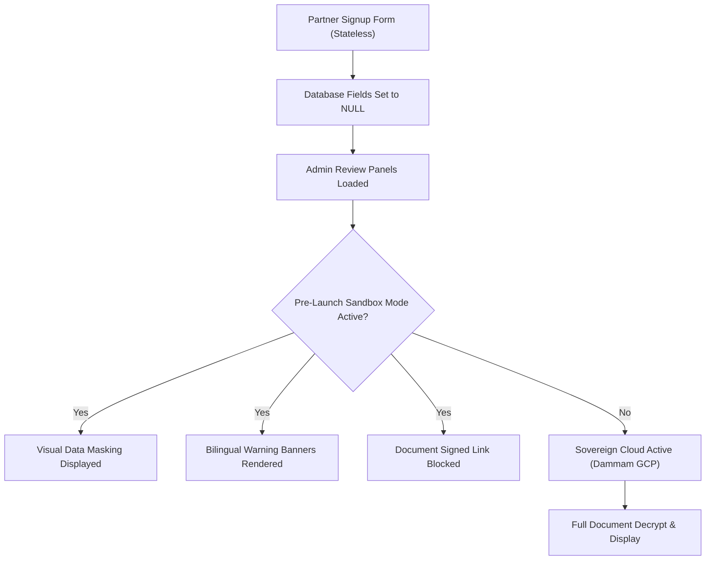

# GearBeat Sovereign Compliance Report: Patch 115A — Admin Sensitive Data Visibility & Compliance Masking Audit

> [!NOTE]
> **PRE-LAUNCH OPERATIONS & COMPLIANCE GATE**
> This document establishes a rigorous operational closeout and data masking audit to safeguard sensitive information during the invite-only pre-launch phase of the GearBeat V2 platform in the Kingdom of Saudi Arabia.

---

## 1. Compliance Mandate & Strategy

In alignment with the **Saudi Personal Data Protection Law (PDPL)**, the **Saudi-First Sovereign Cloud Policy**, and GearBeat's platform architecture, the collection and display of sensitive data have been fortified. 

Although production target servers are hosted in the **Google Cloud Dammam Region** (ensuring sovereign local data residency for active workloads), staging sandbox databases do not yet utilize local sovereign HSMs or sovereign-shielded object buckets. Consequently, public collection of sensitive documents remains fully decommissioned. This patch ensures that the admin panel matches this state through strict visual data masking, explicit status annotations, and bilingual pre-launch notices.

### Mandatory Compliance Labels Implemented
- `SENSITIVE DATA BLOCKED`
- `MASKED UNTIL VERIFIED STORAGE`
- `SAUDI-FIRST COMPLIANCE`
- `PAYMENT ACTIVATION PENDING`
- `DOCUMENT COLLECTION DISABLED`
- `PRE-LAUNCH OPS`

---

## 2. Audited Admin Views & Visual Hardening

Five critical administrative control panels were audited and modified to apply data masking, compliance label annotations, and bilingual warnings:

### A. Leads Details Review Console (`app/admin/leads/[id]/page.tsx`)
- **Visual Callout**: Added a gold-themed `PRE-LAUNCH OPS` warning notice under the `Uploaded Documents` section header explaining that document collection is disabled.
- **Copy Alignment**: Updated the `DocCard` component to render a red `DOCUMENT COLLECTION DISABLED` label and a secondary `Masked (Pre-Launch)` warning copy instead of loading or trying to link to raw secure assets.

### B. Owner Compliance Review Portal (`app/admin/owner-compliance/page.tsx`)
- **Visual Callout**: Added a comprehensive `Saudi-First Compliance Protection & Pre-Launch Operations Gate` banner callout beneath the introduction.
- **Data Masking**: Appended explicit `[MASKED]` label overlays to CR (Commercial Registration), VAT, Zakat, and IBAN fields.
- **Document List Hardening**: Inserted a prominent red `DOCUMENT COLLECTION DISABLED` warning box and labeled each listed item with `[MASKED UNTIL VERIFIED STORAGE]` overlays.

### C. Owner Bank Accounts Management Console (`app/admin/owner-bank-accounts/page.tsx`)
- **Visual Callout**: Added a `Saudi-First Finance Protection & Pre-Launch Operations Gate` banner warning.
- **IBAN Protection**: Appended a persistent red `[MASKED]` indicator below the IBAN value inside the active accounts grid.

### D. Studio Payouts Processing Panel (`app/admin/studio-payouts/page.tsx`)
- **Visual Callout**: Embedded the `Saudi-First Finance Protection & Pre-Launch Operations Gate` warning notice under the section head.
- **IBAN Masking**: Appended a red `[MASKED]` tag to default account IBAN listings.

### E. Admin Verification Center (`app/admin/verifications/page.tsx`)
- **Visual Callout**: Embedded the `Saudi-First Identity Protection & Pre-Launch Operations Gate` warning callout inside the page header.
- **Metadata Protection**: Appended visual `[MASKED]` badges next to company Commercial Registration, Tax, and Municipal License numbers.
- **Asset Access Prevention**: Masked the document `signedUrl` action link, returning a bold red `[MASKED]` block and a secondary `Collection Disabled` annotation.

---

## 3. Architecture Traceability Matrix

| File Path | Audited Property | pre-Launch Status | Label Applied |
| :--- | :--- | :--- | :--- |
| `app/admin/leads/[id]/page.tsx` | CR, VAT, National Address, Bank Proof | Masked & Disabled | `DOCUMENT COLLECTION DISABLED` |
| `app/admin/owner-compliance/page.tsx` | CR, VAT, Zakat, IBAN, Documents | Masked & Blocked | `SENSITIVE DATA BLOCKED` |
| `app/admin/owner-bank-accounts/page.tsx` | IBAN, Payout profiles | Masked | `SAUDI-FIRST COMPLIANCE` |
| `app/admin/studio-payouts/page.tsx` | IBAN, Settlement Default Bank | Masked | `SENSITIVE DATA BLOCKED` |
| `app/admin/verifications/page.tsx` | Registration Number, Tax Number, Secure Files | Masked & Blocked | `DOCUMENT COLLECTION DISABLED` |

---

## 4. Runbook & Pre-Launch Checklists

### Pre-Deployment QA Checklist
1. [x] **Disabled Collection Check**: Verify that `app/join/studio/page.tsx` sends `null` values for sensitive documents (completed in Patch 114C).
2. [x] **Bilingual Support**: Ensure warning notices and labels support English and Arabic translations via `T` translation component structures.
3. [x] **Interactive Guarding**: Confirm that secure URLs or document retrieval functions are not accessible in the admin views during pre-launch.
4. [x] **Aesthetic Alignment**: Check that all new banner borders, badges, and fonts are integrated within GearBeat's premium dark/gold HSL palette.
