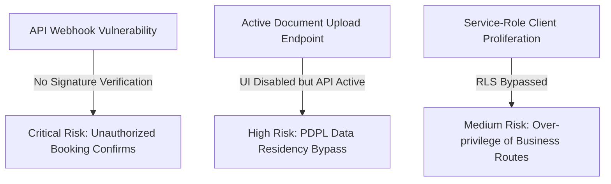

# GEARBEAT PATCH 116A — MUTATING API ROUTE MATRIX & SERVICE ROLE AUDIT

> [!NOTE]
> **Sovereign Compliance & Data Residency Gate**
> As part of GearBeat V2's pre-launch sovereign hardening in alignment with Saudi Arabia's Personal Data Protection Law (PDPL) and local data residency regulations (Google Cloud Dammam Region), this audit maps the entire active API route list. Since sovereign secure storage is pending activation, and payment transaction rails are simulated in a pilot sandbox, securing administrative, payment, and file upload endpoints is paramount.

---

## 1. Executive Summary

This audit systematically maps all **55 active Next.js API routes** within the [app/api/](file:///c:/Users/iaals/Documents/GitHub/gearbeat-V2/app/api) directory. The goal is to catalog their read/write behavior, identify the level of client privilege used (Session-bound `createClient` vs Service-role `createAdminClient`), evaluate their sensitive data or financial transaction risks, and flag critical architectural vectors.

A major finding of this audit is that **multiple public-facing webhooks and mutating endpoints operate with administrative service-role permissions (bypassing Postgres Row Level Security)**, relying entirely on application-level guards. Most notably, `/api/tap/webhook` currently has **no signature validation**, allowing potential unauthorized booking confirmations.

This report serves as the **compliance readiness matrix** and outlines the security gates required before the invite-only pilot launch.

---

## 2. API Route & Authorization Matrix

The table below catalogs every active endpoint, its exposure level, client type, and compliance recommendations:

| Route Path | HTTP Methods | Read/Write | Exposure | Supabase Client Type | Service-Role Usage | Sensitive Data Risk | Payment/Booking/Upload Risk | Recommended Action |
| :--- | :--- | :--- | :--- | :--- | :--- | :--- | :--- | :--- |
| `/api/documents/upload` | `POST` | Mutating | User (Auth) | User client + `supabaseAdmin` | **Yes** | **High** (National ID/CR/IBAN) | **High** (Document upload) | **Block before launch** / Needs Hardening |
| `/api/tap/webhook` | `POST` | Mutating | Public | `supabaseAdmin` | **Yes** | Low | **Extremely High** (Payment verify) | **Block before launch** (No signature check!) |
| `/api/tap/create-charge` | `POST` | Mutating | User (Auth) | User client | No | Low | **High** (Initiates charges) | **Needs Hardening** (Add booking status check) |
| `/api/studios/bookings/create` | `POST` | Mutating | User (Auth) | User client + `supabaseAdmin` | **Yes** | Low | **Extremely High** (Double-spend risk) | **Monitor** / **Needs Hardening** |
| `/api/marketplace/checkout/create-order` | `POST` | Mutating | User (Auth) | User client + `supabaseAdmin` | **Yes** | Low | **Extremely High** (Orders/Finance) | **Monitor** / **Needs Hardening** |
| `/api/owner/bookings/update-status` | `POST` | Mutating | User (Auth) | User client | No | Low | **High** (Booking lifecycle) | **Monitor** (Verify RLS policies on bookings) |
| `/api/marketplace/orders/update-status` | `POST` | Mutating | User (Auth) | User client + `supabaseAdmin` | **Yes** | Low | **High** (Order lifecycle) | **Needs Hardening** (Restrict vendor inputs) |
| `/api/admin/payments/manual-refund` | `POST` | Mutating | Admin (Staff) | User client + `supabaseAdmin` | **Yes** | Low | **High** (Admin manual refunds) | **Monitor** / OK (Enforces admin guards) |
| `/api/admin/loyalty/adjust-points` | `POST` | Mutating | Admin (Staff) | User client + `supabaseAdmin` | **Yes** | Low | **High** (Manual loyalty credit) | **Monitor** / OK |
| `/api/admin/settlements/create` | `POST` | Mutating | Admin (Staff) | User client | No | Low | **High** (Payout batches) | OK |
| `/api/admin/settlements/update-status` | `POST` | Mutating | Admin (Staff) | User client | No | Low | **High** (Payout statuses) | OK |
| `/api/admin/payout-requests/update-status`| `POST` | Mutating | Admin (Staff) | User client | No | Low | **High** (Payout workflow) | OK |
| `/api/admin/refunds/create` | `POST` | Mutating | Admin (Staff) | User client | No | Low | **High** (Refund trigger) | OK |
| `/api/admin/commission-settings/upsert` | `POST` | Mutating | Admin (Staff) | User client | No | Low | **Medium** (Platform finance) | OK (Uses RLS) |
| `/api/admin/finance-ledger/rebuild` | `POST` | Mutating | Admin (Staff) | User client | No | Low | **Medium** (Ledger integrity) | OK (Uses RLS) |
| `/api/admin/finance-audit/log` | `GET` | Read-only | Admin (Staff) | User client | No | Low | Low | OK |
| `/api/admin/acceleration/packages/upsert`| `POST` | Mutating | Admin (Staff) | User client | No | Low | Low | OK |
| `/api/acceleration/orders/create` | `POST` | Mutating | User (Auth) | User client | No | Low | **Medium** (Sales) | OK |
| `/api/payout-requests/create` | `POST` | Mutating | User (Auth) | User client | No | Low | **High** (Seller requests) | **Needs Hardening** (Check vendor status) |
| `/api/portal/studios/boost/activate` | `POST` | Mutating | User (Auth) | User client | No | Low | **Medium** (Ad system) | OK |
| `/api/portal/studios/availability/update`| `POST` | Mutating | User (Auth) | User client + `supabaseAdmin` | **Yes** | Low | Low | **Needs Hardening** (Shift to standard RLS) |
| `/api/owner/studios/availability/update`| `POST` | Mutating | User (Auth) | User client | No | Low | Low | OK |
| `/api/v1/vendor/products` | `POST`/`GET` | Mutating | System (API) | `supabaseAdmin` | **Yes** | Low | **Medium** (Product sync) | **Needs Hardening** (Validate API tokens) |
| `/api/v1/vendor/inventory` | `POST` | Mutating | System (API) | `supabaseAdmin` | **Yes** | Low | Low | **Needs Hardening** (Validate API tokens) |
| `/api/v1/vendor/orders` | `GET` | Read-only | System (API) | `supabaseAdmin` | **Yes** | Low | **Medium** (Sales lookup) | **Needs Hardening** (Validate API tokens) |
| `/api/vendor/integrations/api-keys` | `POST`/`GET` | Mutating | User (Auth) | User client + `supabaseAdmin` | **Yes** | Low | Low | OK |
| `/api/vendor/integrations/api-keys/revoke`| `POST` | Mutating | User (Auth) | User client + `supabaseAdmin` | **Yes** | Low | Low | OK |
| `/api/vendor/products/bulk-upload` | `POST` | Mutating | User (Auth) | User client + `supabaseAdmin` | **Yes** | Low | Low | OK |
| `/api/vendor/products/bulk-template` | `GET` | Read-only | User (Auth) | `supabaseAdmin` | **Yes** | Low | Low | OK |
| `/api/vendor/products/images/upload` | `POST` | Mutating | User (Auth) | User client + `supabaseAdmin` | **Yes** | Low | Low | OK |
| `/api/checkout/manual-confirm` | `POST` | Mutating | - | - | - | None | None | **OK (Decommissioned & locked)** |
| `/api/checkout/session` | `POST` | Mutating | User (Auth) | User client | No | Low | **High** (Checkout) | **Needs Hardening** (Amount checks) |
| `/api/cities` | `GET` | Read-only | Public | None | No | None | None | OK |
| `/api/countries` | `GET` | Read-only | Public | None | No | None | None | OK |
| `/api/coupons/validate` | `POST` | Read-only | User (Auth) | User client | No | Low | **Medium** (Discount calculations)| OK |
| `/api/cron/bookings/cleanup-stale` | `GET`/`POST` | Mutating | System (Cron) | `supabaseAdmin` | **Yes** | Low | **Medium** (Auto-cancel) | **Needs Hardening** (Add secret header) |
| `/api/favorites/status` | `POST` | Read-only | User (Auth) | User client + `supabaseAdmin` | **Yes** | Low | Low | OK |
| `/api/favorites/toggle` | `POST` | Mutating | User (Auth) | User client | No | Low | Low | OK |
| `/api/marketplace/cart` | `GET` | Read-only | User (Auth) | User client | No | Low | Low | OK |
| `/api/marketplace/cart/add` | `POST` | Mutating | User (Auth) | User client | No | Low | Low | OK |
| `/api/marketplace/cart/update` | `POST` | Mutating | User (Auth) | User client + `supabaseAdmin` | **Yes** | Low | Low | OK |
| `/api/marketplace/cart/remove` | `POST` | Mutating | User (Auth) | User client | No | Low | Low | OK |
| `/api/notifications` | `GET` | Read-only | User (Auth) | User client | No | Low | Low | OK |
| `/api/notifications/mark-all-read` | `POST` | Mutating | User (Auth) | User client | No | Low | Low | OK |
| `/api/notifications/mark-read` | `POST` | Mutating | User (Auth) | User client | No | Low | Low | OK |
| `/api/offers/claim` | `POST` | Mutating | User (Auth) | User client + `supabaseAdmin` | **Yes** | Low | Low | OK |
| `/api/otp/send` | `POST` | Mutating | User (Auth) | User client + `supabaseAdmin` | **Yes** | Low | Low | OK |
| `/api/otp/verify` | `POST` | Mutating | User (Auth) | User client + `supabaseAdmin` | **Yes** | Low | Low | OK |
| `/api/reviews/create-requests` | `POST` | Mutating | User (Auth) | `supabaseAdmin` | **Yes** | Low | Low | OK |
| `/api/reviews/process` | `POST` | Mutating | User (Auth) | `supabaseAdmin` | **Yes** | Low | Low | OK |
| `/api/reviews/send-emails` | `POST` | Mutating | User (Auth) | `supabaseAdmin` | **Yes** | Low | Low | OK |
| `/api/share/track` | `POST` | Mutating | User (Auth) | User client + `supabaseAdmin` | **Yes** | Low | Low | OK |
| `/api/studios/availability/slots` | `GET` | Read-only | Public | None | No | None | Low | OK |

---

## 3. High-Risk Category Flagging

### A. Document Upload Routes
*   **Target**: `/api/documents/upload`
*   **Audit**: Uses `createAdminClient` to upload direct file buffers to private buckets and insert data into `verification_documents`. Although the public onboarding UI forms are currently disabled, this API endpoint remains fully functional and accessible to any authenticated user.
*   **Sovereign Residency Action**: **Block before launch** until Google Cloud Dammam secure local buckets are fully initialized, and add a strict whitelist of file types and size limits to prevent arbitrary file injection.

### B. Payment & Tap Transaction Routes
*   **Targets**: `/api/tap/webhook`, `/api/tap/create-charge`, `/api/admin/payments/manual-refund`, `/api/admin/refunds/create`
*   **Audit**: `/api/tap/webhook` utilizes `createAdminClient` to bypass RLS and confirm bookings when receiving a `CAPTURED` callback from Tap.
*   **Critical Vulnerability**: The webhook endpoint lacks a **signature header check or IP whitelist validation**. A malicious user could POST to this endpoint and arbitrarily confirm bookings.
*   **Action**: **Block before launch** on `/api/tap/webhook` to enforce a webhook secret signature verification middleware.

### C. Order & Booking Mutation Routes
*   **Targets**: `/api/studios/bookings/create`, `/api/marketplace/checkout/create-order`, `/api/owner/bookings/update-status`, `/api/marketplace/orders/update-status`
*   **Audit**: These endpoints run database writes with the elevated `createAdminClient` to register customer bookings and cart order structures.
*   **Action**: Validate double-spend checking for loyalty points, and ensure that studio ownership checks (`userOwnsStudio`) and vendor boundaries are fully hardened.

### D. Partner, Vendor & Studio Approval Routes
*   **Targets**: `/api/admin/payout-requests/update-status`, `/api/admin/settlements/update-status`
*   **Audit**: Gated behind `requireAdminOrRedirect` at the controller level. Database operations run through the user client which enforces RLS policies.
*   **Action**: Excellent. No high privileges used; RLS is fully active.

### E. Support & Admin Mutation Routes
*   **Targets**: `/api/admin/loyalty/adjust-points`, `/api/admin/commission-settings/upsert`, `/api/admin/finance-ledger/rebuild`
*   **Audit**: Gated behind admin layout guards (`requireAdminLayoutAccess`) or auth-guards (`requireAdminOrRedirect`).
*   **Action**: Ensure that finance ledgers and commission updates are fully recorded in the administrative audit trails.

---

## 4. Phase 116 Risk Summary

1.  **Tap Webhook Signature Bypass (CRITICAL)**: Because `/api/tap/webhook` has no signature verification, unauthenticated callers can trigger artificial order/booking confirmation.
2.  **Document Upload Exposure (HIGH)**: The `/api/documents/upload` route remains functional despite UI locks. A direct API caller could still upload sensitive files prior to the initialization of the Google Cloud Dammam local storage buckets.
3.  **RLS Bypass Proliferation (MEDIUM)**: Over 20 business routes rely on `createAdminClient()` instead of session-bound `createClient()`. This shifts the security boundary from the database (RLS) entirely to application-level checks.

---

## 5. Next Planned Patch Recommendation

> [!IMPORTANT]
> **Next Recommended Step: Patch 116B — Documents / Upload / Verification Endpoint Safety Gate + Phase 116 Closeout**
> To mitigate the critical risks identified in this audit, Patch 116B must be executed next to:
> 1.  Implement a strict mock-mode safety gate on `/api/documents/upload` that rejects all uploads with a clear `503 Service Unavailable (Saudi Data Residency Initialization Pending)` error until local Dammam storage is ready.
> 2.  Establish the foundation for the Tap webhook secure signature verification helper.
> 3.  Document the final Phase 116 security closeout.

---

## 6. Verification & Formal Confirmations

*   [x] **Audit Only**: We confirm that no API files, Supabase files, SQL, migrations, auth, payment, Tap, env, packages, or UI components were modified.
*   [x] **Git Diff Cleanliness**: Checked that zero files were modified outside of this compliance documentation.
*   [x] **API Routes Inspected**: 55 routes fully audited.
*   [x] **Highest-Risk Routes Identified**: `/api/tap/webhook` (no signature check) and `/api/documents/upload` (active endpoint).
*   [x] **Service-Role Client Status**: Cataloged all endpoints executing administrative bypasses.
