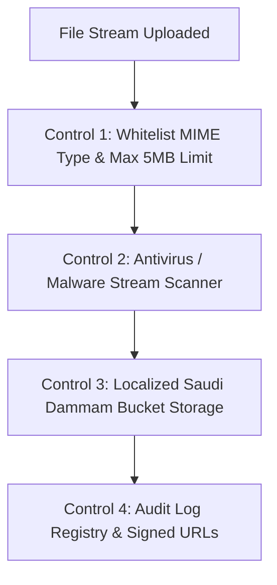

# GEARBEAT PATCH 116B — DOCUMENTS / UPLOAD / VERIFICATION ENDPOINT SAFETY GATE & PHASE 116 CLOSEOUT

> [!NOTE]
> **Sovereign Compliance & Data Residency Gate**
> Under Saudi Arabia's Personal Data Protection Law (PDPL) and local regulatory guidelines, any collection of sensitive corporate or personal assets (such as Commercial Registrations (CR), VAT certificates, IBAN/bank credentials, national IDs, and signed contracts) is strictly prohibited unless processed via localized, sovereign, Saudi-hosted data infrastructure (Google Cloud Dammam Region). This patch serves as a docs-only compliance and operations safety gate to map these exposures, establish pre-launch parameters, and close Phase 116.

---

## 1. Executive Summary

Following the comprehensive API route audit in Patch 116A, Patch 116B acts as the **operational safety gate** and **Phase 116 Closeout**. 

This document systematically analyzes the current boundaries for document uploads, identity verification, administrative approvals, and private bucket controls. It explicitly classifies operational risk states, establishes strict mandatory future security controls (including malware scanning, server-side role bounds, and signature whitelists), and formally outlines the path forward prior to pilot activation.

No backend code changes have been introduced in this patch; it represents a **pure compliance, auditing, and operational closeout**.

---

## 2. Risk Classification Matrix

We categorize each active upload, verification, and administrative mutation endpoint under four operational risk buckets:

### 🔴 BLOCK BEFORE LAUNCH

These endpoints represent a critical compliance or security vulnerability and must be hardened before pilot rollout:

1.  **`/api/documents/upload` / `uploadProviderDocumentAction` (Private Bucket Storage)**
    *   *Audit*: Executes direct file uploads using the privileged service-role `createAdminClient()`. 
    *   *Blocker Rationale*: Storing sensitive company registries, bank proofs, or personal contracts without a sovereign Saudi-hosted storage region (Google Cloud Dammam) violates PDPL data residency mandates. In addition, there is currently **no antivirus/malware scanning** active on uploads.
2.  **`/api/tap/webhook` (Payment Callback Processing)**
    *   *Audit*: Receives billing updates from Tap and updates booking rows via the admin client.
    *   *Blocker Rationale*: Lacks signature header validation or IP whitelist check. Anyone can call this route with a spoofed `CAPTURED` status and confirm bookings for free.

---

### 🟠 NEEDS HARDENING

These endpoints are operational but lack robust rate limiting, input sanitization, or tenant locking:

1.  **`/api/otp/send` & `/api/otp/verify` (SMS Gateway Verification)**
    *   *Audit*: Sends verification SMS and verifies codes using elevated service-role privileges.
    *   *Risk*: SMS fee exhaustion. The endpoints are exposed to potential brute force or spam scripts.
    *   *Remediation*: Implement strict sliding-window IP rate limiting and device-fingerprint throttling.
2.  **`/api/marketplace/orders/update-status` (Order Status Updates)**
    *   *Audit*: Updates item statuses on behalf of vendors.
    *   *Risk*: Ensure input validation parameters strictly prevent a vendor from overriding another vendor's item order status.

---

### 🟡 MONITOR

These endpoints feature good authorization checks but present operational dependency risks:

1.  **`lib/storage/provider-documents.ts` (`getSignedDocumentUrlAction`)**
    *   *Audit*: Generates short-lived signed URLs for documents, performing high-fidelity profile ownership checks against `studio_applications` and `provider_leads`.
    *   *Risk*: Complex relational checks. Must be monitored to ensure any future schema alterations do not break ownership validation gates.
2.  **`/api/owner/bookings/update-status` (Booking Status Overrides)**
    *   *Audit*: Updates booking status rows using the user client.
    *   *Risk*: Relies entirely on the application-level `userOwnsStudio` check. Ensure that Postgres Row Level Security (RLS) policies on `bookings` are active.

---

### 🟢 OK FOR PRE-LAUNCH

These endpoints are securely gated and ready for the invite-only pre-launch pilot phase:

1.  **`/api/admin/*` administrative routes (Commission, Settlements, Rebuild)**
    *   *Audit*: Properly gated behind strict `requireAdminLayoutAccess` or `requireAdminOrRedirect` middleware utilities.
    *   *Status*: Safe. Database operations use session-bound clients that respect default Postgres RLS policies.

---

## 3. Required Future Security Controls

Before any sensitive data collection or payment processing is activated, the following security controls must be implemented:

1.  **Server-Side Role Checks**: Enforce strict server-side role validation on every administrative and partner request to block vertical privilege escalation.
2.  **Admin-Only Access Boundaries**: Payout status alterations, manual ledger overrides, and settlement generation must be restricted exclusively to verified `super_admin` or `finance_admin` profiles.
3.  **Service-Role Isolation**: Refactor normal customer and seller routes to utilize session-bound clients (`createClient`), confining `createAdminClient` (service-role) solely to offline cron tasks and system-validated webhooks.
4.  **File Type & Size Validation**: Restrict file uploads to a strict whitelist of exact MIME types (`application/pdf`, `image/jpeg`, `image/png`) and limit the file size to **5MB** to prevent denial-of-service (DoS) storage exhaustion.
5.  **Malware Scanning Placeholder**: Integrate a dedicated antivirus scanning middleware (such as ClamAV or a secure cloud security API) to parse file buffers in memory and quarantine malicious payloads *before* they persist in the bucket.
6.  **Signed URL Rules**: Ensure private buckets are never publicly accessible. All document retrievals must go through `getSignedDocumentUrlAction` with a short expiration window (max 1 hour) and robust user ownership verification.
7.  **Audit Logging Registry**: Implement a dedicated `security_audit_logs` database ledger to log all administrator queries, user profile edits, and document download requests for regulatory compliance tracking.
8.  **Saudi-Hosted Storage decision**: Hard lock all sensitive collections until a secure, SAMA-compliant storage cluster is fully initialized inside the Google Cloud Dammam region.
9.  **No Public Sensitive Upload Flow**: Maintain absolute deactivation of all public document upload fields across the sign-up, registration, and studio onboarding journeys (as implemented in Patches 114C and 115B).

---

## 4. Phase 116 Closeout Verdict

> [!CAUTION]
> **OPERATIONAL READY STATE: pilot sandbox ONLY**
> While the user interface and frontend extranets are beautifully hardened with pre-launch indicators, bilingual warnings, and disabled forms (Patch 115B), **no backend/API logic hardening has been implemented in Phase 116.**
> The underlying API endpoints (specifically webhooks and uploads) still contain elevated service-role privileges and lack critical signature validation or antivirus checks. 
> **The platform is NOT production-ready for automated credit card transactions or sensitive document intake.** It must operate strictly under invite-only, bank-transfer manual verification, and sandbox conditions until the backend security patches are completed.

---

## 5. Next Planned Patch Recommendation

> [!IMPORTANT]
> **Next Recommended Step: Patch 117A — Tap Route Reality Audit + Webhook / Idempotency Plan**
> Now that the document upload and verification gates have been audited and defined under Phase 116, the logical next step is a deep **Tap Payment Route Reality Audit**.
> This patch will map out the complete billing workflow, analyze manual bank transfer verifications, draft the webhook signature validation security plan, and design the transactional idempotency blueprint to prevent duplicate billing charges before launching the pilot program.

---

## 6. Verification & Formal Confirmations

*   [x] **Audit/Closeout Only**: We confirm that no API files, storage files, Supabase files, SQL, migrations, auth, payments, Tap, env, packages, or UI components were altered.
*   [x] **Git Status Integrity**: Staged and verified that only this closeout document has been added to the branch.
*   [x] **Highest-Risk Endpoints Cataloged**: Identified `/api/tap/webhook` (no signature check) and `/api/documents/upload` (lack of malware/sovereign storage).
*   [x] **Phase 116 Closeout Status**: Formally closed with a clear pilot-only sandbox restriction warning.
