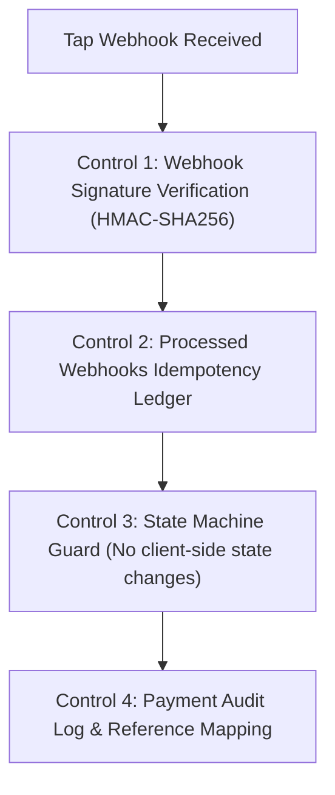

# GEARBEAT PATCH 117A — TAP ROUTE REALITY AUDIT + WEBHOOK & IDEMPOTENCY PLAN

> [!NOTE]
> **Sovereign Payment Compliance Gate**
> For high-fidelity pre-launch hardening in alignment with Saudi Central Bank (SAMA) guidelines, PCI-DSS security standards, and GCC pilot readiness, this document serves as a docs-only reality audit and architectural blueprint. No live payment integration, key configuration, database schema modifications, or API hard-coding occur in this patch.

---

## 1. Executive Summary

This audit systematically evaluates the current state of payment gateways, Tap API routes, and manual bank-transfer rails across the GearBeat V2 workspace. The objective is to identify security exposures, understand what payment features are currently stubbed versus implemented, and design a strict compliance plan for incoming payment callbacks and transaction idempotency.

Key discoveries of this audit show that:
1.  **Redirection is deactivated**: The primary checkout session endpoint `/api/checkout/session` successfully registers checkout sessions in the database, but returns `checkoutUrl: null` and an explicit "sandbox review only" notification, keeping the checkout flow stubbed.
2.  **Webhook lacks protection**: The Tap webhook `/api/tap/webhook` processes payment captured states without signature verification or source-IP whitelist validation.
3.  **No idempotency keys**: Duplicated webhook retries or multiple checkout clicks currently lack deduplication protection at the database or route level.

This document maps out the required future Tap production controls and establishes the baseline before any live card transaction activation is authorized.

---

## 2. Existing Payment-Related API Routes

We mapped all active endpoints handling payment, checkout, and transaction states:

| API Route Path | HTTP Method | Read/Write | Exposure | Supabase Client Type | Integration Status | Risk Level |
| :--- | :--- | :--- | :--- | :--- | :--- | :--- |
| `/api/tap/create-charge` | `POST` | Mutating | User (Auth) | User client | Partially Integrated / delegates to `createTapCharge` | **Medium** (Triggers sandbox charges) |
| `/api/tap/webhook` | `POST` | Mutating | Public | `supabaseAdmin` (Service Role) | Active / Unprotected | **Critical** (No signature validation) |
| `/api/checkout/session` | `POST` | Mutating | User (Auth) | User client + `supabaseAdmin` | Active / **Stubbed checkoutUrl** | **Medium** (Safe mock state) |
| `/api/checkout/manual-confirm`| `POST` | - | - | - | **DECOMMISSIONED (410 Gone)** | **Low** (Locked down) |
| `/api/payments/providers` | `GET` | Read-only | Public | `supabaseAdmin` (Service Role) | Active / Queries configs | **Low** (Configuration lookup) |
| `/api/admin/payments/manual-refund`| `POST`| Mutating | Admin | User client + `supabaseAdmin` | Active / Admin controlled | **Medium** (Manual credit adjustment) |
| `/api/admin/refunds/create` | `POST` | Mutating | Admin | User client | Active | **Medium** (Standard RLS) |
| `/api/admin/settlements/create` | `POST` | Mutating | Admin | User client | Active | **Medium** (Standard RLS) |
| `/api/admin/settlements/update-status`| `POST`| Mutating | Admin | User client | Active | **Medium** (Standard RLS) |
| `/api/admin/payout-requests/update-status`| `POST`| Mutating | Admin | User client | Active | **Medium** (Standard RLS) |

---

## 3. Current Payment & Tap Reality

### A. Tap Integration Status
*   **Checkout Redirection**: Stubbed. `/api/checkout/session` establishes a transaction session via Supabase RPC, but halts before redirecting the browser, returning `checkoutUrl: null` and the following bilingual notice:
    > `"Checkout session created. Real payment redirection is not enabled yet."`
*   **Charge Creation**: The helper `createTapCharge` in `lib/tap/charge.ts` formats the Tap payload (amount, commission, destinations, metadata) and POSTs to `https://api.tap.company/v2/charges`. However, this helper immediately exits if API keys are missing, returning a mock fallback indicator.

### B. Webhook Handling Status
*   **Security State**: `/api/tap/webhook` accepts POST requests from any public IP, parses the payload, and immediately updates the matching booking in `bookings` to `confirmed` and `payment_status` to `paid` via `createAdminClient()`. **There is no header authentication, checksum matching, or source validation.**

### C. Idempotency Status
*   **Deduplication**: Absent. Network retries from Tap or duplicate webhook requests will trigger multiple updates, duplicate notification inserts, and repeated platform commission calculations. No `payment_idempotency_keys` tracking exists at the database or route layer yet.

### D. Payment Status Source of Truth
*   **Database Mapping**: The database `bookings.payment_status` (and `marketplace_orders.payment_status`) is the canonical source of truth. However, since the mutating webhook is unauthenticated, this source of truth is highly vulnerable to injection in its current sandbox state.

### E. Manual Settlement Risks
*   **Manual Reconciliations**: Since automated live card gateways are deactivated, the pre-launch relies on manual bank transfers. This carries massive manual reconciliation risks:
    *   *Double Confirmations*: Two administrators manually confirming the same bank ledger transaction reference.
    *   *Audit Trail Gaps*: Lack of atomic locking when marking orders as manually cleared.

---

## 4. Required Future Tap Production Controls

To graduate the platform from a sandbox pilot to a SAMA-compliant commercial transaction system, the following controls must be implemented:

1.  **Backend Payment Session Only**: All payment charges and checkout sessions must be generated server-side. The frontend must never communicate directly with the Tap gateway or have access to raw card details.
2.  **No Frontend Secret Keys**: The high-privilege `TAP_SECRET_KEY` must remain securely stored on the server-side environment variables (`.env`). Only the public token (`NEXT_PUBLIC_TAP_PUBLIC_KEY`) is allowed in client configurations.
3.  **Hosted Checkout Redirection**: Offload card intake entirely to Tap's PCI-compliant hosted checkout interface, ensuring Mada and Apple Pay operate in a securely isolated iframe/redirection loop.
4.  **Webhook Signature Verification**: Enforce HMAC-SHA256 webhook header signature validation. The incoming callback must contain a valid cryptographic token generated with the shared webhook secret to verify the sender is authentic.
5.  **Idempotency Keys**: Implement a strict `payment_idempotency_keys` table. The webhook handler must verify that the Tap `charge_id` (or unique webhook event ID) has not been processed previously. This prevents duplicate confirmations during webhook retries.
6.  **reference.order and reference.transaction Mapping**: Populate the payment reference fields in the Tap API payload:
    *   `reference.order`: Mapped to our `booking_id` or `order_id`.
    *   `reference.transaction`: Mapped to our secure `checkout_payment_session_id`.
7.  **Payment Event Audit Log**: Record every raw webhook callback (payload, headers, status) in a dedicated `payment_event_logs` table before executing state mutations.
8.  **State Transitions Gated via Webhooks**: Booking and order transitions to `paid` or `confirmed` must occur exclusively through the verified webhook callback, never using browser query parameters or redirect landing pages.
9.  **Automated Refund/Reconciliation Plan**: Enforce refund integrations that tie back to original transactions using Tap's `/refunds` route, recording corresponding net ledger reductions.
10. **Sandbox Locking**: Restrict all credentials to sandbox tokens (`pk_test_...` / `sk_test_...`) and strictly prohibit transitioning to production live keys (`pk_live_...` / `sk_live_...`) until official Saudi Central Bank (SAMA) compliance audits, corporate commercial approvals, and bank account verifications are completed.

---

## 5. Phase 117 Closeout Plan Recommendation

> [!IMPORTANT]
> **Next Recommended Step: Patch 117B — Manual Settlement Runbook + Payment State Matrix + Phase 117 Closeout**
> Since live payments are stubbed and manual bank ledger confirmations are the only operational channel, Phase 117 must close out by:
> 1.  Drafting the **Manual Settlement Operations Runbook** to guide administrators through manual ledger checks.
> 2.  Creating the **Canonical Payment & Booking State Matrix** mapping all valid transitions.
> 3.  Formally closing out Phase 117 before transitioning to SQL-level hardening.

---

## 6. Verification & Formal Confirmations

*   [x] **Audit Only**: We confirm that no API files, payment files, Supabase files, SQL, migrations, auth, env, packages, or UI components were modified.
*   [x] **Git Status Integrity**: Staged and verified that only this security plan document has been added to the branch.
*   [x] **Payment/Tap Routes Audited**: Mapped all checkout, webhook, and admin payment endpoints.
*   [x] **Highest-Risk Gaps Identified**: Highlighted the unauthenticated webhook callback vulnerability and lack of idempotency keys.
*   [x] **Pre-Launch Ready State**: Stated clearly that Tap is currently stubbed and not production-safe.
