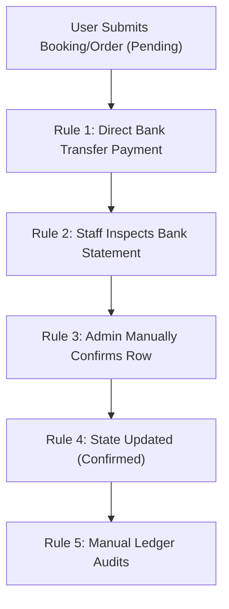

# GEARBEAT PATCH 117B — MANUAL SETTLEMENT RUNBOOK, PAYMENT STATE MATRIX & PHASE 117 CLOSEOUT

> [!NOTE]
> **Sovereign Operational Compliance Gate**
> In compliance with Saudi Arabian financial guidelines, SAMA regulations, and standard pilot phase audit requirements, this document outlines the operational protocols for manual transaction settlement, provides the definitive state-transition matrix, and formally closes out Phase 117. No payment/API/database code or migration modifications occur in this patch.

---

## 1. Executive Summary

As identified in the Patch 117A Payment Audit, the GearBeat V2 platform is structurally configured for a **stubbed sandboxed checkout flow** where live Tap payment redirection is deactivated (`checkoutUrl: null` in `/api/checkout/session`). Consequently, the pre-launch invite-only pilot operates strictly on **manual bank ledger settlements** and manual administrative approvals.

This document serves as the official **Manual Settlement Operations Runbook** for GearBeat staff and defines the canonical **Payment & Booking State Transition Matrix**. Finally, it delivers the **Phase 117 Closeout Verdict**, specifying what is permitted versus strictly blocked prior to full SAMA-compliant gateway activation.

---

## 2. Manual Settlement Operations Runbook (Pilot Phase)

During the invite-only pre-launch pilot, all client billing transactions must adhere to these five core manual settlement rules:

### 📋 Core Operational Rules:
1.  **Strictly No Live Tap Payments**: The system must remain configured with sandbox/test keys only. The production live secret keys (`sk_live_...`) must not be configured or used under any circumstances.
2.  **No Public Commercial Checkout Claims**: All public checkout screens, cart grids, and navigation footers must maintain clear bilingual warnings stating: `"MANUAL BANK TRANSFER VERIFICATION ONLY — NO LIVE CARD TRANSACTIONS"` (as configured in Patch 115B).
3.  **Manual Confirmations Must Remain Admin-Controlled**: All order and booking confirmations are strictly limited to the secure, authorized admin layouts (`/admin/bookings`, `/admin/marketplace-orders`) and protected via the `requireAdminLayoutAccess` layout guard.
4.  **No Automated Completion from Unverified Evidence**: Staff must never confirm a booking or marketplace order based solely on client-submitted screenshots, transaction IDs, or receipt images. Confirmations can only proceed once the funds are fully settled and cleared on GearBeat's official corporate bank account statement.
5.  **Manual Refunds and Payouts**: Standard automatic refund triggers via payment gateway APIs are locked. All refunds and seller payout settlements must be executed manually via external bank transfers and manually recorded in `payment_refunds` and `payout_requests` database tables with corresponding bank reference notes.

---

## 3. Canonical Payment & Booking State Matrix

The following state matrices govern all transaction life cycles across the platform during both manual pilot and future gateway modes:

### A. Studio Booking Lifecycle Matrix
| Current State | Trigger Action | Allowed Transition | Description / Operational Boundaries |
| :--- | :--- | :--- | :--- |
| `draft` | User submits reservation | `pending_payment` | Initial checkout session created. |
| `pending_payment` | Manual bank transfer cleared | `confirmed` | **Manual mode**: Verified by admin check. **Gateway mode**: Triggered from verified Tap webhook. |
| `pending_payment` | Session time expired (20 min)| `failed` / `expired` | Automatically voided to restore slot availability. |
| `confirmed` | Owner rejects slot / User cancels | `cancelled` | Triggers a pending manual refund record. |
| `confirmed` | Time slot completes | `completed` | Marked completed after checkout validation. |
| `completed` | Dispute filed | `disputed` | Retains funds in escrow pending review. |

### B. Marketplace Order Lifecycle Matrix
| Current State | Trigger Action | Allowed Transition | Description / Operational Boundaries |
| :--- | :--- | :--- | :--- |
| `draft` | User converts cart | `pending_payment` | Order session initiated in database. |
| `pending_payment` | Bank payment cleared | `processing` | **Manual mode**: Verified by admin ledger update. **Gateway mode**: Webhook payment confirmation. |
| `pending_payment` | Time limit expired (6 hrs) | `canceled` | Order released, stock levels restored. |
| `processing` | Seller ships package | `shipped` | Package tracking registered. |
| `shipped` | Package delivered | `delivered` | Delivery receipt recorded. |
| `delivered` | Customer confirms / 3 days | `completed` | Settlement window opened for vendor payout. |
| `processing` / `shipped` | Order cancellation | `refunded` | Triggers manual refund log. |

### C. Financial Settlement Lifecycle Matrix
| Entity / State Type | Initial State | Trigger Action | Transition State | Description |
| :--- | :--- | :--- | :--- | :--- |
| **Manual Confirm** | `unverified` | Statement match confirmed | `verified` | Executed strictly in `/admin` controls. |
| **Refund State** | `pending_review` | Bank transfer executed | `refunded` | Manual refund logged by admin. |
| **Payout State** | `requested` | Settlement file generated | `processing` | Vendor payout grouped in batch. |
| **Payout State** | `processing` | Bank transfer completed | `paid` | Payout confirmed in ledger. |

---

## 4. Pre-Launch Payment Permissions & Blocks

To maintain strict compliance boundaries, we define what operations are allowed during this pre-launch pilot versus what is blocked until full gateway activation:

### ✅ ALLOWED (Pre-Launch Pilot Phase)
*   Manual checkout session initialization via RPC (`create_checkout_payment_session`).
*   Admin-only query and dashboard monitoring of booking and order ledgers.
*   Manual status updates to `confirmed`, `paid`, or `refunded` within the secure, role-guarded `/admin` screens.
*   Bilingual pre-launch sandbox informational banners and deactivated form indicators.
*   Manual payout requests and ledger rebuild tasks under admin RLS controls.

### ❌ BLOCKED (Until Future Gateway Activation)
*   **Live Tap credentials**: No configuration of live secret or public keys (`sk_live_...` / `pk_live_...`).
*   **Automated checkout redirection**: Redirection to payment gates remains deactivated (`checkoutUrl: null`).
*   **Automated callbacks**: Processing public `/api/tap/webhook` calls remains deactivated/blocked until secure verification is built.
*   **Antivirus bypass**: Uploading files to private document buckets without memory stream malware scanning.
*   **Sovereign storage bypass**: Collecting sensitive customer CR, VAT, bank statements, or national IDs until sovereign, local, Saudi-hosted GC Dammam secure buckets are initialized.

---

## 5. Phase 117 Closeout Verdict

> [!IMPORTANT]
> **PHASE 117 VERDICT: Ready for payment planning / pre-activation ONLY**
> We formally declare that Phase 117 is closed. The codebase is structurally sound for pre-launch, featuring secure administrative route guards, bilingual pilot-phase indicators, and decommissioned testing gates.
> 
> **Tap Gateway Activation Status: BLOCKED**
> Production card transactions are strictly blocked. Transitioning to live automated checkout requires completion of:
> 1.  SAMA-compliant webhook HMAC-SHA256 signature verification.
> 2.  Database-level `payment_idempotency_keys` uniqueness constraints.
> 3.  Official corporate Tap activation, bank account validation, and merchant ID mapping.

---

## 6. Next Planned Patch Recommendation

> [!TIP]
> **Next Recommended Step: Patch 118A — Marketplace Inventory Reservation + Order Lifecycle + Stale Pending Plan**
> Now that payment state transitions and manual settlement rules are locked, the logical next step is a deep **Marketplace Inventory Reservation & Order Lifecycle Audit**.
> This patch will review the inventory management system, inspect product inventory counts during checkout session creations, map how inventory levels are deducted, formulate the "stale pending order cleanup" cron strategy, and plan the transactional safeguards to prevent double-selling of items during high-volume sales.

---

## 7. Verification & Formal Confirmations

*   [x] **Audit/Closeout Only**: We confirm that no API files, payment files, Supabase files, SQL, migrations, auth, env, packages, or UI components were altered.
*   [x] **Git Status Integrity**: Staged and verified that only this closeout document has been added to the branch.
*   [x] **State Matrix Completed**: Mapped all booking, marketplace, and financial transitions.
*   [x] **Runbook Established**: Formulated the 5 core rules for bank-transfer settlement checks.
*   [x] **Phase 117 Closeout Status**: Formally closed with a clear sandbox pilot-only verdict.
