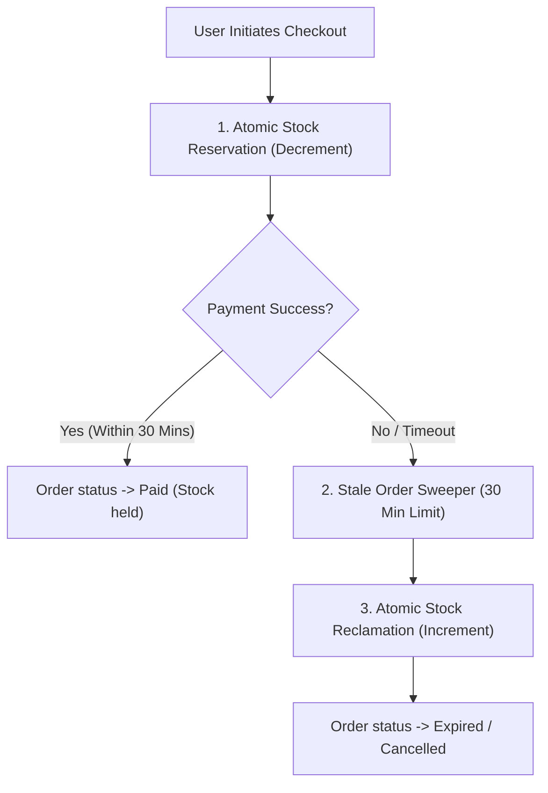

# GEARBEAT PATCH 118A — MARKETPLACE INVENTORY RESERVATION, ORDER LIFECYCLE & STALE PENDING PLAN

> [!NOTE]
> **Sovereign Retail Compliance Gate**
> Under Saudi Arabian consumer protection regulations, e-commerce directives, and SAMA financial guidelines, merchant platforms must maintain absolute stock-ledger integrity. Selling out-of-stock items (overselling) or failing to restore inventory during cancellations violates local customer trust and retail regulations. This document serves as a docs-only reality audit and architectural blueprint. No runtime database mutations or payment code changes are introduced in this patch.

---

## 1. Executive Summary

A deep architectural audit of the GearBeat V2 e-commerce engine has exposed critical security and structural vulnerabilities in how product stock and order life cycles are managed. 

Currently, **inventory tracking is entirely static**. While the checkout creation route `/api/marketplace/checkout/create-order` checks in-memory stock limits before generating a pending order, **the database stock levels are never decremented on checkout or payment, nor are they ever restored on cancellation or refund.** In addition, unpaid "zombie" pending orders remain permanently active in the database without any scheduled clean-up routines.

This document details these operational gaps and lays out a high-fidelity **Atomic Stock Reservation and Stale Order Cleanup Blueprint** to guarantee double-sale prevention prior to commercial launch.

---

## 2. Current Marketplace Inventory & Order Gaps

Our audit of the marketplace routing structure (specifically `/api/marketplace/checkout/create-order` and `/api/marketplace/orders/update-status`) revealed three severe, launch-blocking vulnerabilities:

### 🔴 GAP 1: Stock is Checked but NEVER Decremented (Double-Selling Risk)
*   *Current Reality*: When an order is created, the system checks:
    ```typescript
    if (quantity > availableStock) {
      return NextResponse.json({ error: `${getProductName(product)} has only ${availableStock} units available.` }, { status: 400 });
    }
    ```
    However, once the order is inserted into the database as `pending_payment` (and the checkout session is spawned), **no decrement statement is ever executed on `marketplace_products.stock_quantity` or `marketplace_product_variants.stock_quantity`.**
*   *Vulnerability*: Multiple customers can add the exact same limited item to their carts, initiate checkout, and create multiple overlapping `pending_payment` orders. When manual transfers are cleared (or gateway payments capture), the platform will process multiple paid transactions for a single physical unit, resulting in critical **double-selling / overselling** liabilities.

### 🔴 GAP 2: Stock is NEVER Restored on Cancellation or Refund (Inventory Leaks)
*   *Current Reality*: When an administrator updates an order status to `cancelled`, `canceled`, or `refunded` via `/api/marketplace/orders/update-status`, the database only modifies `marketplace_orders.status` and `marketplace_orders.payment_status`.
*   *Vulnerability*: If decrement logic is built into checkout without a corresponding atomic reclamation handler, stock will permanently leak. Since there is currently no increment query mapped to cancellation scopes, inventory counts would remain permanently drained after voided orders.

### 🔴 GAP 3: Stale "Zombie" Pending Orders (No Cleanup Routine)
*   *Current Reality*: Checkout payment sessions are created with a 30-minute expiry window (`expires_at`). However, when that window passes, the corresponding `checkout_payment_sessions` and `marketplace_orders` (which stay as `pending_payment`) are never updated.
*   *Vulnerability*: The database accumulates hundreds of orphaned, unpaid pending orders. This pollutes vendor seller dashboards (`/portal/store/orders`), distorts administrative reports, and holds reserved stock indefinitely if decrement locks are implemented.

---

## 3. Target Architectural Blueprint

To achieve SAMA and consumer protection compliance, the marketplace engine must be refactored to support **Atomic Inventory Locks** and **Automated Lifecycle Sweepers**:



### 1. Atomic Stock Reservation (Pre-Deduction on Checkout)
*   *Mechanism*: When an order is created, rather than waiting for payment confirmation, the system must immediately reserve the inventory.
*   *Execution*: Wrap cart verification and stock decrement queries in a single database transaction or PostgreSQL RPC block. The query must check stock and decrement in a single thread-safe step:
    ```sql
    UPDATE marketplace_products 
    SET stock_quantity = stock_quantity - p_quantity 
    WHERE id = p_product_id AND stock_quantity >= p_quantity;
    ```
    If zero rows are affected, the transaction aborts and returns an out-of-stock error.

### 2. Strict 30-Minute Checkout Expiry Lock
*   *Mechanism*: Reserved stock must not be held indefinitely. A tight 30-minute lock must be enforced.
*   *Execution*: The database or route layer must map `marketplace_orders.status = 'pending_payment'` directly to the active `checkout_payment_session.expires_at`.

### 3. Automated Cron / Edge Scheduler (Stale Order Sweeper)
*   *Mechanism*: An automated sweeper must run regularly to clean up expired sessions and reclaim stock.
*   *Execution*: Create an administrative, token-protected cron route (e.g., `/api/cron/cleanup-stale-orders`).
*   *Logic*:
    1.  Select all active `checkout_payment_sessions` where `expires_at < NOW()` and status is `created`.
    2.  Mark those sessions as `expired`.
    3.  Select matching `marketplace_orders` and mark them as `expired` / `failed`.
    4.  Loop through order items and atomically **increment** `stock_quantity` back onto the products and variants in the database.

### 4. Admin Manual Settlement Integration
*   *Mechanism*: Ensure staff manual verifications respect stock states.
*   *Execution*: In `/admin/marketplace-orders`, add visual indicator flags highlighting whether stock has been pre-reserved or needs manual allocation. Log all stock-reclaim events to an administrative audit log.

---

## 4. Pre-Launch vs. Post-Hardening Permissions

Until the inventory reservation and stale sweeper system is fully implemented, e-commerce activities must remain under strict limitations:

| Operational Feature | Status in Sandbox Pilot | Status Post-Hardening (Production-Ready) |
| :--- | :--- | :--- |
| **Marketplace checkout** | 🟡 Allowed (Sandbox/Manual review) | 🟢 Fully Active (Automated) |
| **Inventory reservation** | ❌ **Blocked** (Static database counts) | 🟢 Fully Active (Atomic database locks) |
| **Stale order cleanup** | ❌ **Blocked** (Manual DB intervention) | 🟢 Fully Active (Automated cron sweeper) |
| **Stock reclamation** | ❌ **Blocked** (No increment on cancellation) | 🟢 Fully Active (Atomic increments) |

---

## 5. Next Planned Patch Recommendation

> [!IMPORTANT]
> **Next Recommended Step: Patch 118B — Marketplace Inventory Reservation & Stock Restoration Implementation Plan + Phase 118 Closeout**
> Now that the inventory gaps and stale pending orders have been audited, the logical next step is **Patch 118B**.
> This patch will formally close Phase 118 by mapping the database schema requirements (e.g., `marketplace_orders.checkout_session_id` constraints), drafting the SQL migrations needed for automated database function triggers, and detailing the precise REST parameters for the cron-triggered sweeper endpoint.

---

## 6. Verification & Formal Confirmations

*   [x] **Audit Only**: We confirm that no API files, marketplace folders, Supabase configs, SQL, migrations, payment flows, or UI files were modified.
*   [x] **Git Status Integrity**: Staged and verified that only this security planning document has been added to the branch.
*   [x] **Inventory Gaps Identified**: Cataloged the lack of stock decrement on checkout/payment and lack of increment on cancellation/refund.
*   [x] **Zombie Orders Exposed**: Outlined the lack of automated sweepers for stale pending orders.
*   [x] **Phase 118 Planning Ready**: Established the comprehensive blueprint for atomic reservation and reclamation.
