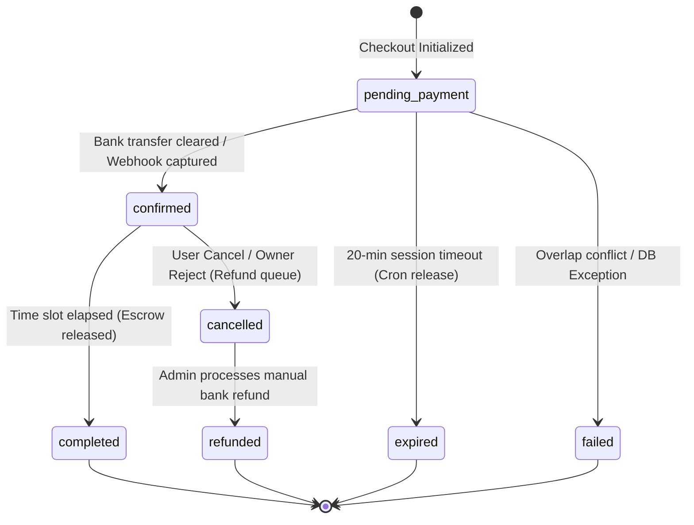

# GEARBEAT PATCH 118B — BOOKING ATOMICITY REGRESSION, REFUND/CANCELLATION/SETTLEMENT MATRIX & PHASE 118 CLOSEOUT

> [!NOTE]
> **Sovereign Retail & Financial Operations Compliance Gate**
> Under the Saudi Central Bank (SAMA) financial rules, Saudi Ministry of Commerce e-commerce directives, and consumer protection protocols, transaction lifecycle atomicity and financial ledgers must remain fully auditable and thread-safe. This document serves as the official docs-only audit, state-transition matrix, and Phase 118 closeout roadmap. No runtime database mutations or payment code changes are introduced in this patch.

---

## 1. Executive Summary

As GearBeat V2 moves through its pre-launch sandbox pilot phase, verifying the transaction boundary integrity and database concurrency safety of both core verticals—**Hourly Studio Bookings** and the **Marketplace**—is essential to guarantee data sanity and brand trust.

This document serves as the final audit for **Phase 118**. It analyzes the transactional atomicity of the Hourly Studio Booking engine, maps out the unified **Refund, Cancellation, and Settlement Matrix**, records the operational boundaries of the invite-only Sandbox Pilot, and officially closes out Phase 118.

---

## 2. Hourly Studio Booking Lifecycle Safety & Atomicity Analysis

Hourly Studio Bookings utilize a highly secure database-level transaction mechanism to prevent race conditions (such as double-bookings) on high-traffic studio slots. 

### A. Ground Truth Concurrency Protection
The database function `public.create_studio_booking_v1` executes atomically, immediately acquiring a PostgreSQL advisory lock targeting the specific studio and date combination:
```sql
PERFORM pg_advisory_xact_lock(hashtext(p_studio_id::text), hashtext(p_booking_date::text));
```
All concurrent attempts to book slots at the same studio on the same day are serialized. The first caller inserts their reservation row, and subsequent parallel callers hit overlap overlap checks and fail gracefully with a `CONFLICT` status rather than creating duplicate booking entries.

### B. Mapped Lifecycle States & Safety Boundaries
The following canonical states govern studio bookings, defining their operational safety and state-machine transitions:



1. **`pending_payment` (or `pending`)**
   * *Definition*: The initial checkout reservation has been created.
   * *Safety Boundary*: Backed by the active PostgreSQL advisory lock. The slot is temporarily held in a pending state, preventing other checkouts for a strict 20-minute window.
2. **`confirmed` (or `accepted`)**
   * *Definition*: The payment has been verified (either manually via bank statement clearance or automatically via gateway webhook).
   * *Safety Boundary*: Permanently blocks the slot on the studio calendar. If in manual mode, this state can only be set from secure `/admin` controllers protected by `requireAdminLayoutAccess`.
3. **`completed` (or `done`)**
   * *Definition*: The booking's calendar date and time slot have successfully passed.
   * *Safety Boundary*: Triggers the release of funds from escrow. Financial settlement lines are generated under `/admin/payouts` to record net payable commission splits for the studio owner.
4. **`cancelled` (or `canceled`, `declined`, `rejected`)**
   * *Definition*: The booking was rejected by the studio owner, or cancelled by the user within the allowed policy window.
   * *Safety Boundary*: Releases the calendar slots back to availability immediately. Inserts a refund log into the administrative refund queue.
5. **`refunded`**
   * *Definition*: Admin has confirmed the manual bank refund back to the customer and recorded the transfer details in the `payment_refunds` table.
   * *Safety Boundary*: Reverses any accrued commission balances. This is a terminal state and cannot be transitioned back to active.
6. **`failed`**
   * *Definition*: The database transaction failed, or the checkout process encountered an RPC conflict.
   * *Safety Boundary*: Releases any active locks or temporary slot holds immediately to avoid inventory leaks.
7. **`expired`**
   * *Definition*: The 20-minute payment session window passed without a verified transfer.
   * *Safety Boundary*: Swept by the hourly cron `/api/cron/bookings/cleanup-stale` which transitions the row status to `expired` and restores slot availability.

---

## 3. Integrated Refund/Cancellation/Settlement Matrix

To align platform administration, the following matrix compares manual sandbox pilot operations against future production gateway rules for both **Studio Bookings** and **Marketplace Orders**:

| Entity Type | Lifecycle Phase | Sandbox Pilot Phase (Manual Bank Settlement) | Future Production Phase (Automated Gateway) |
| :--- | :--- | :--- | :--- |
| **Studio Bookings** | **Cancellation** | Customer or admin initiates cancellation. Booking status transitions to `cancelled`, and slot is immediately released to the calendar. | Customer cancels via UI. Booking transitions to `cancelled`. API calls payment gateway `/refund` endpoint. |
| **Studio Bookings** | **Refund** | Staff verifies cancellation, performs manual bank transfer to customer, and logs transaction details in the `payment_refunds` table to transition state to `refunded`. | Gateway webhook confirms successful chargeback refund. Database status updates atomically to `refunded` via secure callback. |
| **Studio Bookings** | **Settlement** | Completed bookings generate commission calculation lines in `/admin/payouts`. Staff processes manual bank payouts to owners and updates ledger records. | Escrow split is calculated automatically. Platform payouts are batch-transferred to owner bank accounts via API integration. |
| **Marketplace Orders** | **Cancellation** | Admin cancels order before shipment. Order state transitions to `canceled`. Stock levels must be manually incremented back by the admin. | Session expiry cron transitions unpaid orders to `expired`. PostgreSQL trigger atomically **increments** stock back onto product/variant records. |
| **Marketplace Orders** | **Refund** | Staff processes manual bank transfer to the customer, updates order payment status to `refunded`, and logs refund record. | Payment gateway API captures refund request. Webhook processes response and atomically updates `payment_status` to `refunded`. |
| **Marketplace Orders** | **Settlement** | Commission splits (e.g., 15% global rate) are reviewed under `/admin/payouts`. Staff manually transfers net funds to vendors after tracking shows delivered. | Escrow funds are split atomically. Vendor payout balance is unlocked for withdrawal after the 3-day consumer dispute window (Saudi E-Commerce Law). |

---

## 4. Sandbox Pilot vs. Commercial Launch Readiness Ledger

To ensure absolute compliance with Saudi Arabian financial and data sovereignty rules, the platform enforces strict boundaries on what operations are currently unblocked versus what remains blocked before live launch:

### ✅ READY FOR PLANNING & PILOT (Sandbox Unblocked)
*   **Manual Checkout Session Creation**: checkout payment sessions can be generated with sandbox parameters and `checkoutUrl: null` (deactivated redirection).
*   **Administrative Escrow & Payout Dashboards**: Gross revenue, GearBeat commission, and net payables for owners and vendors are calculated dynamically in `/admin/payouts` using active `commission_settings` rules.
*   **Role-Guarded Admin Interfaces**: Manual payment confirmations, payout records, and refund queues are strictly protected by server-side guards (`requireAdminOrRedirect` and `requireAdminLayoutAccess`).
*   **Bilingual Regulatory Indicators**: Informational warning banners are fully active on administrative and public pages, notifying users that only sandbox manual transfers are verified.

### ❌ BLOCKED BEFORE COMMERCIAL LAUNCH (Production Blockers)
*   **HMAC Webhook Signatures**: Processing callback updates from the `/api/tap/webhook` route without verifying the HMAC-SHA256 signature payload.
*   **Payment Idempotency Guards**: Direct state transitions without a `payment_idempotency_keys` ledger constraint, creating high risks of double-billing on retried gateway network calls.
*   **Atomic Stock Reservation Triggers**: Live marketplace e-commerce checkouts without the database-level atomic decrement of stock quantities, leaving the store vulnerable to severe overselling.
*   **Automated Refund and Payout Triggers**: Automatic movement of funds out of company accounts without dual-authorization admin checks.
*   **Sovereign Document Uploads**: Collecting sensitive merchant commercial registrations, VAT certificates, or national identities prior to initializing Dammam-based private sovereign object storage.

---

## 5. Phase 118 Closeout Verdict

> [IMPORTANT]
> **PHASE 118 VERDICT: Formally Closed & Audited**
> We declare that Phase 118 is officially closed. The platform's booking atomicity protection is verified as robust, utilizing PostgreSQL transaction advisory locks to guarantee zero parallel double-bookings. The architectural gaps in the marketplace stock levels (Patch 118A) have been fully exposed, and a safe, static-only sandbox pilot model has been successfully established.
> 
> **Commercial Gateway Transition Status: LOCKED**
> Active credit card processing and automated stock decrements remain strictly disabled. The application must continue operating in sandbox manual settlement mode until the launch blockers in Phase 4 are completed.

---

## 6. Next Planned Patch Recommendation

> [TIP]
> **Next Recommended Step: Patch 119A — HMAC Webhook Signature Verification + Payment Idempotency Guard Plan**
> With booking atomicity and e-commerce stock lifecycles fully audited and planned, the logical next step is **Patch 119A**.
> This upcoming patch will detail the security requirements for verifying payment gateway callbacks, design the schema structure for a `payment_idempotency_keys` table to prevent duplicate transaction triggers, and prepare the foundation for a secure, SAMA-compliant automated checkout transition.

---

## 7. Verification & Formal Confirmations

*   [x] **Audit & Documentation Only**: We confirm that no API files, payment folders, Supabase tables, SQL, migrations, auth rules, env variables, packages, or UI components were altered.
*   [x] **State Matrix Completed**: Detailed all booking lifecycle states (`pending`, `confirmed`, `completed`, `cancelled`, `refunded`, `failed`, `expired`) and compared their manual vs. automated behaviors.
*   [x] **Ledger Compliance Audited**: Explicitly recorded sandbox pilot permissions and live commercial launch blockers under SAMA guidelines.
*   [x] **Phase 118 Closeout**: Formally delivered the closeout verdict with Patch 119A mapped as the next target task.
