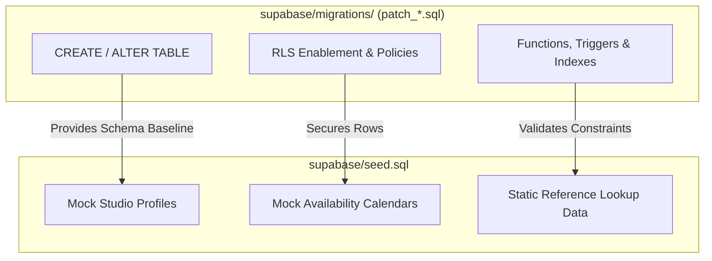
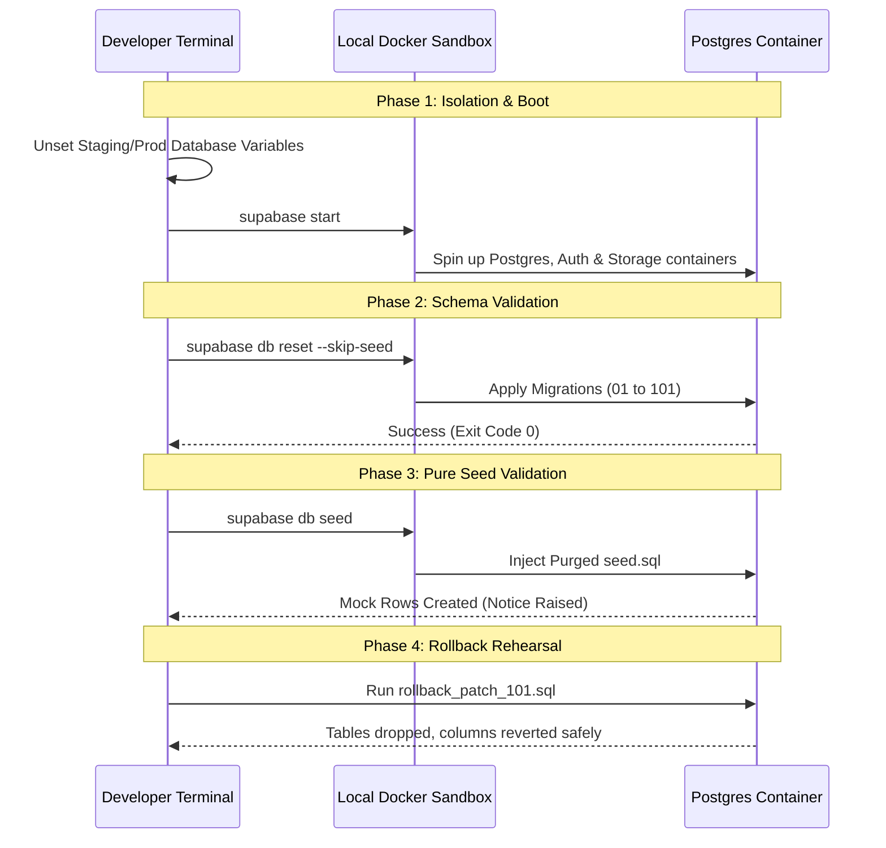

# GEARBEAT PATCH 119A — LOCAL MIGRATION DRY-RUN PLAN + SEED SQL SPLIT VALIDATION

## 1. Executive Summary

During our database structure and baseline audit, we identified critical **structural schema mutations (DDL)** embedded directly inside `supabase/seed.sql` (specifically lines 76–118). Mixing table creation (`studio_boost_subscriptions`), Row-Level Security (RLS) policies, and column extensions (`ALTER TABLE provider_leads`) within a test data file introduces severe environment drift risk. It compromises local developer bootstrapping, breaks standard database migration timelines, and poses operational hazards for staging or production database management.

**Patch 119A** establishes the definitive, documentation-only architectural plan to split and serialize this database state. This plan defines the boundaries between schema definitions and test datasets, establishes a 100% network-isolated local Docker dry-run procedure, and compiles a pre-staging promotion checklist. No database mutations, SQL executions, or Supabase CLI commands are performed during this patch, guaranteeing absolute safety prior to physical database work in **Patch 119B**.

---

## 2. Seed SQL Split Findings & Structural Audit

An audit of [supabase/seed.sql](file:///c:/Users/iaals/Documents/GitHub/gearbeat-V2/supabase/seed.sql) reveals a direct overlap with the proposed SQL draft [GEARBEAT_PATCH_111D_STUDIO_BOOST_PROVIDER_LEADS_DRAFT.sql.txt](file:///c:/Users/iaals/Documents/GitHub/gearbeat-V2/docs/sql-drafts/GEARBEAT_PATCH_111D_STUDIO_BOOST_PROVIDER_LEADS_DRAFT.sql.txt). The following structural elements currently reside in the seed file and **must be extracted**:

### A. Boost Subscriptions Table Creation (Lines 76–94)
*   **Target Code**:
    ```sql
    CREATE TABLE IF NOT EXISTS studio_boost_subscriptions (
      id UUID PRIMARY KEY DEFAULT gen_random_uuid(),
      studio_id UUID NOT NULL REFERENCES studios(id) ON DELETE CASCADE,
      owner_auth_user_id UUID NOT NULL,
      base_commission_percent DECIMAL(5,2) NOT NULL DEFAULT 15.00,
      boost_commission_percent DECIMAL(5,2) NOT NULL DEFAULT 0.00,
      total_commission_percent DECIMAL(5,2) GENERATED ALWAYS AS 
        (base_commission_percent + boost_commission_percent) STORED,
      duration_days INTEGER NOT NULL CHECK (duration_days IN (7, 14, 30)),
      starts_at TIMESTAMPTZ NOT NULL DEFAULT NOW(),
      ends_at TIMESTAMPTZ GENERATED ALWAYS AS 
        (starts_at + (duration_days || ' days')::INTERVAL) STORED,
      status TEXT DEFAULT 'active' 
        CHECK (status IN ('active', 'expired', 'cancelled')),
      terms_accepted BOOLEAN DEFAULT false,
      terms_accepted_at TIMESTAMPTZ,
      created_at TIMESTAMPTZ DEFAULT NOW()
    );
    ```
*   **Risk**: If a developer spins up a local database baseline via `supabase db reset` without executing the seed, the `studio_boost_subscriptions` table does not exist, immediately breaking application route features that reference this table.

### B. Row Level Security Enablement & Policies (Lines 96–112)
*   **Target Code**:
    ```sql
    ALTER TABLE studio_boost_subscriptions ENABLE ROW LEVEL SECURITY;

    DO $$ 
    BEGIN
      IF NOT EXISTS (SELECT 1 FROM pg_policies WHERE policyname = 'Owner can manage own boosts') THEN
        CREATE POLICY "Owner can manage own boosts" 
        ON studio_boost_subscriptions FOR ALL 
        USING (owner_auth_user_id = auth.uid());
      END IF;

      IF NOT EXISTS (SELECT 1 FROM pg_policies WHERE policyname = 'Public can read active boosts') THEN
        CREATE POLICY "Public can read active boosts"
        ON studio_boost_subscriptions FOR SELECT
        USING (status = 'active' AND ends_at > NOW());
      END IF;
    END $$;
    ```
*   **Risk**: RLS policies are structural security constraints. Defining them inside seed scripts bypasses migration history, creating a silent security vulnerability in environments where seeding is disabled or skipped (such as pure production sandbox deployments).

### C. Provider Leads Table Extensions (Lines 114–118)
*   **Target Code**:
    ```sql
    ALTER TABLE provider_leads 
    ADD COLUMN IF NOT EXISTS signed_contract_url TEXT,
    ADD COLUMN IF NOT EXISTS commission_percent INTEGER DEFAULT 15;
    ```
*   **Risk**: Altering existing tables in a seed script creates severe execution ordering conflicts. If test data is inserted into `provider_leads` before these columns are appended, the script fails, disrupting the entire local database initialization flow.

---

## 3. Seed-Only vs. Migration-Only Separation Rules

To lock in standard architectural hygiene in the GearBeat V2 database lifecycle, the engineering team must enforce strict separation boundaries:



### Rule 1: Structural DDL belongs strictly in Migrations
The `supabase/migrations/` directory holds the definitive source of truth for the database schema.
*   **Allowed in Migrations**: `CREATE TABLE`, `ALTER TABLE`, `DROP TABLE`, `CREATE INDEX`, `ALTER TABLE ... ENABLE ROW LEVEL SECURITY;`, `CREATE POLICY`, `CREATE FUNCTION`, and triggers.
*   **File Naming Continuity**: The extracted DDL must be saved as `supabase/migrations/patch_101_studio_boost_and_provider_leads.sql` to maintain chronological sequence with the existing **22 active migration patches** (currently terminating at `patch_90_marketplace_promos.sql` and `patch_100_certified_rewards_program.sql`).

### Rule 2: Pure Mock and Reference Data belongs strictly in Seed
The `supabase/seed.sql` file must remain a **100% pure data-only payload**.
*   **Allowed in Seed**: Pure `INSERT INTO` statements populating test studio accounts (e.g. "Studio One Riyadh"), mock hourly availability slots inside `public.studio_availability_rules`, and static lookup/constant tiers.
*   **Prohibited in Seed**: Any commands modifying schema state (`CREATE`, `ALTER`, `DROP`), security settings (`ENABLE RLS`), or policy definitions.

---

## 4. Local-Only Migration Dry-Run Plan

Prior to pushing any changes to staging or production, developers must execute a multi-phase, containerized local dry-run. This verifies both schema generation and mock data seeding in a clean environment.



### Phase 1: Absolute Network Isolation
To eliminate the risk of accidental mutations on staging/production databases, the local terminal environment must be stripped of remote access:
```powershell
# In PowerShell:
Remove-Item Env:\STAGING_DB_URL -ErrorAction SilentlyContinue
Remove-Item Env:\PRODUCTION_DB_URL -ErrorAction SilentlyContinue
```
Verify that both variables are fully empty before proceeding:
```powershell
echo $Env:STAGING_DB_URL
echo $Env:PRODUCTION_DB_URL
```

### Phase 2: Boot & Schema Verification (`--skip-seed`)
Boot a fresh container stack and apply all migrations up to the newly extracted `patch_101` *without* seeding data:
```bash
supabase db reset --skip-seed > logs/dry_run_reset_output.log 2>&1
```
> [!IMPORTANT]
> **Schema Integrity Audit**: The database must boot and apply all migrations with an exit code of `0`. This confirms that all constraints, triggers, and foreign keys are structurally valid without depending on mock seed data.

### Phase 3: Pure Data Injection Verification
With the structural schema fully built, execute the data seeding command to inject mock studios and calendars:
```bash
supabase db seed > logs/dry_run_seed_output.log 2>&1
```
*   **Validation Check**: The pruned seed file must execute flawlessly. The mock "Studio One Riyadh" row and its 7-day operational slots must insert without triggering missing relation errors or primary key conflicts.

### Phase 4: Capture Compilations & Evidence
Certify the dry-run by saving execution logs inside the repository's `logs/` directory:
1.  **Terminal Output Logs**: `logs/dry_run_reset_output.log` & `logs/dry_run_seed_output.log`.
2.  **Schema Dump Validation**:
    ```bash
    supabase db dump --schema-only > logs/dry_run_schema_verification.sql
    ```
3.  **Application Compile Pass**:
    Ensure the Next.js and typescript configurations compile cleanly after the structural changes are established:
    ```bash
    npm run typecheck > logs/dry_run_typecheck.log 2>&1
    ```

---

## 5. Pre-Staging Validation Checklist

Before remote staging database deployment is authorized, the team must successfully verify every item on the following checklist:

| Category | Check Item | Status | Verification Context |
| :--- | :--- | :---: | :--- |
| **Isolation** | Terminals isolated from remote staging/production URLs during local validation. | [ ] | Run `echo $Env:STAGING_DB_URL` (must be blank). |
| **Chronology** | Target migration serialized precisely as `patch_101_*.sql`. | [ ] | Verify file sequence matches current active migrations list. |
| **Separation** | `seed.sql` stripped of all `CREATE`, `ALTER`, and `POLICY` statements. | [ ] | Confirm `seed.sql` ends at line 74 (pure mock data inserts). |
| **Local Boot** | `supabase db reset --skip-seed` completes with exit code 0. | [ ] | Confirms schema compiles successfully in empty environment. |
| **Seeding Pass** | `supabase db seed` successfully populates Riyadh test studios. | [ ] | Confirms no constraint or table-mismatch exceptions. |
| **Typecheck** | `npm run typecheck` completes with zero TypeScript compile errors. | [ ] | Confirms application bindings and model references are valid. |
| **Rollback Run** | `rollback_patch_101.sql` executes without CASCADE or key errors. | [ ] | Confirms recovery capability inside the Docker sandbox. |

### Rollback Rehearsal Specifications
The rollback script `docs/sql-drafts/rollback_patch_101_studio_boost_and_provider_leads.sql` must revert the schema to the exact `patch_100` state. Run the script against the local database container:
```sql
-- Revert provider_leads table extensions
ALTER TABLE public.provider_leads 
DROP COLUMN IF EXISTS signed_contract_url,
DROP COLUMN IF EXISTS commission_percent;

-- Revert studio_boost_subscriptions table and dependent RLS policies
DROP TABLE IF EXISTS public.studio_boost_subscriptions CASCADE;
```
> [!WARNING]
> **Rollback Hazard Check**: The rollback rehearsal must successfully run without triggering dependent object locks, system crashes, or leaving orphan schema states in the local PostgreSQL catalog.

### Failure Classification Matrix
If the local dry-run fails, the issues must be categorized and logged under `docs/sql-drafts/dry_run_failures.md` using the following classification scheme:

1.  **Syntax Errors**: Parser issues, invalid SQL grammar, or mismatched braces in schema/policy blocks.
2.  **Constraint Mismatches**: Foreign key references referencing rows/tables out of order (e.g. attempting to insert availability slots before the corresponding studio has been inserted).
3.  **RLS Policy Name Collisions**: Duplicate policy declarations on the same table without dropping the original policy first.

---

## 6. Safety Boundaries & Production DB No-Go List

To ensure zero risk of service disruption or data loss, the following rules are strictly enforced:

> [!CAUTION]
> **PRODUCTION DB NO-GO LIST**:
> *   **NO Direct Execution**: Do **NOT** copy and paste DDL statements directly into the Supabase Web Dashboard's SQL Editor on active remote databases.
> *   **NO Manual Staging Push**: Do **NOT** push local schemas using manual database commands without verifying that the staging database migrations ledger matches the local git tree.
> *   **NO Peak Hour Deployments**: Under no circumstances should DB migrations be applied during high-traffic business hours.
> *   **NO Unbacked Deployments**: No remote migration may proceed unless a fresh physical database snapshot (`pg_dump`) has been captured and verified within the last 12 hours.

---

## 7. Next Step: Recommendation for Patch 119B

We highly recommend executing **Patch 119B — Seed SQL Split & Local Dry-Run Verification** as the immediate next step. 

### Patch 119B Objectives:
1.  **Extract the DDL**: Formally create the migration file `supabase/migrations/patch_101_studio_boost_and_provider_leads.sql` containing the DDL extracted from `seed.sql`.
2.  **Purge `seed.sql`**: Modify `supabase/seed.sql` to strip lines 76–118, leaving it as a 100% pure data-only seeding file.
3.  **Execute Local Dry-Run**: Run the local Docker container validation sequence (`supabase db reset --skip-seed`, `supabase db seed`, and `npm run typecheck`).
4.  **Certify Staging Readiness**: Capture terminal logs and verification schemas inside `logs/` to formally certify the patch for staging promotion.
