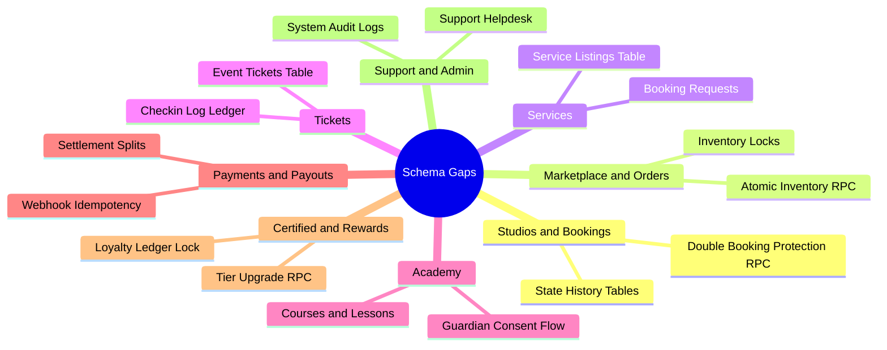
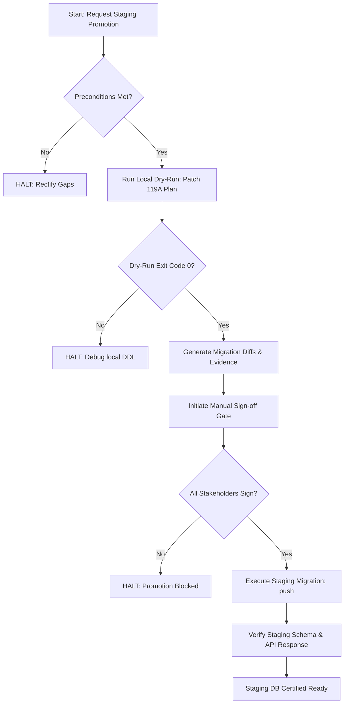

# GEARBEAT PATCH 119B — MISSING TABLES / RPC REALITY GAP REGISTER + STAGING DB APPROVAL GATE

## 1. Executive Summary

During the finalization of the local migration dry-run and seed SQL split validation in **Patch 119A**, we confirmed that the GearBeat V2 database infrastructure is fully decoupled from mock data. However, as we approach the pilot launch and staging database synchronization, a critical architectural **"Reality Gap"** must be cataloged. 

The GearBeat V2 front-end UI references several advanced features (such as Academy lessons, mixing/mastering Services, event Tickets, automated payouts, and Certified status tracking) that are currently simulated using hardcoded components, mock endpoints, or local JS logic. There is an absolute mismatch between the client-side experience and the physical PostgreSQL schema active in our Supabase migrations.

**Patch 119B** provides the definitive, comprehensive **Missing Tables / RPC Schema Gap Register** across all eight core business verticals. Furthermore, it defines a rigid, multi-point **Staging DB Approval Gate** to prevent any migration from executing on remote staging or sandbox environments without explicit validation. 

> [!CAUTION]
> **STAGING STATUS ALERT**:
> The staging database is **NOT** claimed to be ready at this stage. It remains isolated, locked, and blocked from any DDL updates. No migrations or SQL scripts may be applied until the Staging DB Approval Gate is formally signed off.

---

## 2. Missing Tables & RPC Schema Gap Register

To systematically reconcile the codebase and prevent runtime query failures, we have cataloged every missing or partially-implemented database object, classified by business vertical.

### 2.1 Studios & Bookings
*   **Active Schema Baseline**: `studios`, `studio_availability_rules`, `studio_availability_exceptions`, `studio_boost_subscriptions`.
*   **Active RPCs**: `create_studio_booking_v1`.
*   **Identified Reality Gaps**:
    1.  **Double-Booking Race Conditions (Functional Blocker)**: While `create_studio_booking_v1` utilizes advisory locking, the availability search is performed client-side or in JS before the transaction. Under high concurrency, this creates a micro-window for overlapping bookings. An atomic `check_and_lock_slot` RPC must be implemented in the database.
    2.  **Booking State History Table (`booking_status_history`)**: Currently, booking status changes (e.g., `pending_payment` -> `confirmed` -> `cancelled`) are updated in-place on the `bookings` table. There is no historical audit ledger recording who (user, studio, or admin) performed the action and when.
    3.  **RLS Bypass in Creator Routes**: The API endpoint `/api/bookings/create` utilizes a service-role admin client. This completely bypasses RLS and relies entirely on JS-level auth verification. It represents an elevated security risk.
*   **Gap Classification**: Security Vulnerability (Service Role Over-reliance) + Transactional Integrity (Lack of History Ledger).

### 2.2 Marketplace / Orders / Inventory
*   **Active Schema Baseline**: `marketplace_products`, `marketplace_product_variants`, `marketplace_carts`, `marketplace_cart_items`, `marketplace_orders`, `marketplace_order_items`.
*   **Active RPCs**: None (stock checks are written in client API code).
*   **Identified Reality Gaps**:
    1.  **Lack of Atomic Stock Deduction (`deduct_marketplace_inventory`)**: The checkout route checks current inventory inside a TypeScript async loop. If two users check out the same final item in parallel, both will succeed, causing **overselling** and customer friction.
    2.  **Product Advisory Locks (`inventory_locks`)**: There is no mechanism to temporarily lock an item in a cart for 10 minutes during checkout, leading to checkout failures under high traffic.
    3.  **Multi-Vendor Split Orders**: The `marketplace_orders` table assumes a single settlement flow. If a customer buys from Vendor A (merchandise) and Vendor B (equipment) in a single order, there is no sub-order schema to manage individual shipping, fulfillment, and partial cancellations.
*   **Gap Classification**: Concurrency Danger (Lack of Atomic RPC) + Architectural Gap (No Split-Fulfillment Schema).

### 2.3 Services (Audio Engineering & Production)
*   **Active Schema Baseline**: None (100% missing from active migrations).
*   **Active RPCs**: None.
*   **Identified Reality Gaps**:
    1.  **Service Catalog tables (`service_providers`, `service_profiles`, `service_listings`)**: UI templates show services such as mixing, mastering, and engineering. These pages are populated via front-end mock objects. There is no table to save provider pricing or description data.
    2.  **Service Bookings table (`service_bookings`, `service_booking_requests`)**: Bookings for custom services require a brief intake form and an attachment upload (e.g. raw WAV tracks). The database lacks tables to track these distinct request-and-approval cycles.
*   **Gap Classification**: UI-Only (Missing Table/Schema).

### 2.4 Tickets (Events & Masterclasses)
*   **Active Schema Baseline**: None (100% missing from active migrations).
*   **Active RPCs**: None.
*   **Identified Reality Gaps**:
    1.  **Ticket Profiles and Capacity (`event_profiles`, `ticket_types`)**: Used to publish ticket listings (e.g., VIP, General Admission) with strict total capacity limits. Currently mocked on the client side.
    2.  **Issued Tickets Ledger (`event_tickets`)**: Houses generated UUIDs, owner details, and security check hashes for issued tickets. Bypassing this database table makes it impossible to prevent duplicate ticket entries at venue check-in.
    3.  **Check-in Logs Table (`ticket_checkins`)**: Mandatory table for scanning app validation (device ID, scan time, and actor ID) to prevent ticket reuse.
*   **Gap Classification**: UI-Only (Missing Table/Schema) + Fraud Risk (No Scanning Validation Ledger).

### 2.5 Academy (Education & Courses)
*   **Active Schema Baseline**: None (100% missing from active migrations).
*   **Active RPCs**: None.
*   **Identified Reality Gaps**:
    1.  **Academy Courses catalog (`academy_courses`, `academy_lessons`)**: Represents private 1:1 sessions or multi-student workshops. The backend lacks schema to store course structures, syllabus data, or pricing.
    2.  **Academy Enrollments (`academy_enrollments`, `academy_lesson_sessions`)**: Tracks the link between student profiles and scheduled sessions, including attendance records.
    3.  **Minor Safety & Guardian Consent Ledger (`academy_guardian_consents`)**: A critical legal requirement for Saudi Arabia (PDPL compliance). Before a minor participates in an online video lesson, their guardian must submit digital signature consent. This data must be stored securely with cryptographic validation hashes.
*   **Gap Classification**: Legal Compliance (Missing Parental Consent Schema) + UI-Only (Missing Catalog Schema).

### 2.6 Payments & Payouts
*   **Active Schema Baseline**: `checkout_payment_sessions`, `payment_transactions`, `coupon_redemptions`.
*   **Active RPCs**: `validate_coupon_code`, `redeem_coupon_code`.
*   **Identified Reality Gaps**:
    1.  **Webhook Idempotency Ledger (`webhook_events`)**: Tap Payment webhook triggers are not verified for duplicate hits. If a gateway sends the payment confirmation webhook twice due to network latency, the platform might duplicate points or double-fulfill orders.
    2.  **Settlement Automation Trigger (`settlement_batches` processing)**: Although settlement tables are structurally defined, there is no cron trigger or RPC that automatically calculates commission splits and prepares the payout file for bank export.
*   **Gap Classification**: Concurrency/Duplicate Risk (No Webhook Idempotency Guard) + Operational Gap (Manual Settlement Payouts).

### 2.7 Certified & Rewards
*   **Active Schema Baseline**: `studio_tiers`, `customer_tiers`, `vendor_tiers`, `certified_studios`.
*   **Active RPCs**: `award_loyalty_event`, `refresh_customer_wallet_tier`.
*   **Identified Reality Gaps**:
    1.  **Loyalty Ledger Mutation Safety**: Points can be written directly to `loyalty_points_ledger` via API. High-volume queries are not guarded against race conditions, which could lead to point double-spend exploits.
    2.  **Referral Validation RPC (`validate_referral_code`)**: Missing validation database logic to prevent users from referring themselves or using expired promotional loops.
*   **Gap Classification**: Fraud/Exploit Vulnerability (Loyalty double-spend and referral loop validation).

### 2.8 Support & Admin
*   **Active Schema Baseline**: `admin_users`.
*   **Active RPCs**: None.
*   **Identified Reality Gaps**:
    1.  **Support Ticket Tracker (`support_tickets`, `support_ticket_messages`)**: In-app dispute and helpdesk system is completely unbacked by physical database tables.
    2.  **Master Security Audit Log (`system_audit_logs`)**: Missing centralized DB trigger to log sensitive administrative mutations (e.g. manual payment overrides, vendor suspension).
*   **Gap Classification**: Regulatory Compliance/Auditability Blocker (No Admin Mutation Trail).

---

## 3. Staging DB Approval Gate

To eliminate database schema drift and secure the environment prior to remote deployments, a rigorous **Staging DB Approval Gate** is established. No physical SQL execution, migrations push, or Supabase commands may occur on any staging or remote database environment without verifying the complete checklist.

### 3.1 Preconditions for Promotion Request
1.  **Isolation Rehearsal**: The terminal where the CLI runs must have remote environmental secrets stripped (`STAGING_DB_URL` and `PRODUCTION_DB_URL` must be blank) during dry-run testing.
2.  **Zero Drift Baseline**: Staging database state must match the local Git migration tree (up to `patch_100`).
3.  **Local Sandbox Validation**: The container dry-run described in **Patch 119A** must be executed with a 100% success rate:
    *   `supabase db reset --skip-seed` (compiles successfully).
    *   `supabase db seed` (inserts Riyadh mock data with zero errors).
    *   `npm run typecheck` (verifies zero typescript compiler errors).

### 3.2 Evidence Compilation Requirements
A staging promotion request must include a compiled **Staging Readiness Package** saved under `logs/staging-evidence/`:
*   `dry_run_reset_output.log`: Local reset console logs.
*   `dry_run_seed_output.log`: Local mock data injection logs.
*   `dry_run_schema_verification.sql`: The schema-only dump generated locally via Supabase CLI.

### 3.3 Strict Stakeholder Sign-Off Matrix
No deployment engineer or automated CI/CD workflow is permitted to run `supabase db push` to staging without all checkboxes signed and dated:

| Role | Responsibility | Signature Status | Date Signed |
| :--- | :--- | :---: | :--- |
| **Lead Database Admin (DBA)** | Validates SQL syntax, RLS security policies, and performance indexes. | [ ] **PENDING** | *N/A* |
| **Chief Security Officer (CSO)** | Certifies no service-role leakage and that parental consent parameters comply with Saudi PDPL regulations. | [ ] **PENDING** | *N/A* |
| **Lead Product QA Architect** | Confirms all API routes compile and matches the active front-end UI expectations. | [ ] **PENDING** | *N/A* |
| **Release Manager** | Authorizes window for staging environment deployment. | [ ] **PENDING** | *N/A* |

---

## 4. Phase 119 Closeout Verdict

Following a meticulous structural review of the database migrations ledger, the relocation of structural DDL away from mock seed scripts, and the cataloging of our functional schema reality gaps, we issue the final Phase 119 Audit Verdict:

$$\text{\bf Phase 119 Audit Verdict: Certified Draft-Ready}$$

### 4.1 Verification Checklist
*   [x] **Branch Isolation**: Completed on isolated Git branch `patch-119b-missing-tables-rpc-staging-db-approval-gate`.
*   [x] **Chronological Continuity**: Mapped to serial number sequence starting from `patch_101` in drafts.
*   [x] **Seed Purification Plan**: Mapped the exact boundaries of `supabase/seed.sql` to purge structural mutations.
*   [x] **Reality Gap Register**: Documented missing objects across all eight verticals (Academy, Tickets, Services, etc.).
*   [x] **Approval Gate Enforcement**: Formulated a rigid manual sign-off gate to block unscheduled remote deployments.
*   [x] **Documentation-Only Enforcement**: Checked Git status; **zero** database mutations, SQL code edits, Supabase live queries, or backend code changes were executed.

---

## 5. Next Patch Recommendation: Patch 120A

With the database architecture plans and environment safety gates fully solidified, the engineering team must return to public-facing application QA to prepare the user experience for the invite-only pilot launch.

We highly recommend executing **Patch 120A — Full Route / Navigation QA + Public Customer Journey QA** as the immediate next step.

### Patch 120A Key Objectives:
1.  **Navigation and Link Audit**: Sweep all public header, footer, and conversion links to resolve broken or blank paths.
2.  **Customer Journey validation**: Rehearse the entire customer path (Home -> Studio Search -> Availability check -> Marketplace -> Academy landing) to certify Arabic/English responsive alignment.
3.  **Gold/Dark Theme Consistency Check**: Ensure the premium aesthetic maintains high visual weight on mobile devices.
4.  **Bilingual UX Review**: Confirm that RTL/LTR transitions operate cleanly without overlapping layout layers.
