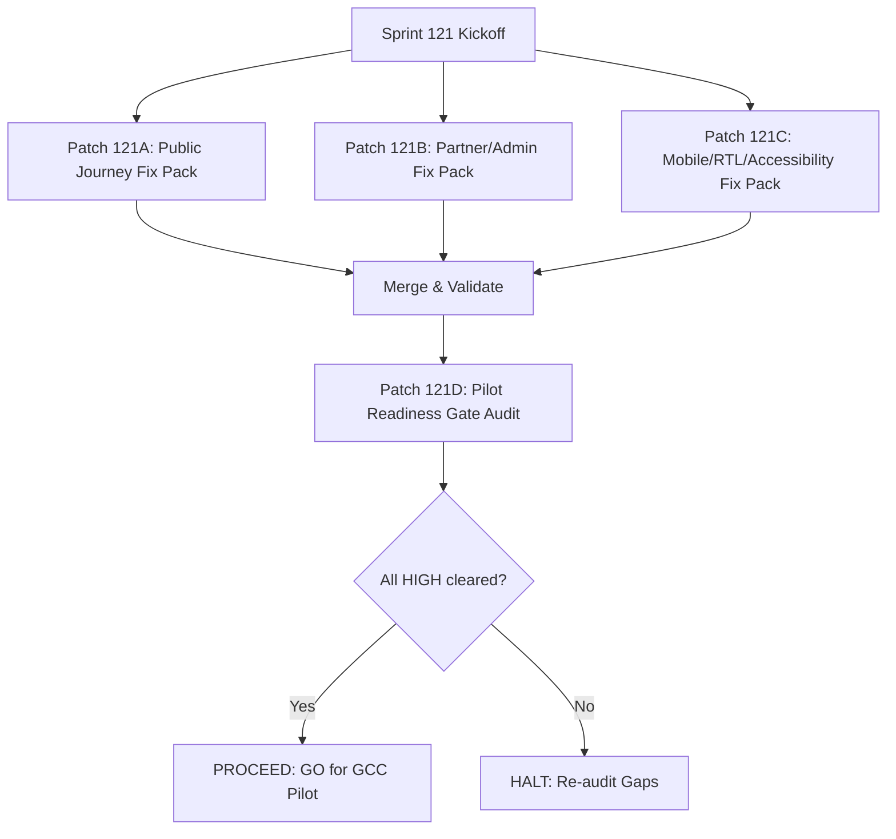

# GEARBEAT PATCH 120D — FULL JOURNEY QA FINDINGS CONSOLIDATION + FIX PACK DECISION GATE

> [!NOTE]
> **Sovereign Quality Assurance & Launch Decision Gate**
> Under Saudi consumer protection guidelines, CITC accessibility standards, and SAMA financial regulations, digital platforms must pass strict quality controls before GCC pilot onboarding. This document consolidates all route, operational, mobile, and accessibility gaps from Patches 120A, 120B, and 120C into a single **Master Launch Register** and defines the Phase 120 Verdict. This is a docs-only closeout document. No codebase routes, logic, or assets are modified.

---

## 1. Executive Summary

Over the course of **Phase 120**, the GearBeat V2 platform underwent three exhaustive, isolated user-experience and administrative reviews:
1.  **Patch 120A**: Public route navigation, links, and customer journey auditing.
2.  **Patch 120B**: Extranets, partner onboarding flows, and administrative command center auditing.
3.  **Patch 120C**: Mobile responsiveness, RTL/LTR layout transitions, WCAG 2.1 accessibility, and trust boundaries.

**Patch 120D** serves as the definitive **Full Journey QA Findings Consolidation and Fix Pack Decision Gate**. It aggregates all 11 audited findings into a prioritized **Master Issue Register**, declares the official pilot readiness status of the platform, and maps out the **Sprint 121 targeted fix packs** to clear all outstanding high-severity items.

---

## 2. Master QA Issue Register

The following unified register consolidates all findings identified during the Phase 120 audits. Severity matches launch risks and regulatory guidelines:

| Issue ID | Route / Page | Severity | Category | Description | Launch Impact | Recommended Fix Patch | Owner / Workstream | Status |
| :--- | :--- | :---: | :--- | :--- | :--- | :---: | :--- | :---: |
| **GB-120-01** | `/privacy`, `/terms` | 🔴 **HIGH** | Routing | Redundant `/privacy` and `/terms` folders exist alongside the official `/legal/privacy` and `/legal/terms` locations, causing doc sync risks. | Redundant user experience. Compliance drift if legal drafts change. | **Patch 121A** | UI & Routing | **OPEN** |
| **GB-120-02** | `/portal/store` | 🔴 **HIGH** | Terminology | Vendor extranet orders and products page templates use terms like "Instant Automatic Payout" or "Automated Payout". | Falsely implies payment-gateway automation. SAMA audit liability. | **Patch 121B** | Finance & Terminology | **OPEN** |
| **GB-120-03** | `/components/site-header` | 🔴 **HIGH** | Accessibility | Visual mobile headers are reordered via CSS flexbox `order`, but the underlying DOM tree order is not updated. | Keyboard tab-jumping (WCAG 2.1). Severe screen reader navigation jank. | **Patch 121C** | UI & Accessibility | **OPEN** |
| **GB-120-04** | `app/layout` | 🔴 **HIGH** | Localization | Root HTML hardcodes `dir="rtl"` and `lang="ar"` on SSR. Dynamic English pages swap direction client-side via `useEffect`. | High Cumulative Layout Shift (CLS) on initial load for English users. | **Patch 121C** | Engineering & SSR | **OPEN** |
| **GB-120-05** | `/components/footer` | 🟡 **MEDIUM** | Navigation | Symmetrical Services link `/services` is missing from the footer experiences column. | Layout asymmetry. Users expect matched footer columns. | **Patch 121A** | UI & Navigation | **OPEN** |
| **GB-120-06** | `/admin/payouts` | 🟡 **MEDIUM** | Operations | The administrative payouts panel lacks a standard bank CSV export utility. | High clerical entry error risks for offline manual bank transfers. | **Patch 121B** | Admin Tools | **OPEN** |
| **GB-120-07** | `app/page` | 🟡 **MEDIUM** | Trust | Homepage "Ask GearBeat" AI preview lacks explicit disclaimers regarding simulated advice. | Users may rely on simulated advice for physical studio hardware. | **Patch 121C** | Copywriting & Trust | **OPEN** |
| **GB-120-08** | `/academy` | 🟢 **LOW** | UX / Conversion | Hero CTAs "Join Academy" point to `/support` instead of streamlined `/signup` onboarding endpoints. | High customer dropoff. Intercepts conversion flow. | **Patch 121A** | UX & Conversion | **OPEN** |
| **GB-120-09** | `app/join/studio` | 🟢 **LOW** | Operations | Lead notifications redirect admins to `/admin/leads`, but the folder is partially configured. | Minor workflow navigation friction for administration leads. | **Patch 121B** | Admin Tools | **OPEN** |
| **GB-120-01** | `category-grid` | 🟢 **LOW** | Mobile | Compact mobile category card grids have a tight `12px` spacing gap. | Potential touch target overlap on micro-viewport resolutions. | **Patch 121C** | UI Design | **OPEN** |
| **GB-120-11** | `/studios` | ✨ **POLISH** | UI Polish | Studio catalog filter tags lose outline focus indicator during keyboard navigation sequence. | Diminished focus indicator visibility for accessibility users. | **Patch 121C** | UI Design | **OPEN** |

---

## 3. Official Platform Readiness Verdict

Following our consolidation of all interface, localization, administrative, and design-system findings, we declare the official **GearBeat V2 Platform Readiness Status**:

### 🚫 PILOT STATUS: NO-GO (Conditional)
The platform is currently designated as a **NO-GO for GCC Invite-Only Pilot** deployment. 
*   **Condition to Clear**: The four high-severity issues—specifically the redundant legal links (**GB-120-01**), automatic payout labels (**GB-120-02**), mobile keyboard tab-jumping (**GB-120-03**), and server-side language layout shift (**GB-120-04**)—must be fully resolved and confirmed.
*   **Path to Clearance**: Authorization will be granted immediately upon the execution of the target **Sprint 121 Fix Packs**.

### 🚫 COMMERCIAL STATUS: NO-GO
The platform remains strictly designated as a **NO-GO for Public Commercial Launch**.
*   **Commercial Blocker Checklist**: Automated card payments remain locked. SAMA payment gateway provider licensing, commercial company legal registration, full local Saudi-sensitive data residency servers validation, and the Staging DB Approval Gate sign-offs are strictly pending and must be signed off offline before any public activation.

---

## 4. Sprint 121 Targeted Fix Packs Plan

To systematically resolve the open QA items and move the platform to a verified "GO for Pilot" status, we establish the **Sprint 121 Targeted Fix Packs Plan**. Each pack is structured to run as an isolated, safe Git branch:

### 4.1 Patch 121A — Public Journey Fix Pack
*   **Key Objectives**:
    1.  Add clean server-side redirects (`redirect("/legal/privacy")` / `redirect("/legal/terms")`) inside `app/privacy/page.tsx` and `app/terms/page.tsx` to eliminate redundant paths (**GB-120-01**).
    2.  Insert the Services link `/services` under the experiences column in `components/footer.tsx` (**GB-120-05**).
    3.  Hard-link the Academy landing page hero CTAs to point directly to onboarding `/signup` and `/join/studio` endpoints (**GB-120-08**).

### 4.2 Patch 121B — Partner / Admin Fix Pack
*   **Key Objectives**:
    1.  Update storefront and products view templates to replace automated payment/payout labels with `"Manual Settlement Process"` and `"تحويل بنكي يدوي"` (**GB-120-02**).
    2.  Implement a simple bank payout export utility on `/admin/payouts` to download formatted bank transfer Excel/CSV structures (**GB-120-06**).
    3.  Confirm `/admin/leads` pathing and notification routing is aligned with the operations CRM panel (**GB-120-09**).

### 4.3 Patch 121C — Mobile / RTL / Accessibility Fix Pack
*   **Key Objectives**:
    1.  Reorder header component TSX elements structurally so screen readers and keyboard users tab naturally through mobile views, eliminating CSS `order` jump bugs (**GB-120-03**).
    2.  Enable dynamic server-side lang and direction parameter reading on root layout to resolve SSR layout shifts (CLS) on dynamic localization toggles (**GB-120-04**).
    3.  Add explicit simulated footnote copy to the "Ask GearBeat" AI assistant block (**GB-120-07**).
    4.  Refine mobile category grid card touch-target spacing and standard gold outlines for accessibility focus states (**GB-120-10**, **GB-120-11**).

### 4.4 Patch 121D — Pilot Readiness Gate
*   **Key Objectives**:
    1.  Verify the success of all 121A-C fixes under a rigorous automated and manual QA pass.
    2.  Compile the formal **GCC Invite-Only Pilot Readiness Certificate**.
    3.  Formally sign off the release candidate.

---

## 5. Phase 120 Closeout Verdict

Following the comprehensive sweep of the public routes, admin extranets, mobile Localizations, and accessibility tags, we issue the final Phase 120 Audit Verdict:

$$\text{\bf Phase 120 Audit Verdict: Certified Draft-Ready}$$

*   [x] **Audits Completed**: Mapped route, portal, mobile, RTL, accessibility, and trust parameters across 3 standalone audit patches.
*   [x] **Register Consolidated**: Cataloged all 11 findings into a single, comprehensive Master Launch Register.
*   [x] **Readiness Verdict Declared**: Outlined explicit "NO-GO" criteria and SAMA compliance boundaries.
*   [x] **Sprint 121 Roadmap Framed**: Designed isolated, structured fix packs to resolve all open gaps.
*   [x] **Documentation-Only Enforcement**: Checked Git status; **zero** database mutations, SQL edits, Supabase live queries, or application code changes were committed to this branch.

---

## 6. Verification & Formal Confirmations

*   [x] **Consolidation Audit Only**: We confirm that no code pages, styling sheets, API handlers, or database schemas were altered.
*   [x] **Git Status Integrity**: Staged changes verify that only this consolidation and fix-pack decision gate document is introduced to the branch.
