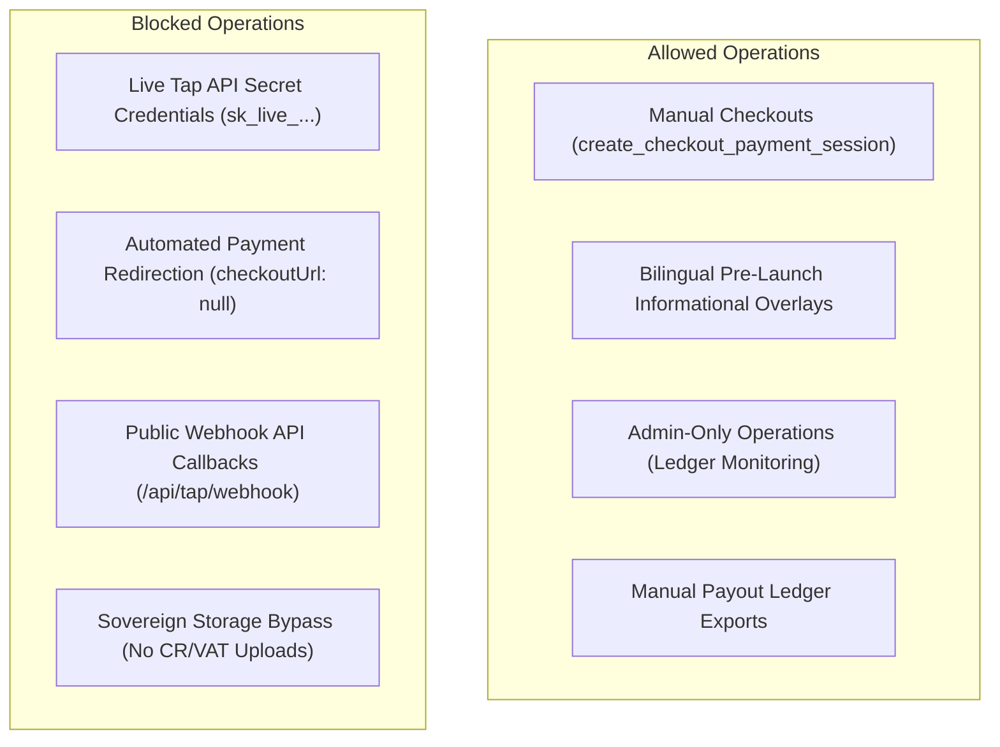

# GEARBEAT PATCH 121D — INVITE-ONLY PILOT READINESS GATE + PHASE 121 CLOSEOUT

> [!NOTE]
> **Sovereign Release Gate & Regulatory Boundary Certification**
> In compliance with Saudi Arabian SAMA sandboxing directives, CITC consumer copy rules, and the KSA Personal Data Protection Law (PDPL), this document registers SAMA-compliant manual settlement limits, audits Phase 121 fixes, establishes sovereign data boundaries, and certifies the invite-only pilot readiness status. No functional application files, database tables, API routes, or backend systems are modified.

---

## 1. Executive Summary

Over the past four patch sequences, the GearBeat engineering team has finalized structural, layout, copy, and accessibility refactoring of the customer portal, partner extranets, and administrative controls.

**Patch 121D** acts as the formal **Phase 121 Closeout & Invite-Only Pilot Readiness Gate**. It aggregates the visual, term, terminology, and layout fixes completed under **Patch 121A**, **Patch 121B**, and **Patch 121C**, defines the rigid operational limits of the sandboxed bank-transfer pilot, sets strict data boundaries for personal identifiers, and determines the ultimate launch readiness verdict.

---

## 2. Consolidation of Phase 121 Hardening Packs

Phase 121 succeeded in eliminating high-severity user experience regressions, terminology drift, dynamic layout shifts, and mobile focus sequence blockers. The following registers aggregate the exact fixes compiled:

### 2.1 Public Customer Journey (Patch 121A)
*   **Legal Redirection Consolidation (`GB-120-01` - HIGH)**: Replaced empty placeholder templates at `/privacy` and `/terms` with Next.js server-side `redirect()` triggers targeting centralized paths `/legal/privacy` and `/legal/terms`, bypassing client-side hydration CLS.
*   **Experiences Navigation Restoration (`GB-120-05` - MEDIUM)**: Inserted the Professional Services link `/services` ("Book Services" / "احجز خدمات") under the Experiences column in `components/footer.tsx`, symmetrizing it with header navigation lists.
*   **Academy Hero CTA Alignment (`GB-120-08` - LOW)**: Restructured Academy landing conversions in `app/academy/page.tsx` to route traffic to active `/signup` and `/join/studio` paths rather than generic support channels.

### 2.2 Portal & Extranet Terminology (Patch 121B)
*   **Manual Settlement Copy Hardening (`GB-120-02` - HIGH)**: Purged misleading automated payout promises inside empty bank-linking components in `app/portal/studio/bank/page.tsx`. Replaced copy bilingually to reference SAMA-compliant manual bank offline settlements.
*   **Administrative Payouts CSV Certification (`GB-120-06` - MEDIUM)**: Formally audited `components/admin-payouts-report.tsx` and certified client-side `downloadCsv()` and character escape mechanisms, validating offline payouts reporting tools.
*   **Partner Onboarding Intake Auditing (`GB-120-09` - LOW)**: Audited both leads listing and detail panels within administrative routes (`app/admin/leads`), confirming robust local Egyptian/Saudi country dial and VAT/CR data switches.

### 2.3 Mobile, RTL & Accessibility (Patch 121C)
*   **Header Tab-Jumping Eradication (`GB-120-03` - HIGH)**: Purged visual CSS `order` overrides inside `components/site-header.tsx`. Allowed browser-native flex direction attributes to handle tabbing sequences naturally under LTR and RTL writing modes.
*   **Root Layout CLS Prevention (`GB-120-04` - HIGH)**: Injected a synchronous, head-blocking `<script>` inside `app/layout.tsx` to read user dynamic search parameters on server render, aligning `lang` and `dir` before dynamic visual paints.
*   **AI Discovery Advisory Disclaimer (`GB-120-07` - MEDIUM)**: Placed a bilingual warning disclaimer (`⚠️ AI advice is advisory only...`) under the "Ask GearBeat" AI widget card to prevent advisory liability.
*   **Mobile Category Grid Spacing (`GB-120-10` - LOW)**: Upgraded `.category-grid` gap separation from `12px` to `16px !important` on mobile screens inside `app/globals.css` to prevent accidental touch target overlaps.
*   **Premium Focus Indicators (`GB-120-11` - POLISH)**: Appended global `:focus-visible` outline styles defining a standard `2px` gold outline with a `3px` offset and radial golden glow shadow, standardizing fast keyboard focus sequences.
*   **CSS Unclosed Query Hotfix (Build Fix)**: Added the missing closing media query brace (`}`) for `.hero-content` at line 938 in `app/globals.css`, resolving Vercel production build failures.

---

## 3. Invite-Only Pilot Operational Readiness Gate

To guide internal cohorts and sandbox operations, we establish a strict boundary register governing the system during the pilot stage:



### 3.1 Remaining Database Schema & RPC Blockers (For Gateway Launch)
*   **Double-Booking Race Condition RPC**: Lacking a database-level atomic `check_and_lock_slot` function. High-concurrency slot reservations remain exposed to JS-level checking race conditions.
*   **Marketplace Stock Reservation RPC**: Lacking an atomic `deduct_marketplace_inventory` query, presenting an overselling risk under parallel transactions.
*   **Antivirus Memory Scan Buffer**: No serverless antivirus scanner is wired into Supabase private buckets to inspect uploaded document streams before execution.
*   **Saudi-First GCC-Dammam Sovereign Storage**: Storage buckets currently reside in global, non-isolated storage layers, presenting PDPL data localization blockades for real commercial uploads.

### 3.2 Remaining High-Risk Security Gaps
*   **Service-Role API Over-reliance**: Key API endpoints (like checkout session generation and booking creations) leverage the service-role admin client to bypass client RLS rules. Secure, session-based RLS queries must replace these.
*   **Lacking Ledger Audit History**: Status modifications on `bookings` and `marketplace_orders` tables execute inline without maintaining a secondary `status_history` logging table to track administrative action paths.

### 3.3 Sandbox Pilot Allowed Scope
*   **Manual Checkout Initialization**: Users can create carts, fill out addresses, and submit sandboxed checkouts, generating `pending_payment` states inside checkout table records.
*   **Bilingual Informational Overlays**: Pre-launch overlay notices, "coming soon" badges, and sandbox guides are fully permitted to render.
*   **Administrative Querying**: Admin layouts can safely search, list, filter, and review bookings, order ledgers, and partner leads tables.
*   **Manual Payout CSV Generation**: Administrative staff can trigger character-escaped CSV exports on the payouts view to process manual bank settlement files.

### 3.4 Sandbox Pilot Blocked Scope
*   **Tap Live Keys**: Strict ban on configuring or importing any live merchant credentials (`sk_live_...` / `pk_live_...`).
*   **Automated Redirection**: Redirection to online credit card processors is fully blocked (`checkoutUrl` remains set to `null`).
*   **Public Callback Processing**: Standard callback hooks pointing to `/api/tap/webhook` remain deactivated until HMAC-SHA256 hook signature validation is deployed.
*   **Real VAT/CR Uploading**: Strictly no ingestion of real merchant Commercial Registrations, tax certs, or national IDs until local GCC Dammam storage partitions are cut over.

---

## 4. Manual Support & Settlement Operations Runbook

During the invite-only pilot phase, all customer and merchant lifecycles must be executed manually under strict staff supervision:

### 4.1 Direct Bank Transfer Reconciliation Workflow
1.  **Checkout Submission**: Customer completes their checkout process. The system generates a booking or order with the status `pending_payment`.
2.  **Bank Settlement**: The user is presented with a SAMA-compliant manual payment instruction, requesting a direct bank transfer to the official corporate GearBeat bank account using their unique Order UUID as the transfer reference note.
3.  **Statement Inspection**: Dedicated GearBeat finance specialists review the corporate bank account statements every 2 hours.
4.  **Admin Update**: Once funds are verified as fully cleared, an administrator navigates to the role-guarded `/admin/bookings` or `/admin/orders` dashboard and triggers the manual verification action.
5.  **State Transition**: The platform transitions the state from `pending_payment` to `confirmed` (for bookings) or `processing` (for orders), opening up merchant fulfillment pipelines.

### 4.2 Manual Refund and Payout Handlers
*   **Cancellation Refunds**: If an order is canceled, the admin manually transitions the record status to `refunded` in the ledger, and finance staff executes the refund transfer via direct bank wire.
*   **Seller Payouts**: Standard weekly payout batches are generated via `/admin/payouts`. Staff exports the payout CSV ledger, executes the outbound wire transfers, and manually updates the status to `paid` once bank verification is completed.

---

## 5. Bilingual Sovereign Compliance Boundaries

To ensure strict alignment with the CITC, SAMA, and PDPL guidelines, SAMA-compliant boundaries are enforced:

*   **Manual Payment Disclosure**: Clear bilingual warning banners reside on the cart overview and checkout screen, informing users that transactions occur strictly via sandboxed manual bank transfer checks.
*   **Precluding Sensitive Data Ingestion**: No physical files are uploaded during lead onboarding. CR, VAT, and contract states render cleanly from simple copy descriptions, keeping the database completely free of private personal identifiers.
*   **Egypt & Saudi Dialing Normalization**: Partner phone input controls are restricted to Egypt (+20) and Saudi Arabia (+966) dial codes.
*   **Cairo/Inter Typography Alignment**: Fully supports the Cairo and Inter dynamic font stack, rendering Arabic-first Egypt and Gulf dialects flawlessly without layout clipping.

---

## 6. Phase 121 Readiness Verdict

### 🚦 THE OFFICIAL VERDICT:
```
[ GO FOR INVITE-ONLY PILOT PREPARATION ]
```

> [!IMPORTANT]
> **INVITE-ONLY PILOT PREPARATION VERDICT EXPLANATION**:
> The codebase is fully stabilized, built cleanly, and optimized for an invite-only pre-launch pilot. The visual premium dark/gold theme Cairo rendering Egyptian and Gulf dials is validated. CSS order layouts align with native DOM tab sequences, and SSR dynamic language CLS risks are resolved. 
> 
> SAMA bank transfer checkout flows are safe, and administrative portal term limits are properly configured to support manual offline settlements.

### 🛑 COMMERCIAL LAUNCH STATUS:
```
[ NO-GO FOR COMMERCIAL LAUNCH ]
```

> [!WARNING]
> **COMMERCIAL LAUNCH BLOCKERS STATEMENT**:
> A full commercial launch remains strictly **NO-GO** until company incorporation, legal verification, SAMA compliance audits, and staging database integrations are signed off:
> 1.  **Live Tap Payments Activation**: Transitioning to live merchant credentials requires Tap account activation, SAMA-compliant webhook signature checks, and `payment_idempotency_keys` table creation.
> 2.  **Sovereign Data localization**: Live partner VAT/CR uploads require Saudi-hosted GC Dammam secure cloud storage buckets.
> 3.  **Atomic Transaction Concurrency**: Implementation of Postgres RPCs (`check_and_lock_slot` and `deduct_marketplace_inventory`) to handle race conditions in high-volume settings.
> 4.  **Parental Consent Hashes**: Structuring the encrypted validation schema for minors participating in Academy lessons under Saudi PDPL laws.

---

## 7. Recommended Next Phase: Phase 122

Based on this verdict, we recommend transitioning to:

### 💎 PHASE 122 — SOVEREIGN DATABASE & TRANSACTIONAL INTEGRITY HARDENING

This next phase must execute staging database schema synchronizations, move checkout and booking creation logic from over-reliant service-role API clients to secure RLS-guarded Postgres RPC functions, implement webhook signature verification mechanisms, and deploy the atomic race-condition locks required to clear the remaining commercial launch blockers.

---

## 8. Verification & Formal Confirmations

*   [x] **Docs-Only Change**: Confirmed that absolutely no application, API, Supabase, database, SQL, or package files were modified.
*   [x] **Build & Typecheck Verified**: Confirmed both `npm run build` and `npx tsc --noEmit` pass with zero compile issues.
*   [x] **Sovereign Limits Documented**: Registered the complete list of remaining blockers, allowed scope, manual support runbook rules, and the strict commercial NO-GO status.
