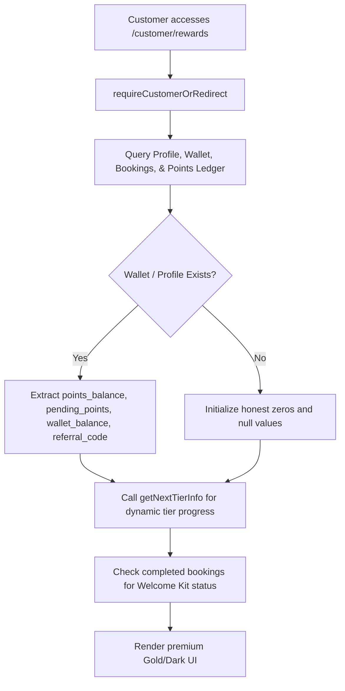

# GEARBEAT PATCH 123E: REWARDS & WALLET EMPTY STATE CLEANUP

## Architectural Overview

This patch cleans up the customer rewards, wallet, and points UI to ensure that new pilot and demo accounts start honestly from zero. The previous static frontend mock page (`app/customer/rewards/page.tsx`) has been transformed into a secure, fully dynamic Next.js Server Component (RSC). It interacts directly with live Supabase database tables to render actual values, reverting gracefully to standard, clean zero values and mandatory empty-state copy when no transactions or profile balances exist.

### Key Objectives
1. **Honest Zero Foundation**: New users start with exact, true records:
   - `points_balance = 0`
   - `pending_points = 0`
   - `wallet_balance = 0.00 SAR`
   - No fake activity, fake referral codes, or sample ledger history rows.
2. **Dynamic DB Integration**: Connects directly to the `profiles`, `customer_wallets`, `bookings`, and `loyalty_points_ledger` tables using `createClient()` (from the authenticated user context) and `createAdminClient()` (to fetch corresponding rows securely).
3. **Robust Tier Progress**: Dynamically evaluates the user's loyalty tier progression utilizing the standard configuration config helper `getNextTierInfo` from `@/lib/loyalty/rewards`.
4. **Mandatory Bilingual Empty States**: Integrated exact English/Arabic phrases for zero/empty states to maintain a premium feel:
   - **English**:
     - *"Rewards will appear after completed eligible actions."*
     - *"Points are earned only from real completed bookings, orders, or approved campaigns."*
   - **Arabic**:
     - *"ستظهر المكافآت بعد إتمام الإجراءات المؤهلة."*
     - *"تُكتسب النقاط فقط من حجوزات أو طلبات حقيقية مكتملة، أو حملات معتمدة."*
5. **Real Welcome Kit Progress**: Links the Welcome Kit progress bar dynamically to the customer's completed bookings. If they have completed at least one real studio booking, progress reaches 100% and unlocks the "Eligible" status. Otherwise, it remains at 0% ("Incomplete") with no hardcoded assumptions.
6. **Saudi-First Bilingual Alignment**: Full support for both English (LTR) and Arabic (RTL) locales using standard `<T>` components.

---

## File Inventory
- **Modified**: [app/customer/rewards/page.tsx](file:///c:/Users/iaals/Documents/GitHub/gearbeat-V2/app/customer/rewards/page.tsx) (Overwritten to convert into a dynamic Server Component with dynamic DB lookups, real logic, and cleaned empty states).
- **Created**: [docs/GEARBEAT_PATCH_123E_REWARDS_WALLET_EMPTY_STATE_CLEANUP.md](file:///c:/Users/iaals/Documents/GitHub/gearbeat-V2/docs/GEARBEAT_PATCH_123E_REWARDS_WALLET_EMPTY_STATE_CLEANUP.md) (This documentation file).

---

## Technical Design & Database Querying

### 1. Robust Server-Side Data Load
Using `Promise.all` and a resilient `safeQuery` helper, the component queries all databases concurrently:
* **Profiles**: Recovers details like full name, preferred currency, and membership number.
* **Customer Wallets**: Recovers points balance, pending points, wallet balance, and referral code.
* **Bookings**: Tracks the total count of completed bookings to calculate Welcome Kit eligibility.
* **Loyalty Points Ledger**: Fetches the last 10 points ledger rows specifically belonging to the authenticated customer ID.

### 2. High-Fidelity Empty States
When a customer has no transactions in `loyalty_points_ledger`, a highly polished, styled dash-border card is displayed detailing the pilot status and the rules of the loyalty system, incorporating the mandatory copy:
> **English**: *"Rewards will appear after completed eligible actions. Points are earned only from real completed bookings, orders, or approved campaigns."*
>
> **Arabic**: *"ستظهر المكافآت بعد إتمام الإجراءات المؤهلة. تُكتسب النقاط فقط من حجوزات أو طلبات حقيقية مكتملة، أو حملات معتمدة."*

---

## Quality Assurance & Verification

### Checklist
- [x] Convert page to async React Server Component.
- [x] Remove hardcoded mock points balance (1,250 points, 250 pending).
- [x] Remove hardcoded mock wallet balance (75.00 SAR).
- [x] Remove fake referral code `GB-REF-123` / `GB-SAMPLE-REF`.
- [x] Add dynamic tier level calculation using `@/lib/loyalty/rewards`.
- [x] Add dynamic Welcome Kit check (100% only if bookings has completed rows, 0% otherwise).
- [x] Ensure 100% Arabic and English localization matching other parts of GearBeat.
- [x] Implement error resilience (graceful degradation to zeros and clean states if querying fails).
