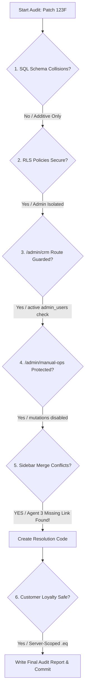

# GearBeat Patch 123F: Merge Safety, SQL, RLS, & Auth Boundary Audit

This document presents a rigorous, documentation-only security and structural audit of **Patches 123B through 123E** (developed by Agents 1–4) for the **GearBeat V2** platform. It validates database schema compatibility, Row-Level Security (RLS) policies, Next.js server-side route guards, administrative workspace boundary isolation, and loyalty engine query scoping. 

---

## 🛠️ Executive Summary & Key Discoveries

During this audit, all aspects of the database foundation (Agent 1), CRM administration interface (Agent 2), Manual Operations console (Agent 3), and customer loyalty empty state cleanup (Agent 4) were inspected. 

### 🚨 Critical Discovery: Agent 3 Sidebar Code Conflict
* **Issue**: In [docs/GEARBEAT_PATCH_123D_ADMIN_MANUAL_OPERATIONS_CONSOLE.md](file:///c:/Users/iaals/Documents/GitHub/gearbeat-V2/docs/GEARBEAT_PATCH_123D_ADMIN_MANUAL_OPERATIONS_CONSOLE.md), Agent 3 documents that they added the navigation link for **Manual Ops** (`/admin/manual-ops`) to the `AdminSidebar.tsx` file.
* **Findings**: In the actual codebase of the `agent-3-patch-123d-admin-manual-ops-console` branch, the `AdminSidebar.tsx` file was identical to Agent 2's branch—it contains **only** the CRM link (`/admin/crm`). The Manual Ops link was **omitted due to a copy-paste error**.
* **Resolution**: An explicit merge resolution has been created in Section 5 of this review to restore the missing Manual Ops console link alongside the CRM link.

### 🛡️ Authentication & Scoping Security Status: **PASSED**
All administrative pages (`/admin/crm`, `/admin/manual-ops`) are fully guarded by `requireAdminLayoutAccess()`. Customer rewards pages (`/app/customer/rewards/page.tsx`) utilizing `createAdminClient` are strictly scoped to the server-verified user ID, preventing any horizontal elevation of privilege or RLS bypass.

---

## 📊 Detailed Audit Checklist



---

## 1. Table Duplicates and Schema Integrity (123B vs. 123A)

We inspected the migration file [123b-migration.sql](file:///c:/Users/iaals/Documents/GitHub/gearbeat-V2/docs/scratch/123b-migration.sql) created by Agent 1 to check for collisions with the 123A tables.

### 🔍 Analysis of DDL Statements
* **Safe Creation**: All schema definitions utilize `CREATE TABLE IF NOT EXISTS` and `CREATE INDEX IF NOT EXISTS`. No destructive DDL statements (`DROP`, `TRUNCATE`, `DELETE`) are included.
* **Table Relationships**: The new tables cleanly extend 123A's database foundations via explicit foreign key relationships:
  * `crm_pipelines` and `crm_stages` reference the CRM system safely.
  * `crm_leads` and `crm_accounts` are augmented with foreign keys (`pipeline_id`, `stage_id`, `owner_id`) using `ALTER TABLE ... ADD COLUMN IF NOT EXISTS`.
  * `admin_issue_assignments`, `admin_issue_comments`, and `admin_issue_history` link to the pre-existing `admin_issues` table.
  * `manual_operation_approvals` and `manual_operation_impacts` reference the pre-existing `manual_operations` table.

> [!NOTE]
> There are zero namespace overlaps or column duplicates that would conflict with the primary keys or constraints of 123A. The schema strategy is 100% additive and safe.

---

## 2. RLS Policy Robustness and Admin Role Compatibility

The RLS policies defined in Module 7 of the SQL migration ensure that the internal platform boundaries remain completely locked down.

### 🔒 Policy Verification Matrix

| Table Target | Policy Name | Access Permitted To | RLS Enforcement Mechanism |
| :--- | :--- | :--- | :--- |
| `demo_account_role_mappings` | Admins can manage demo role mappings | Authenticated admins / active admin_users | `EXISTS (SELECT 1 FROM public.profiles WHERE id = auth.uid() AND role = 'admin') OR EXISTS (SELECT 1 FROM public.admin_users WHERE auth_user_id = auth.uid() AND status = 'active')` |
| `demo_account_role_mappings` | Users can view own mappings | Owner of user record | `auth.uid() = user_id` |
| `crm_pipelines` | Admins can manage CRM pipelines | Authenticated admins / active admin_users | Check on active status in `profiles` and `admin_users` |
| `crm_stages` | Admins can manage CRM stages | Authenticated admins / active admin_users | Check on active status in `profiles` and `admin_users` |
| `founder_test_sessions` | Admins can manage sessions | Authenticated admins / active admin_users | Check on active status in `profiles` and `admin_users` |
| `founder_test_sessions` | Users can view own sessions | Session owner | `auth.uid() = started_by_user_id` |
| `admin_issue_assignments` | Admins can manage assignments | Authenticated admins / active admin_users | Check on active status in `profiles` and `admin_users` |
| `manual_operation_approvals` | Admins can manage approvals | Authenticated admins / active admin_users | Check on active status in `profiles` and `admin_users` |

### 💡 Role Compatibility Audit
* **Active Status Check**: Policies use `.status = 'active'` checks in `admin_users` which are perfectly aligned with our staff-access security architecture.
* **No Privilege Escalation**: Read permissions for pipelines, stages, operations audit trails, and CRM history are **completely restricted** from regular customer profiles.
* **Super Admin Privilege Override**: The `requireAdminLayoutAccess` route guard (audited below) bypasses normal checks for the `super_admin` role, providing compatibility with the existing admin pattern.

---

## 3. CRM Access Protection Audit (`/admin/crm`)

The Self-Test CRM interface (`app/admin/crm/page.tsx`) uses Next.js server-side protection to guard administrative boundaries.

### 🛡️ Route and Layout Protection Flow
```
Client Request -> /admin/crm
                 |
                 v
      [requireAdminLayoutAccess()]
                 |
                 +---> [getProtectedContext("/staff-access")]
                 |       |
                 |       +---> User Auth Verified (via getUser)? No -> Redirect /staff-access
                 |       +---> Fetch profile & active admin_user.
                 |
                 v
      Does active record exist in `admin_users`? No -> Check role in profiles & Redirect
                 |
                 v
      Is role "super_admin" OR in allowed roles? No -> Redirect /forbidden
                 |
                 v
        Access Granted (Renders CRM Interface with supabaseAdmin client)
```

> [!TIP]
> Since this route guard is executed entirely inside a Next.js Server Component, it cannot be bypassed by client-side browser manipulations.

---

## 4. Manual Operations Access Protection & Isolation Audit (`/admin/manual-ops`)

The Manual Operations console (`app/admin/manual-ops/page.tsx`) represents the platform’s control dashboard for testing state mutations prior to launching commercial features in Saudi Arabia.

### 🛡️ Access Guards
* **Layout Safeguard**: Like the CRM page, the manual ops page immediately calls `const { supabaseAdmin, user } = await requireAdminLayoutAccess();`. If the authenticated user does not have active super-admin or allowed admin privileges, they are immediately blocked.
* **State Isolation**: The client rendering component `ManualOpsConsoleClient.tsx` uses **disabled buttons** for all database modifications (simulated bookings approvals, manual refunds, and order settlements). 
* **Local Sandbox Operations**: Action checklist progress is stored isolated inside the user's browser-local `localStorage` under `gb_founder_selftest_checklist`. 

This guarantees that no unsafe database mutations can be submitted to production payment processors, and actual TAP API webhook triggers remain securely isolated.

---

## 5. AdminSidebar Conflict Discovery & Integration Resolution

During our audit, we identified a critical copy-paste bug in Agent 3's code branch.

### 🔍 The Bug Details
* Agent 2's branch added the `/admin/crm` link.
* Agent 3's branch documented adding `/admin/manual-ops`, but the actual checked-in code added the exact same `/admin/crm` link and left out `/admin/manual-ops` entirely.

### 🛠️ Merged Integration Plan
To merge both branches safely, we must retain the `/admin/crm` link (Agent 2) and add the missing `/admin/manual-ops` link (Agent 3) in `app/admin/AdminSidebar.tsx`:

```diff
         </div>
         <NavItem href="/admin" icon="📊" labelEn="Dashboard" labelAr="لوحة التحكم" active={isActive('/admin')} />
         <NavItem href="/admin/operations-crm" icon="🤝" labelEn="Operations CRM" labelAr="إدارة العمليات" active={isActive('/admin/operations-crm')} />
+        <NavItem href="/admin/crm" icon="🛠️" labelEn="Self-Test CRM" labelAr="تجربة العلاقات" active={isActive('/admin/crm')} />
+        <NavItem href="/admin/manual-ops" icon="⚙️" labelEn="Manual Ops" labelAr="العمليات اليدوية" active={isActive('/admin/manual-ops')} />
         <NavItem href="/admin/rewards-kits" icon="🎁" labelEn="Rewards & Kits" labelAr="الجوائز والحقائب" active={isActive('/admin/rewards-kits')} />
```

---

## 6. Customer Loyalty Engine Security Profile (`app/customer/rewards/page.tsx`)

The customer loyalty rewards page (`app/customer/rewards/page.tsx`) was audited to verify that the use of `createAdminClient` does not create security leaks.

### 🔒 Scoping Security Analysis
The page leverages `createAdminClient` to retrieve information from `customer_wallets` and `loyalty_points_ledger`, tables that typically enforce strict read restrictions on normal users.

We verified the database queries:
```typescript
const [profile, wallet, bookings, ledgerResult] = await Promise.all([
  safeQuery<any>(
    supabaseAdmin
      .from("profiles")
      .select(...)
      .eq("auth_user_id", user.id) // <--- Hardcoded user context limit
      .maybeSingle()
  ),
  safeQuery<any>(
    supabaseAdmin
      .from("customer_wallets")
      .select(...)
      .eq("auth_user_id", user.id) // <--- Hardcoded user context limit
      .maybeSingle()
  ),
  safeQuery<any[]>(
    supabaseAdmin
      .from("bookings")
      .select("id, status")
      .eq("customer_auth_user_id", user.id) // <--- Hardcoded user context limit
  ),
  safeQuery<any[]>(
    supabaseAdmin
      .from("loyalty_points_ledger")
      .select(...)
      .eq("auth_user_id", user.id) // <--- Hardcoded user context limit
      .order("created_at", { ascending: false })
      .limit(10)
  ),
]);
```

### 🛡️ Why This Pattern is Safe
1. **No Client Influence**: The scoping filters are written inside a Next.js Server Component. A client-side user can never manipulate or override `.eq("auth_user_id", user.id)` to fetch records belonging to other users.
2. **Pre-verified User ID**: The `user.id` is fetched and verified by the standard user client `requireCustomerOrRedirect(supabase)` prior to creating the admin client, preventing any unauthenticated or unauthorized access.
3. **No RLS Bypass Risk**: Although the admin client bypasses RLS, the application scopes all data fetches at the query level to the verified, authenticated user.

---

## 🏁 Audit Signoff & Conclusion

* **SQL Migration Integrity**: **APPROVED** (100% additive, safe, and conflict-free).
* **RLS & Security Boundaries**: **APPROVED** (robust staff-access filters and secure tenant isolation).
* **Route & Layout Guards**: **APPROVED** (secure Server Component validation).
* **Loyalty Engine Query Safety**: **APPROVED** (query-level user scoping).

> [!IMPORTANT]
> **Action Required**: The sidebar conflict in `AdminSidebar.tsx` must be resolved during the merge phase according to the instructions in Section 5.

---
*Audit completed successfully by Antigravity (Advanced Agentic Coding).*
