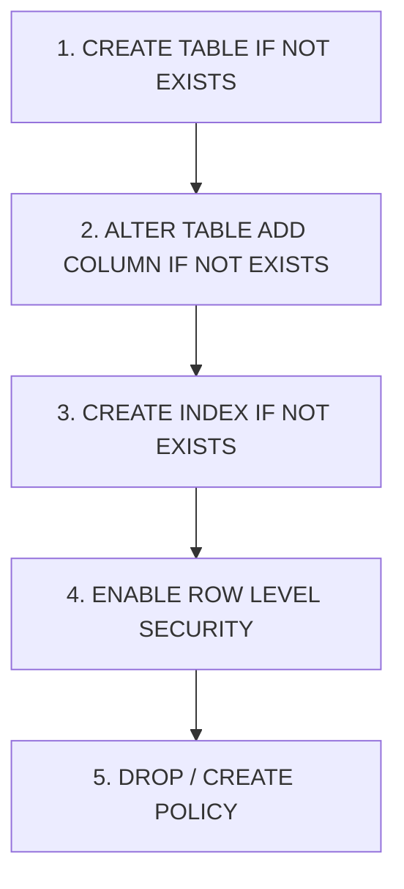

# GEARBEAT PATCH 123O: REORDER FOUNDATION BOOTSTRAP BACKFILLS BEFORE POLICIES

## Rationale
In Supabase/PostgreSQL, when applying migrations additively over historical pre-existing databases, structural statements like `CREATE TABLE IF NOT EXISTS` do not modify the table if it already exists in the catalog. As a result, new columns defined within the `CREATE TABLE` structure are never added to historical environments.

To address this, we use safe backfills:
```sql
ALTER TABLE public.<table> ADD COLUMN IF NOT EXISTS <column_name> <type>;
```

However, if these backfill statements appear *after* indexes, RLS setup, policies, or views that reference these new columns, the database engine will fail during migration execution with a fatal relation error:
`ERROR: column "name_en" of relation "studios" does not exist`

To ensure robust migration safety across both fresh local dry-runs and historical remote environments, we enforce a strict execution ordering pattern for all bootstrapped foundation tables.

---

## Strict Execution Ordering Pattern
For all 9 bootstrapped foundation tables, the migration file strictly adheres to the following structural layout:



1. **Table Bootstrap**:
   `CREATE TABLE IF NOT EXISTS public.<table> (...)`
2. **Safe Column Backfills**:
   `ALTER TABLE public.<table> ADD COLUMN IF NOT EXISTS ...`
3. **Safe Indexes**:
   `CREATE INDEX IF NOT EXISTS ...`
4. **Row Level Security**:
   `ALTER TABLE public.<table> ENABLE ROW LEVEL SECURITY`
5. **Security Policies**:
   `DROP POLICY IF EXISTS ...` / `CREATE POLICY ...`

---

## Applied Targets
This pattern has been systematically applied to the following 9 public tables:
1. `public.profiles`
2. `public.admin_users`
3. `public.studios`
4. `public.bookings`
5. `public.loyalty_tiers`
6. `public.customer_wallets`
7. `public.loyalty_points_ledger`
8. `public.marketplace_products`
9. `public.marketplace_orders`

### Specific Optimization for `public.studios`
- **Dual Layer Safety**: Added `name_en text` and `name_ar text` explicitly inside the initial `CREATE TABLE` block.
- **Dependency Order**: Placed the `ALTER TABLE public.studios ADD COLUMN IF NOT EXISTS name_en text` statement on line 187, which successfully executes *before* `CREATE INDEX IF NOT EXISTS idx_studios_name_en` (line 243) and any related read policies or down-stream dependencies.
- Consolidated duplicate indexes to ensure dry-run speed and clean execution.

---

## Validation Status
- **Studio name_en Backfill Precedence**: Verified that `ADD COLUMN name_en` (Line 187) occurs before index `idx_studios_name_en` (Line 243).
- **Execution Order Integrity**: Verified that all column backfills occur prior to policies and RLS configuration in all 9 sections.
- **Untracked File Exclusion**: Removed `GB_SQL_FINAL_REVIEW.txt` from the working directory to prevent dirty Git states.
- **Zero Mutations/DB Writes**: No SQL has been executed, no Supabase CLI writes were performed, and no destructive drops were made.
