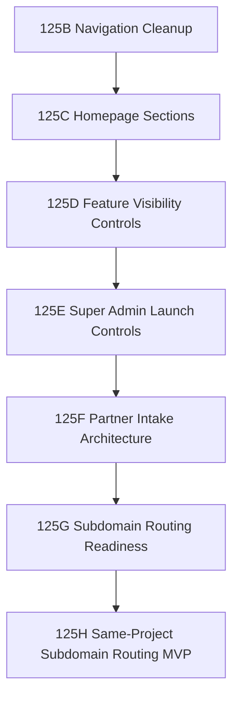

# GEARBEAT PATCH 125A — SUBDOMAIN & ROLE ACCESS ARCHITECTURE MAP

> [!NOTE]
> This document maps out the approved GearBeat domain/subdomain architecture, role access controls, and pathing boundaries. It serves as the single source of truth for upcoming routing, security, and navigation updates.

---

## 1. Domain & Subdomain Architecture Map

To streamline user experience, isolate security boundaries, and support multi-tenant partner dashboards, GearBeat is dividing its routes across dedicated subdomains.

| Domain/Subdomain | Access Role(s) | Primary Purpose | Signup / Intake Flow |
| :--- | :--- | :--- | :--- |
| **`gearbeat.app`** | Public, Customers (`customer`) | Public marketing website, search, booking engine, and customer portal | Public at `/signup` |
| **`partners.gearbeat.app`** | Prospects (All Partners) | Combined application intake for all partner types | Public partner interest forms |
| **`portal.gearbeat.app`** | Studio Owners (`owner`) | Dashboard for approved music & audio studio partners | Invitation/Approval only (no public route) |
| **`seller.gearbeat.app`** | Sellers (`vendor`) | Dashboard for approved marketplace gear sellers | Invitation/Approval only (no public route) |
| **`admin.gearbeat.app`** | Operators (`admin`, `super_admin`) | Internal system administration console | No public route (manual seeding/ops only) |

### Future Subdomains (Post-Launch Expansion)
As additional partner verticals mature, they will be migrated to isolated subdomains matching their specific tools and operational requirements:
- **`providers.gearbeat.app`** — For third-party audio service providers.
- **`instructors.gearbeat.app`** — For academy trainers and mentors.
- **`organizers.gearbeat.app`** — For event and ticket organizers.

---

## 2. Path Separation & Login Architecture

Until subdomain-based routing is fully implemented and active in Vercel/Cloudflare, path-based routing acts as the secondary security boundary. Authentication screens are separated to prevent role collision and leakage.

### Login Targets

* **Customer Login (`/login`)**
  * Target Audience: Customers looking to book studios or buy gear.
  * Flow: Validates session, verifies user has profile, and redirects to customer home (`/customer`).
* **Partner Login (`/portal/login`)**
  * Target Audience: Active Studio Owners and Sellers/Vendors.
  * Flow: Restricts entry to accounts with role `owner` (studio owner) or `vendor` (seller). Redirects to `/portal/studio` or `/portal/store`.
* **Admin Login (`/admin/login`)**
  * Target Audience: System Administrators and Operations Operators.
  * Flow: Explicitly restricted to `admin` and `super_admin` accounts.
  * Signup: **No public signup exists.** All admin accounts must be provisioned via SQL/manual console seeding.

---

## 3. Public Page Policy & Navigation Visibility

The root domain `gearbeat.app` retains public-facing marketing, listings, and checkout systems. Features must reflect the actual status of the respective vertical to avoid confusing visitors.

### Domain Public Verticals
The following areas remain fully exposed and searchable:
* **Studios** (`/studios`, `/studios/[slug]`)
* **Marketplace** (`/marketplace`)
* **Academy** (`/academy`)
* **Services** (`/services`)
* **Tickets** (`/tickets`)
* **Experiences** (`/experiences`)

### Navigation & Visibility Rule
1. **Nav Menu Cleanup:** All links to unlaunched or partial verticals (e.g. unfinished ticket platforms, store listings, etc.) must be removed from the main header and footer navigation menus.
2. **Coming Soon Placards:** Pages for unlaunched features should render a premium, branded "Coming Soon" section with an optional newsletter/interest capture instead of half-broken interfaces or empty states.

---

## 4. Implementation Sequence

The transition from a single monolithic domain and route structure to the subdomain-separated architecture will proceed via the following phases:

### Detailed Sequence Checklist

1. **`125B` Public Header/Footer Navigation Cleanup**
   - Audit all menu links across headers, sidebars, and footers.
   - Remove or comment out pathways leading to unfinished components.
2. **`125C` Homepage Coming Soon Product Sections**
   - Redesign homepage components to highlight coming verticals (Academy, Marketplace) as "Coming Soon" teasers with premium layout styling.
3. **`125D` Config-Based Public Feature Visibility Controls**
   - Introduce a JSON/JS config mapping feature flags to route availability.
   - Gate routing dynamically at the middleware or layout level.
4. **`125E` Super Admin Launch Controls Preview**
   - Design mock/console UI allowing super administrators to toggle feature flag config parameters live.
5. **`125F` Partner Application Intake Architecture**
   - Develop unified database tables/routes to intake interested leads across all partner roles (instructors, organizers, owners, sellers).
6. **`125G` Subdomain Routing Readiness Plan**
   - Audit codebase for absolute URLs, state managers, and cookie domains to prepare for subdomains.
7. **`125H` Same-Project Subdomain Routing MVP**
   - Implement Next.js middleware routing mapping requests from `*.gearbeat.app` to specific sub-folders inside the Next.js `app` directory.
