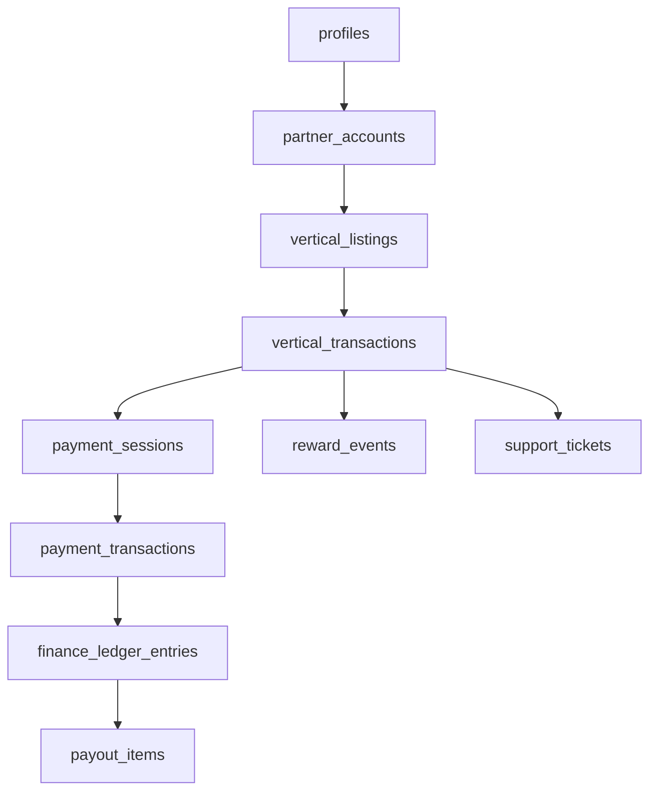

# GEARBEAT: SQL MASTER CONSOLIDATION REVIEW (SPRINTS 0–7)
**Agent:** Agent 3 — SQL/Database Readiness  
**Status:** DRAFT / REVIEW ONLY  
**Date:** 2026-05-15  

---

## 1. EXECUTIVE SUMMARY
Over the course of 8 architectural sprints (0-7), GearBeat V2 has moved from a "Database Reality" audit to a complete, 100+ table relational blueprint. This schema foundation establishes professional-grade isolation between business verticals while consolidating all financial, legal, and growth data into unified core engines. The system is now structurally ready for a phased migration to Supabase.

## 2. SQL SPRINT COVERAGE MAP
| Sprint | Domain | Key Achievement |
| :--- | :--- | :--- |
| **S0** | Gap Inventory | Identified 100+ schema requirements and existing tech debt. |
| **S1** | Core Identity | Established RBAC, Partner Accounts, and System Audit logs. |
| **S2** | Studios & Bookings | Defined hourly availability engine and studio lifecycle. |
| **S3** | Marketplace | Created multi-vendor e-commerce with inventory reservations. |
| **S4** | Services/Academy/Tickets | Drafted specialized vertical logic (Minor safety, event capacity). |
| **S5** | Finance & Ledger | Developed unified payment model and triple-entry ledger. |
| **S6** | Loyalty & Trust | Created Certification, Rewards, and Referral engine. |
| **S7** | Operations/Legal/Audit | Finalized Support, Legal policy tracking, and Admin Audit. |

## 3. PROPOSED FINAL DOMAIN GROUPS
- **Core Platform**: Identity, RBAC, Partner Accounts, System-wide auditing.
- **Studios & Space**: Studios, Rooms, Equipment, Hourly Availability, Bookings.
- **Commerce**: Vendors, Products, Inventory, Carts, Orders, Fulfillment.
- **Specialized Verticals**: Academy (Lessons/Minors), Services (Provider Work), Tickets (Events/Check-ins).
- **Financial Core**: Unified Payments, Refunds, Payouts, Commissions, Ledger, Reconciliation.
- **Trust & Growth**: Certified Program, Rewards/Loyalty, Referrals, Badges, Campaigns.
- **Operations & Legal**: Support Ticketing, Notifications, Legal Consents, Admin Tasks, Risk Review.

## 4. MASTER TABLE INVENTORY (SIGNIFICANT TABLES)
- **Identity**: `profiles`, `user_roles`, `partner_accounts`, `partner_members`.
- **Verticals**: `studios`, `marketplace_products`, `academy_lessons`, `service_listings`, `event_profiles`.
- **Transactions**: `studio_bookings`, `marketplace_orders`, `academy_enrollments`, `event_tickets`.
- **Finance**: `payment_transactions`, `finance_ledger_entries`, `payout_batches`, `commission_rules`.
- **Loyalty**: `certified_entities`, `reward_balances`, `referral_codes`, `digital_badges`.
- **Admin**: `support_tickets`, `admin_audit_logs`, `legal_policy_versions`, `notification_outbox`.

## 5. DUPLICATE OR OVERLAPPING ENTITIES TO RESOLVE
- **Certification**: `certified_entities` (General) vs `certified_studios` (Specific). Recommendation: Use a polymorphic `certified_entities` table for all verticals.
- **Fulfillment**: `merch_fulfillment_orders` vs `marketplace_order_items`. Recommendation: Consolidate into a unified `shipping_fulfillment` system.
- **Payment Refs**: Existing `payment_references` columns in vertical tables should be deprecated in favor of `payment_references_unified`.

## 6. MISSING TABLES OR UNCLEAR DEPENDENCIES
- **Unified Schedule**: While each vertical has availability, a cross-platform "Partner Calendar" view is needed for providers who operate across Studios, Academy, and Services.
- **Currency Conversion**: Schema assumes SAR baseline; multi-currency support for future expansion requires a `currency_rates` lookup table.

## 7. FOREIGN KEY DEPENDENCY MAP (HIGH-LEVEL)

## 8. SUGGESTED MIGRATION ORDER
1.  **Phase 1 (Foundational)**: `profiles`, `roles`, `partner_accounts`, `legal_policies`.
2.  **Phase 2 (Transactional Core)**: `payment_sessions`, `payment_transactions`, `finance_ledger`.
3.  **Phase 3 (Verticals)**: `studios`, `marketplace`, `academy`, `services`, `tickets`.
4.  **Phase 4 (Growth & Ops)**: `rewards`, `referrals`, `certified`, `support`, `notifications`.

## 9. MVP SCHEMA CUT LINE
### Required for Controlled Pilot (Current)
- Core Identity & RBAC.
- Studio & Marketplace base tables.
- Manual Payment Confirmations.
- Support Ticketing (Basic).
- Legal Policy Acceptance (Basic).

### Required before Live Payments
- Unified Financial Ledger.
- Idempotency & Webhook event tracking.
- Automated Commission Calculations.
- Payout Account verification.

### Required before Public Commercial Launch
- Certified Program (Full Audit Trail).
- Referral & Reward engine.
- Automated Reconciliation.
- Notifications Outbox (Email/SMS).

### Can be Deferred
- Merch Kit Fulfillment tracking.
- Advanced PR/Marketing attribution.
- Risk/Fraud scoring automation.

## 10. RLS/SECURITY RISK REVIEW
- **Service Role Abuse**: The current `manual-confirm` API risk must be mitigated by moving to RLS-enforced `manual_payment_confirmations` where only verified `finance_admin` roles can trigger state changes.
- **Data Leakage**: RLS must strictly isolate `partner_account` data. A vendor must never see a studio's revenue data.

## 11. PAYMENT/REFUND/RECONCILIATION RISK REVIEW
- **Atomic Failure**: The risk of a payment being recorded without the associated vertical transaction being confirmed. **Requirement**: All state changes must be wrapped in Supabase RPCs/PostgreSQL functions.

## 12. PRIVACY/LEGAL/CONSENT RISK REVIEW
- **Minor Safety**: Academy guardian consents must be non-nullable for students under 18. This requires a strict "Is Minor" check on the profile during enrollment.

## 13. NO-GO LIST BEFORE REAL MIGRATION
- Do not migrate without a formal PII audit of `metadata` JSONB columns.
- Do not migrate until the `handle_updated_at()` and `audit_logging` triggers are performance-tested.
- Do not activate Live Payments until `payout_batch` reconciliation is verified against a test bank statement.

## 14. RECOMMENDED NEXT STEP
**Serialization**: Convert these 7 sprints of draft SQL into a series of numbered Supabase migrations (`0001_core.sql`, `0002_finance.sql`, etc.) and run them in a dedicated `staging` database environment for integration testing.

---

> [!IMPORTANT]
> **REVIEW ONLY**: This document is a strategic synthesis of the SQL readiness sprints. It does NOT alter existing database logic and is NOT an executable migration.
