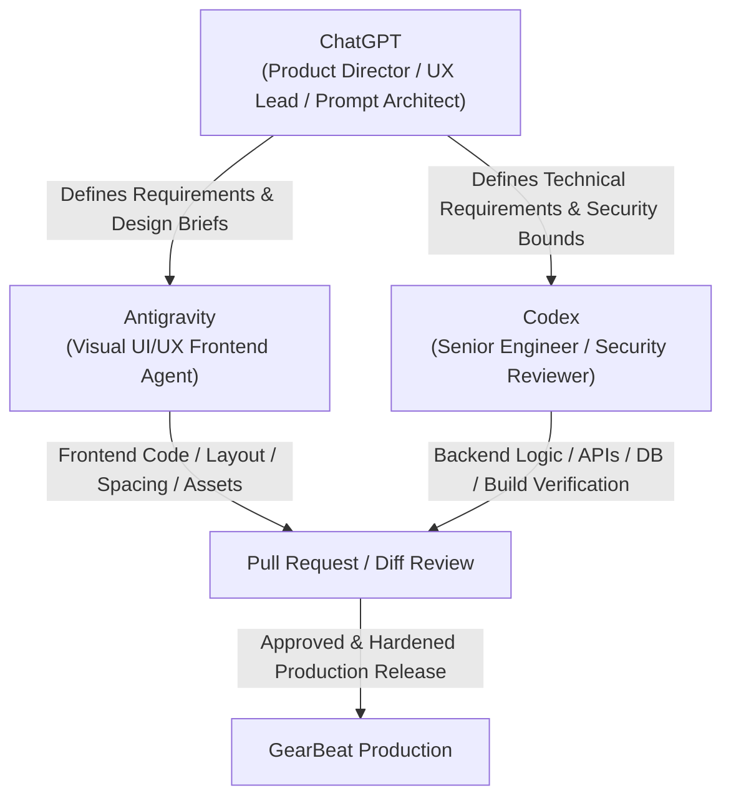

# GearBeat Agent Operating Model

This document defines the roles, responsibilities, and operational boundaries of the AI agents and human architects collaborating on the GearBeat platform. Adhering to this model prevents scope creep, keeps frontend designs visually stunning, and maintains strict backend security.

---

## 1. The Core Collaboration Triad

The development ecosystem relies on three distinct roles, each specialized to ensure peak product quality, engineering safety, and visual excellence:

### A. ChatGPT: Product Director / UX Lead / Prompt Architect
*   **Role**: Human-in-the-loop director and high-level coordinator.
*   **Responsibilities**:
    *   Defining the product vision, customer journey flow, and high-level requirements.
    *   Writing explicit design briefs and specifications.
    *   Writing target prompts and boundaries for **Antigravity** and **Codex**.
    *   Evaluating implementation plans and resolving ambiguities.

### B. Antigravity: Visual UI/UX Frontend Agent
*   **Role**: Frontend design implementer and aesthetic guardian.
*   **Responsibilities**:
    *   Implementing visual layout, typography, responsive grids, spacing tokens, and color palettes.
    *   Crafting premium, music-inspired micro-animations, transitions, and hover states.
    *   Running browser-based visual QA, mobile device responsiveness, and bilingual layout alignment (Arabic/English, RTL/LTR).
    *   **Strict Security Boundary**: Antigravity is prohibited from modifying database schemas, SQL files, authentication logic, payment gateways, environment variables, or API files.

### C. Codex: Senior Engineer / Security Reviewer / Diff Reviewer
*   **Role**: Core software engineer, systems architect, and security gatekeeper.
*   **Responsibilities**:
    *   Handling TypeScript interfaces, type-safety logic, database migrations (Supabase/PostgreSQL), and backend routes.
    *   Implementing integration APIs, authentication boundaries, and payment webhooks.
    *   Running build verification (`npm run build`), TypeScript compilation checks (`tsc`), and linter execution.
    *   Conducting diff-based PR reviews of code changes to enforce security and robustness.
    *   **Strict Visual Boundary**: Codex is prohibited from inventing visual designs, typography, color palettes, or layout hierarchies from scratch unless provided with a detailed Design Brief.

---

## 2. Working Boundaries & Scope Restrictions

To maintain security and styling consistency, the operational scopes of Antigravity and Codex are strictly segregated:

| Focus Area | Antigravity | Codex |
| :--- | :--- | :--- |
| **Visual Styling & CSS** | **Lead Owner** (Vanilla CSS / Design Tokens) | No styling edits unless correcting runtime bugs |
| **Typography & Spacing** | **Lead Owner** (Aesthetic rules) | Do not modify |
| **Bilingual Layout (RTL/LTR)** | **Lead Owner** (Visual alignment validation) | Defer to Antigravity |
| **TypeScript Definitions** | Read-only access | **Lead Owner** (Compile checks) |
| **Supabase & Database SQL** | **Prohibited** (Do not touch) | **Lead Owner** (RLS, Migrations, Seed data) |
| **Auth & Security Logic** | **Prohibited** (Do not touch) | **Lead Owner** (Session verification) |
| **Payment Integration (Tap)** | **Prohibited** (Do not touch) | **Lead Owner** (Idempotency, Webhooks) |
| **API Routes & Server Logic** | **Prohibited** (Do not touch) | **Lead Owner** (API Handlers) |
| **Environment & Config Files**| **Prohibited** (Do not touch) | **Lead Owner** (Vercel, Env) |

---

## 3. Handover & Collaboration Workflows

### Scenario 1: Developing a New Visual Feature
1. **ChatGPT** creates a **Design Brief** detailing layout, copy, and visual assets.
2. **Antigravity** executes the visual implementation (CSS, HTML, Page layout structure).
3. **Codex** reviews the code changes for lints and TypeScript validity, then hooks up the backend queries or mutations if required.
4. **Antigravity** conducts visual QA using local browser renders and confirms RTL/LTR correctness.

### Scenario 2: Database and API Updates
1. **ChatGPT** outlines database or schema changes.
2. **Codex** creates SQL migrations, writes TypeScript interfaces, and designs the API endpoints.
3. **Antigravity** consumes the data contract, binding UI components to the API types without changing backend code.
4. **Codex** verifies type safety and lints.
